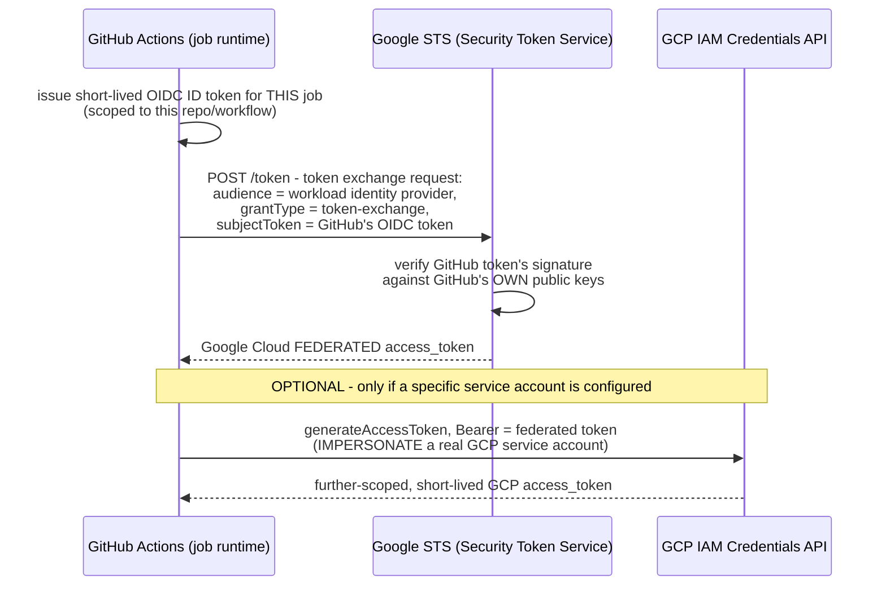

**TL;DR:** How does a GitHub Actions job authenticate to GCP without ever storing a GCP credential? Workload Identity Federation exchanges GitHub's own short-lived OIDC token for a Google Cloud token via an OAuth2 token exchange (RFC 8693) at request time — Google's STS verifies the token against GitHub's public keys and hands back a federated access token, with nothing long-lived stored on either side.

**Real repo:** [`google-github-actions/auth`](https://github.com/google-github-actions/auth)

## 1. The Engineering Problem: CI pipelines calling cloud APIs traditionally need a long-lived stored secret

CI/CD pipelines calling GCP APIs traditionally needed a downloaded service account JSON key stored as a CI secret — a long-lived, exportable credential that, if the CI provider's secret store is ever compromised (or a misconfigured workflow leaks it into logs), grants an attacker persistent GCP access with no automatic expiration. GitHub Actions already issues its *own* short-lived identity token for every job — an OIDC ID token proving "this is genuinely a workflow run from repo X, on branch Y." Rather than requiring a completely separate, GCP-specific long-lived secret on top of that, could GCP just trust the token GitHub already issues, directly?

---

## 2. The Technical Solution: an OAuth2 token exchange, with nothing long-lived stored anywhere

**Workload Identity Federation** implements exactly this: an OAuth2 token exchange (RFC 8693) where GitHub's own OIDC token gets swapped for a Google Cloud token at request time, with nothing long-lived stored on either side.



Core truths: **no GCP secret exists anywhere in this flow** — not a downloaded key, not a rotated key, nothing persisted on GitHub's side or GCP's side. The trust relationship is configured *once* (a Workload Identity Pool/Provider on GCP, configured to trust GitHub's OIDC issuer for a specific repo/condition), and every subsequent CI run re-proves its identity fresh, from scratch, via a brand-new token exchange. And **service account impersonation is a separate, optional step layered on top of the token exchange**, not a replacement for it — the federated token alone can call GCP APIs directly if granted permissions directly; impersonation exists for cases where the actual permissions should live on a dedicated service account instead.

---

## 3. The clean example (concept in isolation)

```json
POST https://sts.googleapis.com/v1/token
{
  "audience": "//iam.googleapis.com/projects/123/locations/global/workloadIdentityPools/my-pool/providers/github",
  "grantType": "urn:ietf:params:oauth:grant-type:token-exchange",
  "requestedTokenType": "urn:ietf:params:oauth:token-type:access_token",
  "scope": "https://www.googleapis.com/auth/cloud-platform",
  "subjectTokenType": "urn:ietf:params:oauth:token-type:jwt",
  "subjectToken": "<GitHub's own OIDC ID token for this job>"
}
```

---

## 4. Production reality (from `google-github-actions/auth`)

```typescript
// src/client/workload_identity_federation.ts
async getToken(): Promise<string> {
    const pth = `${this._endpoints.sts}/token`;

    const body = {
      audience: this.#audience,   // //iam.googleapis.com/.../workloadIdentityPools/.../providers/...
      grantType: `urn:ietf:params:oauth:grant-type:token-exchange`,
      requestedTokenType: `urn:ietf:params:oauth:token-type:access_token`,
      scope: `${this._endpoints.www}/auth/cloud-platform`,
      subjectTokenType: `urn:ietf:params:oauth:token-type:jwt`,
      subjectToken: this.#githubOIDCToken,   // GitHub's OWN OIDC token
    };

    const resp = await this._httpClient.postJson<{ access_token: string }>(pth, body, headers);
    const result = resp.result;

    this.#cachedToken = result.access_token;   // Google Cloud FEDERATED token
    this.#cachedAt = now;
    return result.access_token;
}
```

```typescript
// createCredentialsFile - optional impersonation, layered on top
if (this.#serviceAccount) {
    const impersonationURL =
        `${this._endpoints.iamcredentials}/projects/-/serviceAccounts/${this.#serviceAccount}:generateAccessToken`;
    data.service_account_impersonation_url = impersonationURL;
}
```

What this teaches that a hello-world can't:

- **`this.#audience` is computed as `//${iamHost}/${workloadIdentityProviderName}` in the constructor, not passed as a raw string** — the audience value is a specific, structured resource path identifying the exact Workload Identity Provider this exchange is targeting. Google's STS endpoint uses this to know *which* configured trust relationship to check the incoming GitHub token against — get this wrong (point at the wrong provider) and the exchange fails outright, safely, rather than silently succeeding against an unintended trust boundary.
- **The token is cached for only 30 seconds (`now - this.#cachedAt < 30_000`)** — this is a real, deliberately short cache window, not a "cache forever until the process restarts" shortcut. A CI job making several GCP API calls in quick succession avoids hammering the STS endpoint for every single call, while still re-exchanging frequently enough that the cached token's own short lifetime doesn't become a practical long-lived credential in its own right.
- **`credential_source` in `createCredentialsFile` embeds the exact URL and header GCP's own client libraries need to FETCH GitHub's OIDC token themselves** (`Authorization: Bearer ${githubOIDCTokenRequestToken}`), rather than embedding the token itself. This is what lets a downstream tool (Terraform, `gcloud`, application code) authenticate the *same* way without the auth action needing to hand it a live token directly — the credential file describes *how to fetch* a fresh token when needed, not a pre-fetched one that could go stale mid-run.

Known-stale fact: long-lived service account JSON keys stored as CI secrets — arguably the single most common real-world GCP credential-leak vector — are exactly what Workload Identity Federation exists to eliminate, and this real code demonstrates it concretely: there is no GCP secret anywhere in this authentication flow, not even a short-lived one persisted to disk by default. The trust boundary is configured once, on GCP's side, as a condition on which GitHub OIDC tokens are accepted (which repo, which branch, which environment) — narrower and more auditable than a shared key that works from anywhere until manually rotated or revoked.

---

## Source

- **Concept:** Workload Identity Federation (service-to-service auth without long-lived keys)
- **Domain:** gcp
- **Repo:** [google-github-actions/auth](https://github.com/google-github-actions/auth) → [`src/client/workload_identity_federation.ts`](https://github.com/google-github-actions/auth/blob/main/src/client/workload_identity_federation.ts) — Google's own official GitHub Action for authenticating CI workflows to GCP.
