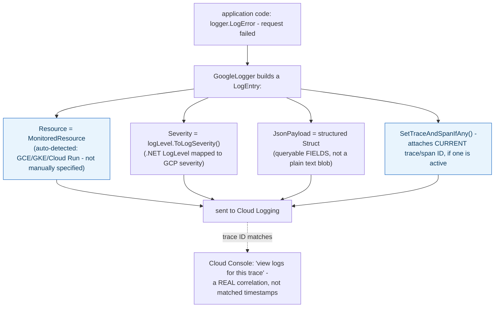

**TL;DR:** How does Cloud Logging know which trace a specific log line belongs to? Google's client library builds every `LogEntry` with the currently-active trace and span ID stamped on automatically via `SetTraceAndSpanIfAny`, alongside an auto-detected `MonitoredResource` and a structured, queryable `JsonPayload` — a concrete field written at log-creation time, not a UI correlation guessed from timestamps.
> **In plain English (30 sec):** Think of this like concepts you already use, but in a production system at scale.


**Real repo:** [`googleapis/google-cloud-dotnet`](https://github.com/googleapis/google-cloud-dotnet)

## 1. The Engineering Problem: logs and traces are usually two disconnected systems

A log line saying "request failed" doesn't inherently connect to the specific distributed trace showing *where* in a multi-service call chain it failed — correlating them manually (matching timestamps, guessing based on proximity) doesn't scale and is unreliable under concurrent traffic. Separately, raw text log lines are hard to query precisely — "show me every ERROR-severity log with field `user_id=123`" needs either full-text search hacks or manually parsing structured fields back out of a plain string at query time.

---

## 2. The Technical Solution: structure and correlation built into every log entry automatically

Google's own Cloud Logging client for .NET builds each `LogEntry` as a genuinely structured object with three things baked in automatically, not left to the caller to wire up manually:



Core truths: **trace-log correlation is a concrete field written onto the log entry at creation time**, not a UI feature guessing based on proximity — `SetTraceAndSpanIfAny` pulls the actively-running trace context (if the log call happens inside a traced request) and stamps its exact Trace ID and Span ID directly onto the entry; and **the payload is a structured `Struct`, not a formatted string** — individual fields inside it remain genuinely queryable in Cloud Logging's query language after the fact, not just discoverable via full-text search.

---

## 3. The clean example (concept in isolation)

```csharp
var entry = new LogEntry
{
    Resource = monitoredResource,              // WHICH GCE/GKE/Cloud Run resource
    Severity = logLevel.ToLogSeverity(),         // mapped severity
    JsonPayload = new Struct                     // structured, queryable fields
    {
        Fields = { ["message"] = Value.ForString("request failed"),
                   ["user_id"] = Value.ForString(userId) }
    }
};
entry.SetTraceAndSpanIfAny(traceTarget, serviceProvider);  // correlate to the active trace, if any
consumer.Receive(new[] { entry });
```

---

## 4. Production reality (from `googleapis/google-cloud-dotnet`)

```csharp
// apis/Google.Cloud.Diagnostics.Common/.../Logging/GoogleLogger.cs
LogEntry entry = new LogEntry
{
    Resource = _loggerOptions.MonitoredResource,
    LogName = _fullLogName,
    Severity = logLevel.ToLogSeverity(),
    Timestamp = Timestamp.FromDateTime(_clock.GetCurrentDateTimeUtc()),
    JsonPayload = CreateJsonPayload(eventId, state, exception, message),
};

_ambientScopeManager.GetCurrentScope()?.ApplyTo(entry);
GoogleLoggerScope.Current?.ApplyTo(entry);
entry.SetTraceAndSpanIfAny(_traceTarget, _serviceProvider);

_consumer.Receive(new[] { entry });
```

What this teaches that a hello-world can't:

- **`_ambientScopeManager.GetCurrentScope()?.ApplyTo(entry)` and `GoogleLoggerScope.Current?.ApplyTo(entry)` are TWO separate scope-application steps, not one.** Structured logging labels can come from ambient context set up outside the immediate call site (a using-block scope wrapping a whole operation) as well as thread-local "current" scope state — both get merged onto the same entry, meaning labels attached at different levels of the call stack all end up on the final log line without the innermost logging call needing to know about any of them explicitly.
- **`SetTraceAndSpanIfAny` is conditional — "if any"** — a log call happening outside any active trace context (a background job, application startup) simply doesn't get trace/span fields, rather than the method failing or writing empty placeholder values. Trace correlation is opportunistic: present when there's something real to correlate to, silently absent otherwise.
- **`_traceTarget` is computed once, in the logger's constructor, from `LogTarget.Kind`** — trace correlation only applies at all when logging to a `Project` target (`logTarget.Kind == LogTargetKind.Project ? TraceTarget.ForProject(...) : null`), not an `Organization` target. This is a real, non-obvious scoping detail: Cloud Trace itself is a project-level concept, so a logger configured to write at organization scope structurally can't attach trace correlation, and the code reflects that constraint directly rather than attempting it and failing at request time.

Known-stale fact: Cloud Logging and Cloud Trace (both part of Google Cloud's Operations Suite) are sometimes assumed to require manual correlation between the two — grepping trace IDs out of log messages, matching timestamps. The real client library wires trace and span IDs directly into every log entry automatically whenever an active trace context exists, which is the actual mechanism behind Cloud Console's "view logs for this trace" feature — a concrete field on the log entry, not an inference the UI makes after the fact.

---

## Source

- **Concept:** Cloud Monitoring & Logging (Ops Suite: metrics, traces, logs)
- **Domain:** gcp
- **Repo:** [googleapis/google-cloud-dotnet](https://github.com/googleapis/google-cloud-dotnet) → [`apis/Google.Cloud.Diagnostics.Common/Google.Cloud.Diagnostics.Common/Logging/GoogleLogger.cs`](https://github.com/googleapis/google-cloud-dotnet/blob/main/apis/Google.Cloud.Diagnostics.Common/Google.Cloud.Diagnostics.Common/Logging/GoogleLogger.cs) — the official Google Cloud diagnostics/logging client library for .NET.


