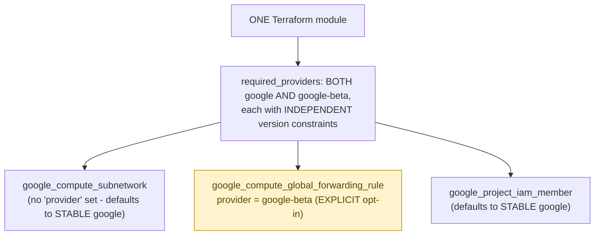

**TL;DR:** Why does a single Terraform module need both the `google` and `google-beta` providers? GCP's stable and beta API surfaces graduate features independently, so a module declares both providers with independent version constraints and opts individual resources into beta explicitly via `provider = google-beta`, while everything else defaults to the stable provider.

**Real repo:** [`terraform-google-modules/terraform-google-lb-http`](https://github.com/terraform-google-modules/terraform-google-lb-http)

## 1. The Engineering Problem: GCP's own API has a stable surface and a beta surface, and they don't graduate together

GCP's REST APIs have a stable (v1, GA) surface and a separate beta surface — some resource types or specific fields are only available on the beta surface, sometimes for a long time, before eventually graduating to GA (if ever). Terraform's `google` provider tracks GCP's stable API; a completely separate `google-beta` provider tracks the beta surface. A module needing even one beta-only feature — a specific load balancer configuration option, a newly-launched IAM feature — has to route *that specific resource* through `google-beta`, while everything else in the same module can stay on stable `google`. Real production modules routinely need both, resource by resource, not as an all-or-nothing choice.

---

## 2. The Technical Solution: both providers declared, each resource opts into beta explicitly

Terraform's `required_providers` block declares `google` and `google-beta` as independent requirements, each with its own version constraints — the beta provider's release cadence isn't tied to the stable provider's. Individual resource blocks opt into beta explicitly via `provider = google-beta`; everything else defaults to stable `google` unless told otherwise.



Core truths: **this is a deliberate, resource-by-resource decision a module author makes, not a blanket "this module is beta/unstable" flag** — most resources in a real module stay on the stable provider, and only the specific resources needing a beta-only feature get the explicit override; and **the two providers' version constraints are independent** — bumping the beta provider's allowed version range doesn't require touching the stable provider's constraint, and vice versa, because they genuinely track different underlying API surfaces with different release timelines.

---

## 3. The clean example (concept in isolation)

```hcl
terraform {
  required_providers {
    google = {
      source  = "hashicorp/google"
      version = ">= 6.0, < 8"
    }
    google-beta = {
      source  = "hashicorp/google-beta"
      version = ">= 6.0, < 8"
    }
  }
}

resource "google_compute_subnetwork" "default" {
  # no 'provider' set - uses STABLE google by default
  name = "default-subnet"
}

resource "google_compute_global_forwarding_rule" "https" {
  provider = google-beta   # this specific resource needs a beta-only feature
  name     = "my-forwarding-rule"
}
```

---

## 4. Production reality (from `terraform-google-modules/terraform-google-lb-http`)

```hcl
# versions.tf
terraform {
  required_version = ">= 1.3"
  required_providers {
    google = {
      source  = "hashicorp/google"
      version = ">= 6.0, < 8"
    }
    google-beta = {
      source  = "hashicorp/google-beta"
      version = ">= 6.0, < 8"
    }
    random = {
      source  = "hashicorp/random"
      version = ">= 2.1"
    }
  }

  provider_meta "google" {
    module_name = "blueprints/terraform/terraform-google-lb-http/v14.2.0"
  }
  provider_meta "google-beta" {
    module_name = "blueprints/terraform/terraform-google-lb-http/v14.2.0"
  }
}
```

```hcl
# main.tf - the SAME module, this specific resource opts into beta
resource "google_compute_global_forwarding_rule" "https" {
  provider   = google-beta
  name       = "${var.name}-https"
  target     = google_compute_target_https_proxy.default[0].self_link
  ip_address = local.address
  port_range = var.https_port
}
```

What this teaches that a hello-world can't:

- **Both `google` and `google-beta` get their own `provider_meta` block, with the identical `module_name` value.** This isn't decorative — `provider_meta` is how Terraform attributes API calls back to the specific public module that generated them, for usage telemetry Google (and module authors) can see. Since the SAME module makes calls through *both* providers, both need this attribution wired up independently, or calls made via `google-beta` specifically would go unattributed even though calls via `google` were tracked correctly.
- **The version constraint `>= 6.0, < 8` is identical for both providers in this file, but that's a choice this module made, not a requirement of the mechanism itself** — nothing forces `google` and `google-beta` to share a version range; they're independent constraints that happen to be aligned here because this module's maintainers chose to keep them in lockstep for simplicity, not because Terraform enforces it.
- **`google_compute_global_forwarding_rule` needing `google-beta` isn't a sign this specific resource type is experimental or risky** — global forwarding rules are a completely standard, heavily-used production GCP resource. Certain *configurations* of it (specific `load_balancing_scheme` values, IPv6 support, and other newer capabilities) simply haven't graduated to the stable provider's resource schema yet, which is a narrower, more precise reason than "beta = don't use in production."

Known-stale fact: a common assumption is that `google-beta` signals "this whole configuration is experimental or unstable" — in practice, production Terraform modules routinely use `google-beta` for specific, well-established resource configurations that simply haven't graduated to the stable API surface, sometimes for years. It's a resource-by-resource API-surface selection tracking GCP's own versioning scheme, not a blanket risk signal correlated with how mature or widely deployed that particular feature actually is in real production use.

---

## Source

- **Concept:** Terraform on GCP (infrastructure as code with the `google` provider)
- **Domain:** gcp
- **Repo:** [terraform-google-modules/terraform-google-lb-http](https://github.com/terraform-google-modules/terraform-google-lb-http) → [`versions.tf`](https://github.com/terraform-google-modules/terraform-google-lb-http/blob/main/versions.tf), [`main.tf`](https://github.com/terraform-google-modules/terraform-google-lb-http/blob/main/main.tf) — Google's own real, versioned Terraform load balancer module.


