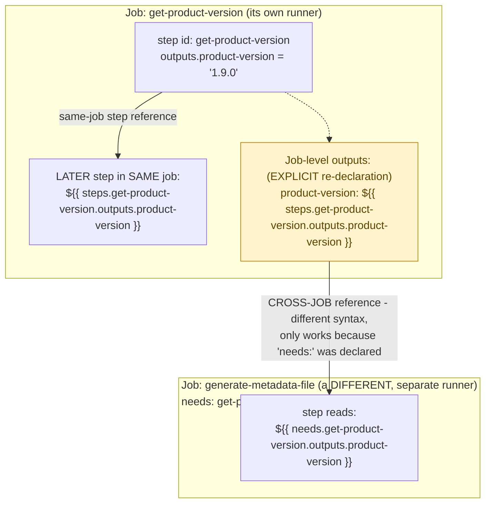



**TL;DR:** Why does one workflow need two different ways to pass a value between steps  one for steps, another for jobs? Steps in the same job share a runner, so a later step reads an earlier step's output directly (`steps.<id>.outputs.<name>`); jobs run on separate runners, so a job must explicitly re-declare a step's output in its own `outputs:` block before another job  which must also declare `needs: <job-name>`  can reference it as `needs.<job-name>.outputs.<name>`.

> **In plain English (30 sec):** Code you already write — Map, function, API call, just bigger.

**Real repo:** [`hashicorp/terraform`](https://github.com/hashicorp/terraform)

## 1. The Engineering Problem: steps and jobs run at genuinely different isolation levels

A pipeline like "determine the version number, then build using that version, then publish artifacts tagged with it" needs data to flow between different parts of the workflow. But those parts run at different isolation levels: individual **steps** within one job run sequentially on the *same* runner  same filesystem, same environment  while different **jobs** in the same workflow run on *separate* runners entirely, potentially different machines provisioned and torn down independently. "Pass a value from here to there" needs a genuinely different mechanism depending on which boundary is being crossed.

---

## 2. The Technical Solution: step outputs for same-job, job outputs (declared explicitly) for cross-job

**Step-level**: a step gets an `id:`; a later step in the *same* job references its output directly as `${{ steps.<id>.outputs.<name> }}`  this works because both steps share the same runner and workspace. **Job-level**: a job must *explicitly* declare `outputs:` to re-expose a step's output beyond itself  job outputs never bubble up automatically. A different job wanting that value declares `needs: <job-name>` (creating both a dependency and an execution order) and references it as `${{ needs.<job-name>.outputs.<name> }}`  a different syntax entirely, because it's crossing a genuine runner-isolation boundary, not just a step boundary within one shared environment.



Core truths: **job outputs require deliberate, explicit declaration**  a value computed inside a step but never re-declared in that job's own `outputs:` block is genuinely invisible to every other job in the workflow, not just harder to access; and **`needs:` does two things simultaneously**  it creates the data-access relationship (`needs.<job>.outputs`) *and* an execution-order dependency (the consuming job waits for the producing job to finish)  you can't reference another job's outputs without also making your job depend on its completion.

---

## 3. The clean example (concept in isolation)

```yaml
jobs:
  determine-version:
    runs-on: ubuntu-latest
    outputs:
      version: ${{ steps.get-version.outputs.value }}   # EXPLICIT re-exposure
    steps:
      - id: get-version
        run: echo "value=1.2.3" >> "$GITHUB_OUTPUT"
      - name: use it in the SAME job
        run: echo "Building ${{ steps.get-version.outputs.value }}"   # same-job syntax

  build:
    needs: determine-version   # dependency AND access, both required
    runs-on: ubuntu-latest
    steps:
      - run: echo "Building ${{ needs.determine-version.outputs.version }}"   # cross-job syntax
```

---

## 4. Production reality (from `hashicorp/terraform`)

```yaml
# .github/workflows/build.yml
get-product-version:
  name: "Determine intended Terraform version"
  runs-on: ubuntu-latest
  outputs:
    product-version: ${{ steps.get-product-version.outputs.product-version }}   # explicit re-declaration

  steps:
    - name: Decide version number
      id: get-product-version
      uses: hashicorp/actions-set-product-version@d9be602dfa87e201c79a3937c038f19391c9a430 # v2.0.2
    - name: Determine experiments
      id: get-ldflags
      env:
        RAW_VERSION: ${{ steps.get-product-version.outputs.product-version }}   # same-job step reference
      run: .github/scripts/get_product_version.sh

generate-metadata-file:
  name: "Generate release metadata"
  runs-on: ubuntu-latest
  needs: get-product-version   # dependency: waits for the job above to finish

  steps:
    - name: Generate package metadata
      uses: hashicorp/actions-generate-metadata@a43468dfb100445f2c2aa52cdc3d57b2c982a0f3 # v1.1.4
      with:
        version: ${{ needs.get-product-version.outputs.product-version }}   # cross-job reference
```

What this teaches that a hello-world can't:

- **`get-product-version`'s `outputs:` block re-exposes FIVE different step outputs at once** (`product-version`, `product-version-base`, `product-version-pre`, `experiments`, `go-ldflags`, `pkg-name` in the real file)  a job commonly needs to surface *multiple* independent pieces of data computed across *different* steps within it, each requiring its own explicit line in the job's `outputs:` block, not a single blanket "expose everything" switch.
- **`RAW_VERSION: ${{ steps.get-product-version.outputs.product-version }}` shows a step output consumed as an environment variable in a LATER step, not just interpolated into a `run:` command string.** This is a real, common pattern for passing structured or multi-line values safely into a script (`.github/scripts/get_product_version.sh`) without string-interpolation escaping concerns  the value arrives as a genuine environment variable the script can read normally.
- **`generate-metadata-file` only needs `get-product-version`, not `get-go-version`** (a separate job defined nearby in the same file)  jobs without a `needs:` relationship to each other run fully in parallel by default. The dependency graph in a real workflow is deliberately sparse: only jobs that genuinely need each other's data or ordering get connected, everything else runs concurrently to keep total pipeline time down.

Known-stale fact: a common beginner assumption is that any step or job in a workflow can simply read what an earlier one produced, the way local variables would work in a single script. Job outputs are not automatic  they require explicit `outputs:` declaration at the job level, and a value computed inside a step but never re-declared there is genuinely inaccessible to any other job, not just inconvenient to reach. This is a frequent, real source of "why is this value empty in my downstream job" confusion when a step output was set but never explicitly promoted to a job output.

---

## Source

- **Concept:** GitHub Actions workflow anatomy (workflows, jobs, steps, runners)
- **Domain:** cicd
- **Repo:** [hashicorp/terraform](https://github.com/hashicorp/terraform) ? [`.github/workflows/build.yml`](https://github.com/hashicorp/terraform/blob/main/.github/workflows/build.yml)  a large, real project's production release pipeline.



