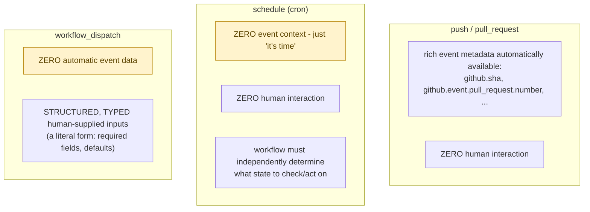

---
layout: post
title: "GitHub Actions Triggers: Schedule vs workflow_dispatch"
date: 2026-02-09 09:00:00 +0530
categories: cicd
order: 3
tags: [cicd, github-actions, triggers, workflow-dispatch]
excerpt: ""
---


**TL;DR:** Why does a scheduled workflow have nothing to react to, but a manually-triggered one gets a form? `schedule` is pure time-based with essentially no event payload, so the workflow has to independently determine what needs doing on every run; `workflow_dispatch` provides zero automatic event data either, but instead exposes structured, typed, author-defined input fields that become a literal form a human fills in before the run starts.

**Real repo:** [`hashicorp/terraform`](https://github.com/hashicorp/terraform)

## 1. The Engineering Problem: different automation needs fundamentally different triggering shapes

Some automation should react to a specific event — a push, a PR opened — with no human involved and no configuration beyond the event itself. Some should run on a schedule, independent of any code change — a nightly cleanup, a stale-issue sweep — but a schedule trigger has no git event to react to at all; the workflow has to figure out what needs doing from scratch each run, since cron provides zero context. And some things should only happen when a human deliberately decides to run them, often needing specific parameters supplied for that one run — a fundamentally different, parameterized trigger shape from the other two.

---

## 2. The Technical Solution: three genuinely different data-availability models, not one trigger mechanism with different names



`schedule: - cron: '...'` is pure time-based — it runs unconditionally on the clock, with essentially no useful event payload (unlike `push`/`pull_request`'s rich event object). `workflow_dispatch: inputs: {...}` is manually triggered from the UI or API, with structured, typed, potentially required input fields that become a literal form a human fills in before the run starts, consumed inside the workflow as `${{ inputs.<name> }}`.

Core truths: **`workflow_dispatch` inputs are the *only* trigger-provided data of their kind — explicitly author-defined, not automatically derived from any event** — push and pull_request triggers hand you metadata about what already happened; `workflow_dispatch` hands you exactly, and only, whatever fields the workflow author chose to expose as a form. And **a schedule-triggered run's `github.event` context carries essentially nothing actionable** — a common, real surprise for anyone assuming every trigger type provides comparably rich context to react to.

---

## 3. The clean example (concept in isolation)

```yaml
on:
  schedule:
    - cron: '0 2 * * *'   # 2 AM daily - NO event data, just "it's time"

  workflow_dispatch:
    inputs:
      environment:
        type: choice
        options: [staging, production]
        required: true
      dry_run:
        type: boolean
        default: true

jobs:
  run:
    runs-on: ubuntu-latest
    steps:
      - run: echo "Deploying to ${{ inputs.environment }}, dry_run=${{ inputs.dry_run }}"
```

---

## 4. Production reality (from `hashicorp/terraform`)

```yaml
# .github/workflows/lock.yml - schedule trigger, zero event context
name: 'Lock Threads'
on:
  schedule:
    - cron: '50 1 * * *'

permissions:
  issues: write
  pull-requests: write

jobs:
  lock:
    runs-on: ubuntu-latest
    steps:
      - uses: dessant/lock-threads@89ae32b08ed1a541efecbab17912962a5e38981c # v6.0.2
        with:
          process-only: 'issues, prs'
          issue-inactive-days: '30'
```

```yaml
# .github/workflows/equivalence-test-manual-update.yml - workflow_dispatch with typed inputs
name: equivalence-tests-manual
on:
  workflow_dispatch:
    inputs:
      target-branch:
        type: string
        description: "Which branch should be updated?"
        required: true
      new-branch:
        type: string
        description: "Name of new branch to be created for the review."
        required: true
      equivalence-test-version:
        type: string
        description: 'Equivalence testing framework version to use (no v prefix, eg. 0.5.0).'
        default: "0.5.0"
        required: true

jobs:
  run-equivalence-tests:
    runs-on: ubuntu-latest
    steps:
      - uses: actions/checkout@9c091bb21b7c1c1d1991bb908d89e4e9dddfe3e0 # v7.0.0
        with:
          ref: ${{ inputs.target-branch }}   # a HUMAN chose this value at trigger time
```

What this teaches that a hello-world can't:

- **`lock.yml` never references `github.event` anywhere in its logic** — the entire workflow just runs, unconditionally, at `50 1 * * *` (1:50 AM UTC daily), and the third-party action itself is responsible for figuring out which issues/PRs qualify (inactive 30+ days). There's genuinely nothing for the workflow to "react to" beyond the clock; all the decision logic about *what* to act on lives downstream of the trigger, not in it.
- **`equivalence-test-manual-update.yml`'s inputs have real, distinct field semantics**: `target-branch` and `new-branch` are `required: true` with no default (the run genuinely cannot start without a human supplying them), while `equivalence-test-version` has both `required: true` *and* a `default: "0.5.0"` — required just means "this field will always have SOME value," and a default is what supplies that value when the human running it doesn't override it. Required and defaulted aren't contradictory; a required field with a sensible default just means most runs won't need to think about it.
- **`ref: ${{ inputs.target-branch }}` feeds a human-supplied string directly into which branch gets checked out** — this is real, meaningful power a push/pull_request-triggered workflow doesn't have: the human deciding to run this workflow is choosing, at trigger time, *which* branch the entire rest of the job operates against, not just confirming an already-determined target the way merging a PR would.

Known-stale fact: it's easy to assume every GitHub Actions trigger type hands the workflow a comparable "here's what happened" payload to work with, the way `push` and `pull_request` do — `schedule` is the clear counterexample, providing essentially no actionable event data at all. Any scheduled workflow that needs to know "what's changed" or "what needs attention" has to determine that itself, from scratch, on every run — the trigger only tells it *when*, never *what*.

---

## Source

- **Concept:** Triggers & events (push, pull_request, workflow_dispatch, schedule)
- **Domain:** cicd
- **Repo:** [hashicorp/terraform](https://github.com/hashicorp/terraform) → [`.github/workflows/lock.yml`](https://github.com/hashicorp/terraform/blob/main/.github/workflows/lock.yml), [`.github/workflows/equivalence-test-manual-update.yml`](https://github.com/hashicorp/terraform/blob/main/.github/workflows/equivalence-test-manual-update.yml) — a large, real project's production automation workflows.

