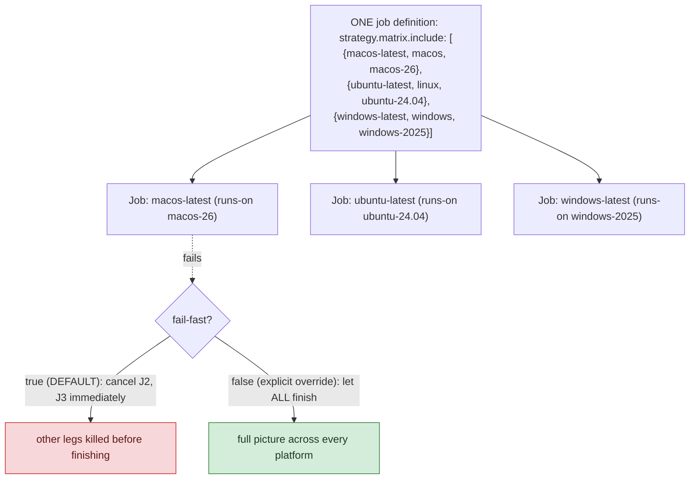

---
layout: post
title: "GitHub Actions Build Matrix: include and fail-fast"
date: 2026-02-11 09:00:00 +0530
categories: cicd
order: 4
tags: [cicd, github-actions, build-matrix, testing]
excerpt: ""
---


**TL;DR:** Why does one failed OS in a build matrix sometimes cancel every other OS's tests? GitHub's default `fail-fast: true` behavior cancels every other in-progress matrix leg the moment any single one fails, trading complete cross-platform information for saved compute; setting `fail-fast: false` explicitly gives up that savings so every platform finishes and you see the full picture.

**Real repo:** [`App-vNext/Polly`](https://github.com/App-vNext/Polly)

## 1. The Engineering Problem: hand-duplicated per-OS jobs drift out of sync

Testing across multiple OSes or versions by hand-writing a separate job for each combination — one job for Linux, one for macOS, one for Windows — means real, tedious duplication. Every configuration change (a new step, a new environment variable) has to be applied to every duplicated job definition independently, and it's easy for them to silently drift out of sync over time. You want one job *definition* that automatically expands into multiple parallel runs, one per combination, without hand-duplicating the YAML.

---

## 2. The Technical Solution: `strategy.matrix` expands one job into N, with real control over which combinations and how failures propagate

`strategy: matrix:` expands one job definition into N parallel jobs, one per combination. Two real behaviors matter beyond the basic expansion:



The `include:` form specifies fully-correlated combinations as explicit objects, rather than a naive cross-product of separate arrays — the difference between "every OS-name paired with every possible runner" (mostly invalid combinations) and "exactly these deliberate, valid pairings." And GitHub's *default* behavior — cancel every other in-progress matrix job the moment any one leg fails — trades complete information for saved compute; `fail-fast: false` explicitly gives up that savings to see the full picture across every platform every time.

Core truths: **matrix variables aren't limited to parameterizing setup steps** — they can conditionally gate whether an entire step runs at all (`if: matrix.os-name == 'windows'`), letting platform-specific steps live inside the *same* job definition as everything else rather than needing a wholly separate job; and **`fail-fast` is a real, deliberate tradeoff, not a default worth ignoring** — for a matrix genuinely testing platform-specific behavior, seeing that Linux and macOS still pass even after Windows fails is often exactly the information you need, and the default setting throws it away.

---

## 3. The clean example (concept in isolation)

```yaml
jobs:
  test:
    strategy:
      fail-fast: false   # let every leg finish, even if one fails
      matrix:
        include:
          - os-name: linux
            runner: ubuntu-latest
          - os-name: windows
            runner: windows-latest
    runs-on: ${{ matrix.runner }}
    steps:
      - run: echo "testing on ${{ matrix.os-name }}"
      - name: Windows-only step
        if: matrix.os-name == 'windows'
        run: echo "signing artifacts"
```

---

## 4. Production reality (from `App-vNext/Polly`)

```yaml
# .github/workflows/build.yml
jobs:
  build:
    name: ${{ matrix.job-name }}
    runs-on: ${{ matrix.runner }}

    strategy:
      fail-fast: false
      matrix:
        include:
          - job-name: macos-latest
            os-name: macos
            runner: macos-26
          - job-name: ubuntu-latest
            os-name: linux
            runner: ubuntu-24.04
          - job-name: windows-latest
            os-name: windows
            runner: windows-2025

    steps:
      # ... build, test ...

      - name: Upload coverage to Codecov
        uses: codecov/codecov-action@fb8b3582c8e4def4969c97caa2f19720cb33a72f # v7.0.0
        with:
          flags: ${{ matrix.os-name }}
          token: ${{ secrets.CODECOV_TOKEN }}

      - name: Upload signing file list
        uses: actions/upload-artifact@043fb46d1a93c77aae656e7c1c64a875d1fc6a0a # v7.0.1
        if: matrix.os-name == 'windows'   # ONLY this one platform
        with:
          name: signing-config
          path: eng/signing
```

What this teaches that a hello-world can't:

- **Three separate `matrix` properties (`job-name`, `os-name`, `runner`) exist for genuinely different purposes**, not redundantly: `runner` is the literal `runs-on` value GitHub needs; `os-name` is a normalized, short label used repeatedly for artifact naming and Codecov flags (`coverage-${{ matrix.os-name }}`); `job-name` is a human-friendly display label. One matrix axis producing three differently-shaped values for three different downstream consumers is a real, common pattern once a matrix job does more than just "run tests."
- **`flags: ${{ matrix.os-name }}` is passed to Codecov on every leg** — coverage results from all three platforms get uploaded *separately, tagged by platform*, not merged into one undifferentiated blob. This is what lets a coverage dashboard show "this code path is covered on Linux but not on Windows" rather than an aggregate number that hides platform-specific gaps.
- **The signing-file-list upload is gated to exactly one matrix leg (`if: matrix.os-name == 'windows'`), and only that one produces a `signing-config` artifact.** Real matrix jobs frequently need exactly this shape — mostly-shared steps, with a small number of genuinely platform-specific steps layered in via conditionals — rather than every leg doing identical work end to end.

Known-stale fact: build matrix testing is often assumed to just mean "run the same steps N times with a different version string," using the simpler array-cross-product matrix form (`os: [...]`, `version: [...]`, every combination generated automatically). That form works well when axes are genuinely independent, but breaks down when they're correlated — a specific runner label only makes sense paired with a specific OS. Using the cross-product form for correlated axes either produces invalid combinations that have to be pruned with `exclude:` rules, or wastes CI time generating jobs that were never going to be valid; `include:` with fully-specified objects lets you state the valid combinations directly instead.

---

## Source

- **Concept:** Build matrix (multi-OS/multi-version testing)
- **Domain:** cicd
- **Repo:** [App-vNext/Polly](https://github.com/App-vNext/Polly) → [`.github/workflows/build.yml`](https://github.com/App-vNext/Polly/blob/main/.github/workflows/build.yml) — the real, production .NET resilience library's cross-platform build pipeline.

