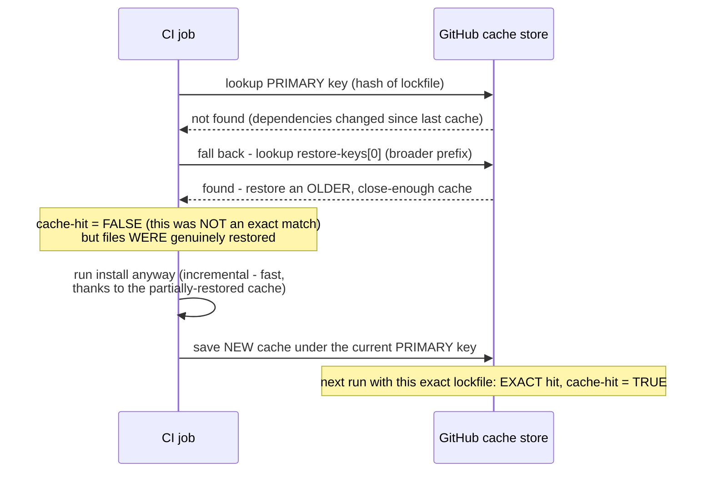



**TL;DR:** Why does `cache-hit: false` still mean your dependencies got restored? `cache-hit` reports `true` only for an exact primary-key match; a `restore-keys` fallback match still restores real files from an older, close-enough cache but reports `cache-hit: false`  the correct signal to run the install step anyway, since a fallback-restored cache is a fast starting point, not a guaranteed-complete substitute.

> **In plain English (30 sec):** Memoization you already do: check Map first, only call DB on miss.

**Real repo:** [`actions/cache`](https://github.com/actions/cache)

## 1. The Engineering Problem: a single fixed cache key is either useless or dangerously stale

Re-downloading dependencies on every CI run wastes real minutes when the same dependency set is usually unchanged between many consecutive runs. But a single fixed cache key is either useless (change it every run, and the cache always misses) or dangerous (never change it, and the cache always hits even after dependencies genuinely changed, silently testing against stale packages). The key needs to be tied to something that genuinely reflects "did the dependency set change"  and there still needs to be graceful behavior for the *first* run after dependencies do change, which would otherwise be a full cache miss with no fallback at all.

---

## 2. The Technical Solution: an exact primary key, with an ordered prefix-fallback chain behind it

`actions/cache`'s real restore logic tries the primary key first  typically a hash of the lockfile, changing exactly when dependencies change  and if that's not found, falls back through an *ordered* list of `restore-keys`: broader prefix matches (like just the OS and package-manager name, no lockfile hash) that restore the closest available older cache instead of nothing at all.



The critical, precise signal: `cache-hit` is `true` **only** for an exact primary-key match. A restore-key fallback match still restores real files into the cache path, but reports `cache-hit: false`  which is exactly the correct signal for a workflow to decide "run the install step anyway," because a fallback-restored cache is a useful *starting point* for an incremental install, not a guaranteed-complete substitute for one.

Core truths: **`cache-hit` answers "was this an exact match," not "was anything restored"**  those are genuinely different questions, and conflating them leads to either skipping a necessary install step or discarding a partially-useful cache; and **restore-keys are tried in the order they're listed, stopping at the first match**  a workflow author controls the fallback specificity by ordering broader-to-narrower (or vice versa) deliberately.

---

## 3. The clean example (concept in isolation)

```yaml
- uses: actions/cache@v4
  id: cache
  with:
    path: ~/.npm
    key: npm-${{ hashFiles('package-lock.json') }}   # exact - changes when deps change
    restore-keys: |
      npm-   # fallback - ANY older npm cache, even for a different lockfile hash

- name: Install dependencies
  # ALWAYS run - even on a fallback restore, this stays fast (incremental)
  # thanks to whatever the fallback cache already provided
  run: npm ci
```

---

## 4. Production reality (from `actions/cache`)

```typescript
// src/restoreImpl.ts
const primaryKey = core.getInput(Inputs.Key, { required: true });
const restoreKeys = utils.getInputAsArray(Inputs.RestoreKeys);

const cacheKey = await cache.restoreCache(
    cachePaths,
    primaryKey,
    restoreKeys,   // ordered fallback list, tried after primaryKey misses
    { lookupOnly: lookupOnly },
    enableCrossOsArchive
);

if (!cacheKey) {
    core.info(`Cache not found for input keys: ${[primaryKey, ...restoreKeys].join(", ")}`);
    return;
}

const isExactKeyMatch = utils.isExactKeyMatch(
    core.getInput(Inputs.Key, { required: true }),
    cacheKey   // the key that ACTUALLY matched - may be primaryKey OR a restore-key
);

core.setOutput(Outputs.CacheHit, isExactKeyMatch.toString());   // precise: EXACT match only
core.info(`Cache restored from key: ${cacheKey}`);
```

What this teaches that a hello-world can't:

- **`restoreCache` returns the key that actually matched (`cacheKey`), not a boolean.** This is what makes `isExactKeyMatch` possible at all  the function compares the *returned* matched key against the *originally requested* primary key, which is a fundamentally different check than "did `restoreCache` return something non-null." A fallback match and an exact match both return a truthy `cacheKey`; only comparing the two strings reveals which kind of match actually happened.
- **The log message on a miss lists ALL keys tried (`[primaryKey, ...restoreKeys].join(", ")`), not just the primary one.** This is a real, deliberate debugging aid  when a cache genuinely can't be found at all, the workflow log shows every key that was attempted, which is exactly the information needed to diagnose whether a restore-key list was too narrow, misspelled, or simply had no prior cache to match at all.
- **`failOnCacheMiss` is a separate, opt-in input that changes miss behavior from "log and continue" to "throw and fail the job."** Most caching use cases genuinely want a miss to be non-fatal (just means a slower, from-scratch run)  this option exists for the narrower case where a workflow *depends* on a cache existing (e.g., referencing a cache populated by an earlier, separate job) and treats its absence as a real error rather than an expected occasional cold start.

Known-stale fact: it's a common but imprecise assumption that `cache-hit: true`/`false` answers "was anything restored." It specifically answers "did the exact primary key match"  a fallback restore-key match still restores real files but reports `false`. Treating `false` as "nothing was restored, so there's nothing to gain from running the install step efficiently" would be a real misreading; the correct interpretation  always run the install step, but expect it to be fast when a fallback cache was actually restored  is what makes the restore-keys mechanism worth having in the first place.

---

## Source

- **Concept:** Caching dependencies (`actions/cache`, restore-keys)
- **Domain:** cicd
- **Repo:** [actions/cache](https://github.com/actions/cache) ? [`src/restoreImpl.ts`](https://github.com/actions/cache/blob/main/src/restoreImpl.ts)  the official GitHub Actions cache action's own real restore logic.



