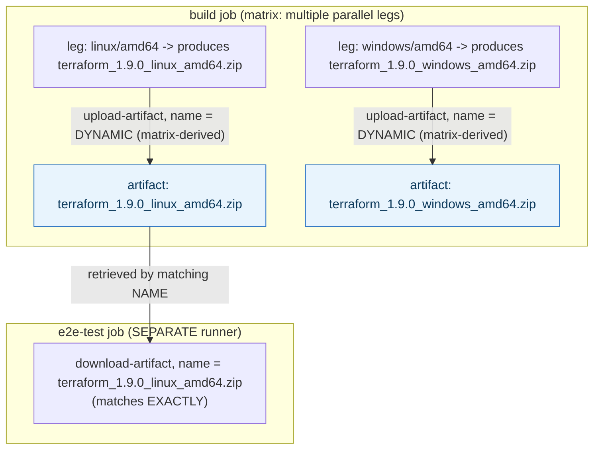



## 1. The Engineering Problem: job outputs can't carry real files

Job outputs pass small string values between jobs — a version number, a computed flag. They can't carry an actual compiled binary, a built package, or a test-coverage report — real files, potentially megabytes in size. Yet a real pipeline routinely needs exactly this: build a binary in one job on one platform's runner, then test that exact binary in a later, separate job, or package it, or publish it — and each of those later jobs runs on its *own* separate runner with no access to the first job's filesystem at all, which may already be destroyed by the time the next job starts.

---

## 2. The Technical Solution: upload real files under a name, download them by that name in a later job

`actions/upload-artifact` uploads real files from a job's workspace to GitHub's artifact storage, under an explicit name; `actions/download-artifact` in a *later* job retrieves those exact files back into its own workspace by matching that name. This is architecturally separate from job outputs because it solves a genuinely different problem: moving real file content across the same runner-isolation boundary job outputs cross with small strings.



Core truths: **the artifact name is often dynamically computed** (from matrix values, from a runtime-determined filename) specifically so multiple parallel matrix legs don't collide uploading *different* files under the *same* name; and **an empty or missing upload can be made a hard failure, not a silent no-op** — `if-no-files-found: error` catches a real, easy-to-miss bug class where a build step silently produces nothing (a wrong path, a failed compile that didn't actually fail the step), which would otherwise only surface much later when a downstream job can't find the artifact it expected.

---

## 3. The clean example (concept in isolation)

```yaml
jobs:
  build:
    strategy:
      matrix:
        os: [linux, windows]
    runs-on: ubuntu-latest
    steps:
      - run: make build-${{ matrix.os }}
      - uses: actions/upload-artifact@v4
        with:
          name: app-${{ matrix.os }}   # DYNAMIC name - one per matrix leg
          path: dist/app-${{ matrix.os }}
          if-no-files-found: error      # fail loudly, don't silently upload nothing

  test:
    needs: build
    runs-on: ubuntu-latest
    steps:
      - uses: actions/download-artifact@v4
        with:
          name: app-linux   # matches by EXACT name
```

---

## 4. Production reality (from `hashicorp/terraform`)

```yaml
# .github/workflows/build-terraform-cli.yml - dynamic, runtime-determined names
- name: Determine package file names
  run: |
    echo "RPM_PACKAGE=$(basename out/*.rpm)" >> $GITHUB_ENV

- if: ${{ inputs.goos == 'linux' }}
  uses: actions/upload-artifact@043fb46d1a93c77aae656e7c1c64a875d1fc6a0a # v7.0.1
  with:
    name: ${{ env.RPM_PACKAGE }}   # computed at RUNTIME, not hardcoded
    path: out/${{ env.RPM_PACKAGE }}
    if-no-files-found: error
```

```yaml
# .github/workflows/build.yml - later job downloading by exact matching name
- name: "Download Terraform CLI package"
  uses: actions/download-artifact@3e5f45b2cfb9172054b4087a40e8e0b5a5461e7c # v8.0.1
  with:
    name: terraform_${{ env.version }}_${{ env.os }}_${{ env.arch }}.zip
    path: .
```

What this teaches that a hello-world can't:

- **`RPM_PACKAGE=$(basename out/*.rpm)` computes the artifact name from a glob at runtime, not a hardcoded string.** The RPM package's exact filename includes version and architecture details baked in by the packaging tool itself — rather than duplicating that naming logic in the workflow YAML (and risking it drifting out of sync with what the tool actually produces), the workflow just asks the filesystem what got created and uses that directly.
- **The download step references `${{ env.os }}` and `${{ env.arch }}`, values that must have been set earlier in that SAME job** — matching a dynamically-named artifact across jobs requires the downloading job to independently reconstruct the exact name string the uploading job used, which means both jobs need access to the same underlying matrix/version values (via job outputs, env vars, or matrix inputs) — the artifact system itself does no fuzzy matching; the name must match exactly, byte for byte.
- **`if-no-files-found: error` is set explicitly on every upload step shown here, not left at its default.** The default behavior (a warning, not a failure) would let a build that silently produced zero files pass its own job successfully, only to fail confusingly several jobs later when nothing can be downloaded — setting `error` moves that failure to the moment it actually happened, with a much clearer error message pointing at the real cause.

Known-stale fact: job outputs and artifacts are sometimes treated as interchangeable "pass data between jobs" mechanisms — they're not. Job outputs are for small, string-shaped values referenced directly in expressions elsewhere in the workflow YAML (`if:`, `with:`, other steps' inputs); artifacts are for actual file content a later job's steps need to read, execute, or test. Using one where the other fits — stuffing file content into a job output string, or uploading an artifact just to carry a single boolean flag — is a real, avoidable inefficiency once a pipeline grows past its simplest form.

---

## Source

- **Concept:** Artifacts & build outputs (sharing between jobs)
- **Domain:** cicd
- **Repo:** [hashicorp/terraform](https://github.com/hashicorp/terraform) → [`.github/workflows/build-terraform-cli.yml`](https://github.com/hashicorp/terraform/blob/main/.github/workflows/build-terraform-cli.yml), [`.github/workflows/build.yml`](https://github.com/hashicorp/terraform/blob/main/.github/workflows/build.yml) — a large, real project's multi-platform release pipeline.

