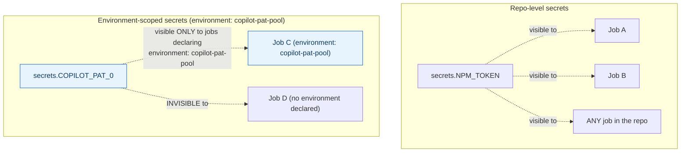



**TL;DR:** Why do some secrets need their own GitHub Environment instead of just being a repo secret? A repo secret is visible to every workflow and job in the repo, but a secret defined at the environment level is only accessible to a job that explicitly declares that environment — every other job, even one that syntactically references it, gets an empty value, giving high-value secrets a narrower blast radius independent of any deployment gating.

**Real repo:** [`dotnet/aspnetcore`](https://github.com/dotnet/aspnetcore)

## 1. The Engineering Problem: a repo secret is visible to every workflow, and that's too broad for some secrets

A repo-level secret is visible to every workflow and job in the repo that references it — fine for most secrets, but for something high-value (a pool of tokens driving automated agent behavior, a production deployment credential) that blast radius is too wide. You want a narrower boundary: only specific, deliberately-designated jobs should even be *able* to reference that secret, ideally with the option to layer additional gating (required reviewers, wait timers) on top, independent of ordinary repo-secret access.

---

## 2. The Technical Solution: environments scope which secrets even exist for a given job, separate from any gating rules

GitHub Environments are a distinct secret-scoping boundary from repo or org secrets. A secret defined *at the environment level* is only accessible to a job that explicitly declares `environment: <name>` — every other job in the repo, even one that syntactically references `secrets.SOME_ENV_SECRET`, gets an empty value, because the secret simply doesn't exist outside that environment's scope.



Scoping (which secrets exist here) and gating (who or what can trigger a run that uses them — required reviewers, wait timers) are two separate, composable mechanisms. A repo can use an environment purely for its scoping property, with zero deployment gate involved, for a workflow that isn't deploying anything at all.

A second, real practice worth naming precisely: secrets are injected via `env:` directly on the *step* that needs them, never interpolated into a shell command string. GitHub's runner automatically redacts known secret values from logs, but that redaction reliably tracks a value coming *directly* from a secrets context — a value transformed, concatenated, or echoed through shell substitution can slip past that automatic protection.

---

## 3. The clean example (concept in isolation)

```yaml
jobs:
  validate-tokens:
    environment: token-pool   # scopes access to environment-level secrets ONLY
    runs-on: ubuntu-latest
    steps:
      - name: Check token 0
        env:
          TOKEN: ${{ secrets.POOL_TOKEN_0 }}   # injected via env:, never interpolated into a command
        run: |
          curl -H "Authorization: Bearer $TOKEN" https://api.example.com/whoami
```

---

## 4. Production reality (from `dotnet/aspnetcore`)

```yaml
# .github/workflows/validate-pat-pool.yml
name: Validate PAT Pool
on:
  schedule:
    - cron: '17 2 * * *'
  workflow_dispatch:

permissions: {}   # no GitHub API access needed at all

jobs:
  validate:
    environment: copilot-pat-pool   # secret scoping boundary
    runs-on: ubuntu-latest
    steps:
      - name: Validate COPILOT_PAT_0
        id: pat0
        continue-on-error: true       # let ALL PATs be checked, not just the first
        env:
          COPILOT_GITHUB_TOKEN: ${{ secrets.COPILOT_PAT_0 }}   # env:, not string interpolation
        shell: bash
        run: |
          eval "$VALIDATE_PAT"

      - name: Validate COPILOT_PAT_1
        id: pat1
        continue-on-error: true
        env:
          COPILOT_GITHUB_TOKEN: ${{ secrets.COPILOT_PAT_1 }}
        shell: bash
        run: |
          eval "$VALIDATE_PAT"
      # ... repeated for PAT_2 through PAT_9 ...
```

What this teaches that a hello-world can't:

- **This workflow uses an environment with NO deployment involved at all** — it validates a pool of tokens, it doesn't deploy anything. This is direct, real evidence that environments aren't a deployment-only feature; the scoping property alone is valuable enough to justify using one, independent of whether required reviewers or wait timers are configured on it.
- **Ten near-identical steps each set `COPILOT_GITHUB_TOKEN` via `env:` from a *different* secret (`COPILOT_PAT_0` through `COPILOT_PAT_9`)** — a pool of interchangeable credentials, each validated independently, so a single compromised or expired token in the pool doesn't take down the whole automation system relying on it. `continue-on-error: true` on each step is what makes checking the *entire* pool possible in one run — without it, the first invalid PAT would stop the job before the remaining nine were ever checked.
- **`permissions: {}` at the workflow level is set explicitly, even though this workflow does real, sensitive work (validating authentication tokens).** This is the precise, minimal-permission mindset applied consistently: the job needs zero GitHub API access to do its job (it's calling an *external* Copilot CLI, not the GitHub API), so it's granted zero — a deliberate absence, not an oversight.

Known-stale fact: GitHub Environments are commonly assumed to be purely a deployment-gating feature — configure required reviewers, wait a few minutes, then deploy to production. The broader, more fundamental mechanism is secret and variable *scoping*, with protection rules as an optional layer on top. This real workflow uses an environment purely for its scoping property, with no deployment or reviewer gate involved at all — proof the two capabilities are genuinely separable, not a single bundled feature.

---

## Source

- **Concept:** Secrets & environments (repo/org secrets, required reviewers, OIDC federation to cloud providers)
- **Domain:** cicd
- **Repo:** [dotnet/aspnetcore](https://github.com/dotnet/aspnetcore) → [`.github/workflows/validate-pat-pool.yml`](https://github.com/dotnet/aspnetcore/blob/main/.github/workflows/validate-pat-pool.yml) — a real, current .NET repository's environment-scoped secret validation pipeline.

