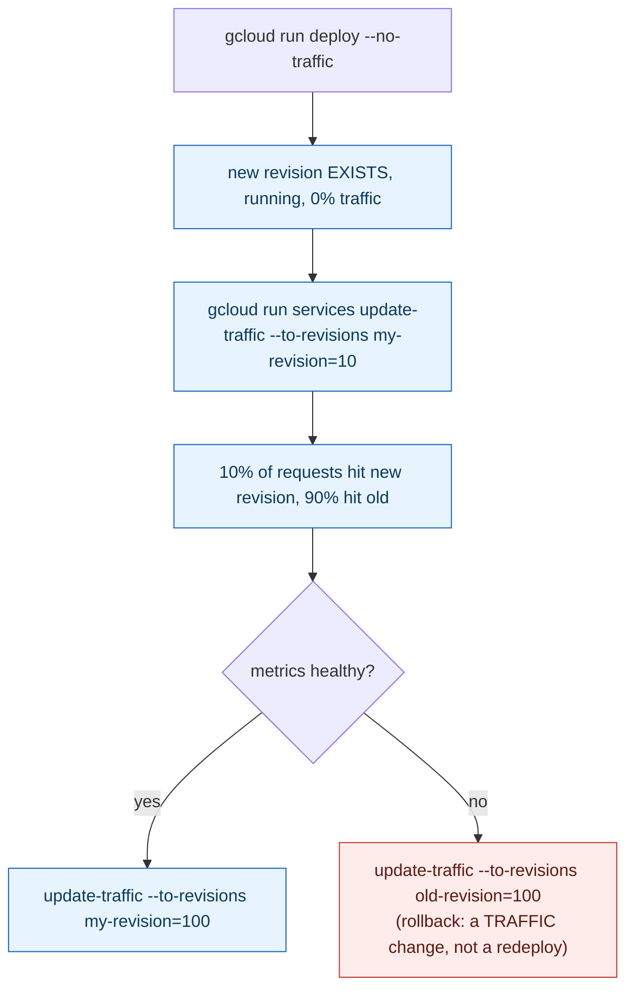

> **In plain English (30 sec):** A focused deep-dive on a specific mechanism or problem pattern.



## 1. The Engineering Problem: "deploy" and "receive traffic" are two different events, and conflating them is what makes a bad release dangerous

The naive CD pipeline treats deployment as one atomic step: build, push, deploy, done  and the instant the new version is deployed, it receives 100% of production traffic. If the new version has a bug that only shows up under real load, every single user hits it simultaneously, and the only remedy is a full rollback after the damage is already done. A canary or blue-green strategy needs to separate two genuinely different operations: *creating* a new, running version of the service, and *deciding how much traffic, if any, that version receives*  and to be able to change the second decision repeatedly and quickly without redeploying anything.

---

## 2. The Technical Solution: deploy without traffic, then move traffic in a separate, explicit step

Cloud Run's revision model makes this split literal, and `google-github-actions/deploy-cloudrun` (the official Google GitHub Action) exposes it directly as two independent operations a workflow can call separately. A revision can be deployed with `no_traffic: true`  it exists, it's running, health checks pass, but it receives 0% of production requests. A *second*, separate command then explicitly assigns traffic percentages, either to named revisions (`revision_traffic: 'my-revision=10'`) or to a stable *tag* pointing at whichever revision currently holds it (`tag_traffic: 'canary=10'`)  and that second step can be re-run repeatedly (10% ? 50% ? 100%) without ever redeploying the underlying code.



The critical property: rollback is a traffic-split operation, not a redeploy. The old revision was never deleted or replaced  it's still running, still holding whatever percentage of traffic it wasn't assigned away from  so "undo" is exactly as fast as "do," and carries none of the risk of a fresh deploy potentially hitting a different failure mode than the one being rolled back from.

---

## 3. The clean example (concept in isolation)

```yaml
- uses: google-github-actions/deploy-cloudrun@v2
  with:
    service: my-app
    image: gcr.io/my-project/my-app:${{ github.sha }}
    no_traffic: true       # deploy WITHOUT shifting any traffic
    tag: canary             # give it a stable URL: canary---my-app-xyz.run.app

- uses: google-github-actions/deploy-cloudrun@v2
  with:
    service: my-app
    tag_traffic: 'canary=10'   # a SEPARATE step: move 10% of traffic to it
```

---

## 4. Production reality (from `google-github-actions/deploy-cloudrun`)

```typescript
// src/main.ts - the action's own source
const noTraffic = (getInput('no_traffic') || '').toLowerCase() === 'true';
const revTraffic = getInput('revision_traffic');
const tagTraffic = getInput('tag_traffic');

if (revTraffic && tagTraffic) {
  throw new Error('Only one of `revision_traffic` or `tag_traffic` inputs can be set.');
}
if ((revTraffic || tagTraffic) && !service) {
  throw new Error('No service name set.');
}
```

```typescript
// deploy step: --no-traffic is a flag on the DEPLOY command
if (noTraffic) deployCmd.push('--no-traffic');
```

```typescript
// traffic step: a COMPLETELY SEPARATE gcloud invocation, run only if traffic inputs were set
let updateTrafficCmd = ['run', 'services', 'update-traffic', service];
if (revTraffic) updateTrafficCmd.push('--to-revisions', revTraffic);
if (tagTraffic) updateTrafficCmd.push('--to-tags', tagTraffic);
// ...
if (revTraffic || tagTraffic) {
  const updateTrafficExec = await getExecOutput(toolCommand, updateTrafficCmd, options);
  if (updateTrafficExec.exitCode !== 0) {
    throw new Error(`failed to update traffic: ...`);
  }
}
```

What this teaches that a hello-world can't:

- **`--no-traffic` is a flag on the `gcloud run deploy` command itself, and `update-traffic` is a genuinely different `gcloud` subcommand entirely**  this is not the action layering an abstraction on top of a single Cloud Run primitive; it's exposing two real, independently-callable Cloud Run operations exactly as they exist underneath, which is why one workflow step can deploy-without-traffic and a *later*, separately-triggered workflow (or even a manual `gcloud` call, or a scheduled promotion job) can shift traffic without needing to know anything about how the revision was built.
- **`revTraffic && tagTraffic` throws  the two traffic-targeting modes are mutually exclusive by design**, and the error is raised in the action's own TypeScript before any `gcloud` command runs at all. Naming a revision directly (`revision_traffic`) versus naming a stable tag that points at whichever revision currently holds it (`tag_traffic`) are different enough operationally  a tag survives across multiple deploys, a revision name doesn't  that mixing them in one call would be ambiguous about which one wins.
- **The traffic-update command only runs `if (revTraffic || tagTraffic)`**  a workflow that never sets either input never calls `update-traffic` at all, meaning ordinary "deploy and immediately serve 100%" behavior is the *default* when neither canary input is used; canary/blue-green is opt-in behavior layered onto the same action, not a fork of it.

Known-stale fact: canary and blue-green deployment are sometimes described as requiring a dedicated deployment tool or service mesh (Argo Rollouts, Flagger, Istio traffic splitting) to be technically possible at all. Cloud Run's own revision-and-traffic-split model, driven directly from two `gcloud` commands an official GitHub Action already wraps, delivers the same "deploy without exposure, then shift traffic gradually, roll back by re-splitting rather than redeploying" mechanics with no mesh or extra control-plane component required  the primitive is native to the platform, not bolted on.

---

## Source

- **Concept:** Continuous Deployment strategies (blue-green/canary via Actions)
- **Domain:** cicd
- **Repo:** [google-github-actions/deploy-cloudrun](https://github.com/google-github-actions/deploy-cloudrun) ? [`src/main.ts`](https://github.com/google-github-actions/deploy-cloudrun/blob/main/src/main.ts), [`README.md`](https://github.com/google-github-actions/deploy-cloudrun/blob/main/README.md)  Google's own official GitHub Action for Cloud Run deployments.



