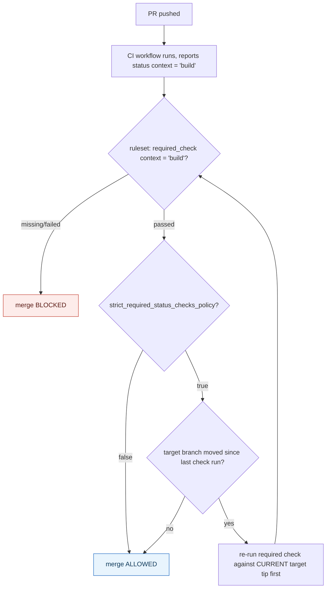

## 1. The Engineering Problem: a CI result is just information unless something enforces it

A workflow reporting red or green is, by itself, just a status update — nothing about running CI *prevents* a merge. Without an explicit enforcement layer, a red build and a green build are both mergeable by clicking the same button; the signal exists, but nothing is wired to act on it. Worse, "wired to act on it" has to answer several sharper questions too: tested against *which* commit — the PR branch as it was pushed, or as it would look merged into the current tip of main (which may have moved since)? Required for *everyone*, or can specific people or bots bypass it for a hotfix? One team's answer to these questions for one repo, versus another repo's answer, has to be expressible and auditable, not a checkbox someone remembers to click in a settings page.

---

## 2. The Technical Solution: a ruleset names required check contexts and can demand a same-code re-test, as code

GitHub's Repository Ruleset model — the current, recommended replacement for older "classic" per-branch protection settings — expresses required status checks as a rule with two separable properties. `required_check { context = "..." }` names the exact CI job/context string that must report success. `strict_required_status_checks_policy` is a separate boolean: when true, a PR must be re-tested against the *latest* state of the target branch before merging, not just whatever the target branch looked like when the PR was last pushed — closing the gap where a check passed against stale code that has since drifted from what will actually land after the merge.



Rulesets are also composable in a way classic branch protection wasn't: multiple rulesets can apply to the same branch simultaneously — one requiring status checks, a separate one requiring code-owner review, another restricting who can bypass — each independently scoped, rather than one monolithic protection config per branch name pattern.

---

## 3. The clean example (concept in isolation)

```hcl
resource "github_repository_ruleset" "main_protection" {
  name        = "protect-main"
  repository  = "my-repo"
  target      = "branch"
  enforcement = "active"

  conditions {
    ref_name { include = ["~DEFAULT_BRANCH"], exclude = [] }
  }

  rules {
    pull_request {
      required_approving_review_count = 1
    }

    required_status_checks {
      required_check { context = "build" }
      required_check { context = "test" }
      strict_required_status_checks_policy = true   # must re-test against LATEST main
    }
  }
}
```

---

## 4. Production reality (from `integrations/terraform-provider-github`)

```hcl
# real resource schema, from the provider's own documented example
resource "github_repository_ruleset" "example" {
  name        = "example"
  repository  = github_repository.example.name
  target      = "branch"
  enforcement = "active"

  conditions {
    ref_name {
      include = ["~ALL"]
      exclude = []
    }
  }

  bypass_actors {
    actor_id    = 13473
    actor_type  = "Integration"   # a specific GitHub App can bypass
    bypass_mode = "always"
  }

  rules {
    creation                = true
    update                  = true
    deletion                = true
    required_linear_history = true
    required_signatures     = true
  }
}
```

The provider's own field documentation for the status-check rule:

```
rules.required_status_checks:
  required_check (Required, Block Set, Min: 1)
    - context (Required, String) — status check context name that must be present
    - integration_id (Optional, Number) — the check must originate from THIS GitHub App
  strict_required_status_checks_policy (Optional, Boolean, default false)
    — PRs must be tested with the LATEST code before merge
  do_not_enforce_on_create (Optional, Boolean, default false)
    — allow branch/repo CREATION even if a check would otherwise block it
```

What this teaches that a hello-world can't:

- **`integration_id` scoped to a specific `context`** means a required check isn't just matched by name string — it can be pinned to originate from one specific GitHub App's identity. Without it, anything capable of setting a commit status with the matching context string (including a compromised token) could satisfy the requirement; pinning the App ID closes that gap.
- **`bypass_actors` takes `actor_type = "Integration"`, not just a human team or user** — real repos wire specific automation (a release bot, a dependency-update App) to bypass a ruleset's rules with `bypass_mode = "always"`, distinct from `bypass_mode` values that only apply during specific operations like a pull request merge — bypass is a first-class, actor-scoped, mode-scoped concept, not a blanket "admins can always force-push" escape hatch.
- **`do_not_enforce_on_create` exists as its own separate boolean from the check requirement itself** — a repo can require status checks on every *update* to a branch while still allowing that branch (or the repository) to be *created* in the first place even before any check has ever run against it, a real ordering problem ("the check can't exist before the branch does") that a single blanket "require checks" toggle can't express.

Known-stale fact: "classic" branch protection (one settings object per branch-name pattern, configured via the older `github_branch_protection`/`branch_protection_v3` REST-backed Terraform resources) is sometimes assumed to be the only or current mechanism. The same provider now documents `github_repository_ruleset` as the current model precisely because rulesets solve what classic protection couldn't: multiple independently-scoped rulesets composing on the same branch, `target`-based rules that also cover `tag` and `push` events (not just branches), and per-bypass-actor granularity — the provider carries both resources side by side today as living evidence of that transition, not a retired API replaced outright.

---

## Source

- **Concept:** Branch protection & required status checks
- **Domain:** cicd
- **Repo:** [integrations/terraform-provider-github](https://github.com/integrations/terraform-provider-github) → [`docs/resources/repository_ruleset.md`](https://github.com/integrations/terraform-provider-github/blob/main/docs/resources/repository_ruleset.md) — the community-maintained, widely-used Terraform provider's own resource documentation for GitHub's current branch-protection mechanism.
