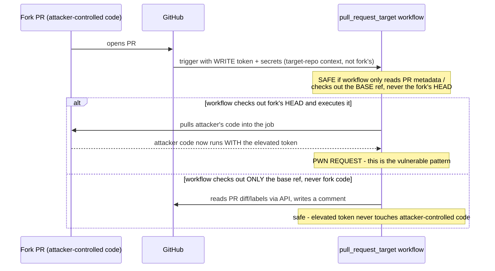

> **In plain English (30 sec):** A focused deep-dive on a specific mechanism or problem pattern.



## 1. The Engineering Problem: three separate attack surfaces converge in one ordinary CI workflow

A third-party action referenced by a mutable tag (`@v4`) can be silently repointed to malicious code if that tag is ever force-moved  the 2025 `tj-actions/changed-files` compromise is a real, documented incident where exactly this happened. Pinning to a commit SHA fixes that, but a SHA never updates itself; a repo either freezes on one commit forever (missing real fixes, including security ones) or needs an active process to bump it safely. Separately, `GITHUB_TOKEN`'s permissions matter even for trustworthy actions: broader write access than a job actually needs just enlarges the blast radius if anything in that job is later compromised. And a third, sharper problem: `pull_request_target` (the trigger needed to let a workflow post PR comments or use secrets for pull requests from *forks*, which the plain `pull_request` trigger can't do) hands a workflow elevated permissions and secret access *while a fork's PR is open*  if that same workflow also checks out and runs the fork's own code, the fork's code runs with the elevated token. This is the real, named "pwn request" pattern.

---

## 2. The Technical Solution: pin by SHA with an update path, minimize the token, and never execute fork content under elevated permissions



Three concrete, separately-verifiable practices close these gaps: **pin every third-party action to a full commit SHA**, with a human-readable `# vX.Y.Z` comment alongside it for auditability, and let Dependabot's `github-actions` ecosystem support open PRs that bump the pin when a new release exists  the SHA stays a fixed, auditable commit, but isn't stuck there forever. **Scope `permissions:` down explicitly** to only what a workflow needs (`contents: read`, plus `pull-requests: write` only if it actually posts comments), rather than relying on default token scope. **Never let a `pull_request_target`-triggered workflow check out or execute the fork's own head commit**  if it needs the fork's code at all, that has to happen in a separate, unprivileged `pull_request`-triggered workflow instead, with results passed across via `workflow_run`.

---

## 3. The clean example (concept in isolation)

```yaml
name: PR comment
on:
  pull_request_target:   # needed for write access on fork PRs
    types: [opened, synchronize]

permissions:
  contents: read          # NOT the broad default
  pull-requests: write    # only what this job actually does

jobs:
  comment:
    runs-on: ubuntu-latest
    steps:
      - uses: actions/checkout@9c091bb21b7c1c1d1991bb908d89e4e9dddfe3e0 # v7.0.0
        with:
          ref: ${{ github.base_ref }}   # the TARGET branch, never the fork's head
      - uses: actions/github-script@3a2844b7e9c422d3c10d287c895573f7108da1b3 # v9.0.0
        with:
          script: 'github.rest.issues.createComment({...})'
```

```yaml
# .github/dependabot.yml
- package-ecosystem: github-actions
  directory: /
  schedule: {interval: monthly}
```

---

## 4. Production reality (from `hashicorp/terraform`)

```yaml
# .github/workflows/enforce-changelog.yml
# The pull_request_target trigger event allows PRs raised from forks to have write permissions and access secrets.
# We use it in this workflow to enable writing comments to the PR.
#
# Do not extend this workflow to include checking out the code (e.g. for building and testing
# purposes) while the pull_request_target trigger is used.
# Instead, see use of workflow_run in https://securitylab.github.com/resources/github-actions-preventing-pwn-requests/
on:
  pull_request_target:
    types: [opened, ready_for_review, reopened, synchronize, labeled, unlabeled]

permissions:
    contents: read
    pull-requests: write

jobs:
  check-changelog-entry:
    steps:
      - uses: dorny/paths-filter@fbd0ab8f3e69293af611ebaee6363fc25e6d187d # v4.0.1
        with:
          filters: |
            changelog:
              - 'CHANGELOG.md'

      - uses: actions/checkout@9c091bb21b7c1c1d1991bb908d89e4e9dddfe3e0 # v7.0.0
        with:
          sparse-checkout: |
            version/VERSION
          sparse-checkout-cone-mode: false
          ref: ${{ github.base_ref }}   # base ref = TARGET branch, not the fork's PR head
```

```yaml
# .github/dependabot.yml
- package-ecosystem: github-actions
  directory: /
  schedule:
    interval: monthly
  groups:
    github-actions-breaking:
      update-types: [major]
    github-actions-backward-compatible:
      update-types: [minor, patch]
```

What this teaches that a hello-world can't:

- **The workflow's own comment names the exact vulnerability it's avoiding, with a citation.** This isn't a hardening practice inferred from best-practice lists  the repo's own maintainers wrote, verbatim, "Do not extend this workflow to include checking out the code... while the pull_request_target trigger is used," pointing at GitHub's own Security Lab writeup on the pwn-request pattern. That's a real team encoding a real, previously-learned lesson directly into the file most likely to be extended carelessly later.
- **`actions/checkout` is used with `ref: ${{ github.base_ref }}` and a `sparse-checkout` limited to one file (`version/VERSION`)**  even the checkout that *does* happen in this elevated-permission workflow pulls only the target branch's own file, never the fork's contributed commit, and only the one path actually needed. Two independent restrictions (which ref, which paths) stacked on the one checkout step that could otherwise have been the pwn-request vector.
- **Dependabot's `github-actions` ecosystem groups updates by `update-types: [major]` versus `[minor, patch]`**  a SHA-pinned action bump is exactly the kind of change that needs human review before merging (a new commit SHA is, mechanically, a totally different, unverified piece of code until reviewed), and separating breaking-risk bumps from routine ones lets a maintainer apply a different review bar to each group rather than treating every pin update identically.

Known-stale fact: pinning a third-party action to a mutable version tag (`@v4`) is sometimes treated as sufficient supply-chain protection on its own. It is not  the tag can be force-moved to point at different, unreviewed code without the pinning repo's knowledge, which is exactly what happened in the real, documented 2025 `tj-actions/changed-files` compromise. Pinning to a full commit SHA closes that specific gap, but only if something (Dependabot's `github-actions` ecosystem, or an equivalent process) keeps that pin from silently aging past the point where it's missing real security fixes  SHA-pinning and an update process are a pair, not a single fix.

---

## Source

- **Concept:** Security hardening (SHA-pinning actions, `GITHUB_TOKEN` permissions, supply-chain risk)
- **Domain:** cicd
- **Repo:** [hashicorp/terraform](https://github.com/hashicorp/terraform) ? [`.github/workflows/enforce-changelog.yml`](https://github.com/hashicorp/terraform/blob/main/.github/workflows/enforce-changelog.yml), [`.github/dependabot.yml`](https://github.com/hashicorp/terraform/blob/main/.github/dependabot.yml)  a large, real project's production security-hardened pull-request automation.



