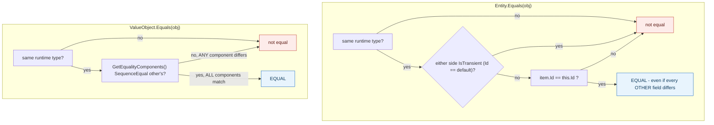

**TL;DR:** Why does one field on `Order` (its `Address`) get its own class with no ID, while everything else doesn't? Because `Address` is a Value Object — equal only if every one of its fields matches, with no identity concept at all — while `Order` is an Entity, equal only by its `Id` regardless of what its other fields say, so each needs a different equality rule implemented as a different base class.

**Real repo:** [`dotnet/eShop`](https://github.com/dotnet/eShop)

## 1. The Engineering Problem: "are these two the same thing?" has two different correct answers in one domain model

A domain model constantly needs to answer "are these two objects the same thing?" — but the correct answer genuinely depends on *what* is being compared. Two `Order` records with identical dates, items, and status are still two *different* orders if they have different order numbers — comparing every field would wrongly conclude they're interchangeable. But two `Address` values with an identical street, city, and zip code genuinely *are* interchangeable — there's no meaningful "identity" to an address beyond what it says. Using one equality rule for both kinds of objects gets one of them wrong.

---

## 2. The Technical Solution: identity-based equality for Entities, structural equality for Value Objects — as two literal, different base classes

An **Entity** is equal to another object only if it's the *same type* and has the *same identity* (an `Id`) — every other field can differ, or change over the entity's lifetime, without it becoming "a different" entity. A **Value Object** has no identity field at all; it's equal to another instance only if *every one of its defining components* matches — change any component and it's a genuinely different value, not the same value object with an updated field.



A sharp edge the identity rule has to handle explicitly: two brand-new, not-yet-persisted entities both have no real `Id` assigned yet (`IsTransient()` — the id equals its type's default value). Comparing two transients by `Id` would wrongly say every new, unsaved entity is equal to every other one — so the equality check treats *any* transient comparison as unequal, falling back to reference identity instead.

---

## 3. The clean example (concept in isolation)

```csharp
public abstract class Entity {
    public int Id { get; protected set; }
    bool IsTransient() => Id == default;

    public override bool Equals(object obj) {
        if (obj is not Entity other || GetType() != other.GetType()) return false;
        if (IsTransient() || other.IsTransient()) return false;   // two "new" entities aren't equal
        return Id == other.Id;
    }
}

public abstract class ValueObject {
    protected abstract IEnumerable<object> GetEqualityComponents();
    public override bool Equals(object obj) {
        if (obj is not ValueObject other || GetType() != other.GetType()) return false;
        return GetEqualityComponents().SequenceEqual(other.GetEqualityComponents());
    }
}
```

---

## 4. Production reality (from `dotnet/eShop`)

```
src/Ordering.Domain/
├── SeedWork/
│   ├── Entity.cs         # base class for identity-equality types
│   └── ValueObject.cs    # base class for structural-equality types
└── AggregatesModel/OrderAggregate/
    ├── Order.cs           # : Entity, IAggregateRoot
    └── Address.cs         # : ValueObject
```

```csharp
// SeedWork/Entity.cs
public override bool Equals(object obj)
{
    if (obj == null || !(obj is Entity)) return false;
    if (Object.ReferenceEquals(this, obj)) return true;
    if (this.GetType() != obj.GetType()) return false;

    Entity item = (Entity)obj;
    if (item.IsTransient() || this.IsTransient())
        return false;               // two unsaved entities are NOT considered equal
    else
        return item.Id == this.Id;  // identity, not field comparison
}
```

```csharp
// SeedWork/ValueObject.cs
public override bool Equals(object obj)
{
    if (obj == null || obj.GetType() != GetType()) return false;
    var other = (ValueObject)obj;
    return this.GetEqualityComponents().SequenceEqual(other.GetEqualityComponents());
}
```

```csharp
// AggregatesModel/OrderAggregate/Order.cs
public class Order : Entity, IAggregateRoot
{
    // Address is a Value Object pattern example persisted as EF Core 2.0 owned entity
    [Required]
    public Address Address { get; private set; }
    // ... OrderDate, OrderStatus, OrderItems, etc. - none of these define Order's identity
}
```

```csharp
// AggregatesModel/OrderAggregate/Address.cs
public class Address : ValueObject
{
    public string Street { get; private set; }
    public string City { get; private set; }
    // ... State, Country, ZipCode

    protected override IEnumerable<object> GetEqualityComponents()
    {
        yield return Street;
        yield return City;
        yield return State;
        yield return Country;
        yield return ZipCode;
    }
}
```

What this teaches that a hello-world can't:

- **The `Order` class itself carries a code comment identifying `Address` as "a Value Object pattern example"** — this is the team's own domain model explicitly flagging the distinction for future readers of the code, not a label applied externally in this lesson.
- **`Address` has no `Id` property at all — not an unused one, an *absent* one.** `Order` inherits `Id` from `Entity` because an order needs to be looked up, referenced, and distinguished from every other order regardless of what its fields currently say. `Address` has nothing to look up *by* — its only defining information is its five fields, which is exactly what `GetEqualityComponents()` returns.
- **`Entity.Equals` explicitly excludes comparing two transient (unsaved) entities as equal**, even though both would otherwise share the same default `Id` value (`0` or `default`). Without that `IsTransient()` guard, every newly-constructed, not-yet-saved `Order` would be considered "equal" to every other newly-constructed `Order` purely because neither has been assigned a real database identity yet — a real bug class the base class exists specifically to prevent.

Known-stale fact: value objects are sometimes implemented as simple structs or plain records "for immutability" without deliberately implementing structural equality — but immutability and value-based equality are two separate properties. A C# `record` gets structural equality for free from the compiler, but a hand-written `class` (as `Address` is here) needs `GetEqualityComponents()` (or equivalent) written explicitly, or it silently falls back to reference equality — two `Address` instances with identical fields would incorrectly compare as *not equal* without this override.

---

## Source

- **Concept:** Entities vs value objects
- **Domain:** ddd
- **Repo:** [dotnet/eShop](https://github.com/dotnet/eShop) → [`src/Ordering.Domain/SeedWork/Entity.cs`](https://github.com/dotnet/eShop/blob/main/src/Ordering.Domain/SeedWork/Entity.cs), [`ValueObject.cs`](https://github.com/dotnet/eShop/blob/main/src/Ordering.Domain/SeedWork/ValueObject.cs), [`AggregatesModel/OrderAggregate/Order.cs`](https://github.com/dotnet/eShop/blob/main/src/Ordering.Domain/AggregatesModel/OrderAggregate/Order.cs), [`Address.cs`](https://github.com/dotnet/eShop/blob/main/src/Ordering.Domain/AggregatesModel/OrderAggregate/Address.cs) — a real, actively maintained DDD reference implementation.


