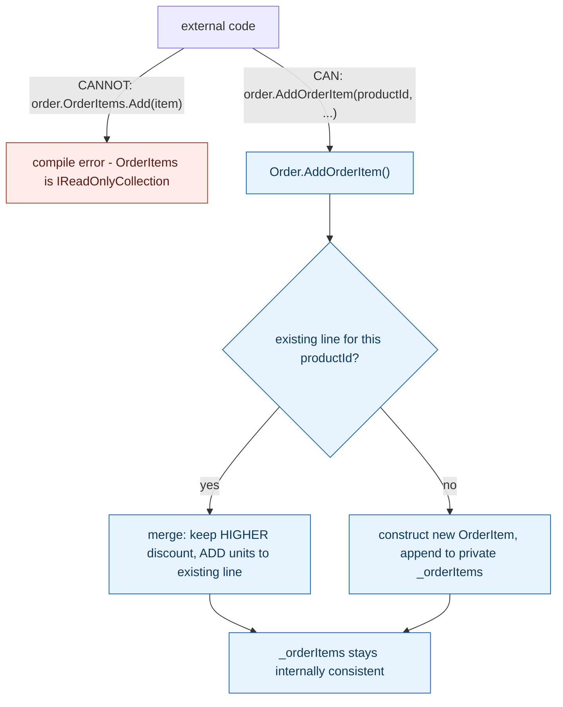

**TL;DR:** Why can't you just call `orderItems.Add()` directly on an order's item list? Because the aggregate root (`Order`) is the only object in the cluster reachable from outside it — the item collection is exposed only as read-only, so every mutation must go through `Order`'s own methods (like `AddOrderItem`), which is what lets the root enforce business rules and keep the whole graph consistent.

> **In plain English (30 sec):** Code you already write — Map, function, API call, just bigger.

**Real repo:** [`dotnet/eShop`](https://github.com/dotnet/eShop)

## 1. The Engineering Problem: a graph of related objects needs one place where "is this still valid?" gets checked

An order and its line items are obviously related — but if any code anywhere can freely mutate the item collection directly, nothing guarantees the order stays internally consistent. Adding a duplicate product line instead of merging it, adding an item after the order has already shipped, applying a lower discount when a higher one was already recorded — none of these violate the compiler, but all of them violate the *business's* definition of a valid order. Something has to own "is this whole graph still valid?" as a single, non-bypassable responsibility, or every call site touching the order has to independently remember and re-implement those rules.

---

## 2. The Technical Solution: one object owns the consistency boundary; everything reachable through it is only mutated through it

A DDD **aggregate** is a cluster of objects (here: an `Order` and its `OrderItem`s) treated as one consistency unit, transacted and loaded together. The **aggregate root** — `Order` — is the only object in that cluster reachable from outside it; every other member (`OrderItem`) is only ever reached and mutated *through* the root's own methods, never directly. This is enforced at the language level, not just by convention: the item collection is a `private readonly List<OrderItem>`, exposed externally only as `IReadOnlyCollection<OrderItem>` — there is no `Add`/`Remove` method on the public surface at all, only `AddOrderItem(...)` on `Order` itself, which can run whatever business rules the order needs before anything actually changes.



The same boundary applies to state, not just collections: `SetShippedStatus()` checks `OrderStatus != OrderStatus.Paid` and throws before allowing the transition — the order itself refuses an invalid state change rather than trusting every caller to check first. Cross-aggregate transactions are avoided for the same reason the boundary exists at all: if a transaction spans two different aggregate roots, there are now two places responsible for "is this consistent," which defeats the entire point of having one.

---

## 3. The clean example (concept in isolation)

```csharp
public class Order : Entity, IAggregateRoot
{
    private readonly List<OrderItem> _orderItems = new();
    public IReadOnlyCollection<OrderItem> OrderItems => _orderItems.AsReadOnly();  // read-only from outside

    public void AddOrderItem(int productId, decimal unitPrice, decimal discount, int units)
    {
        var existing = _orderItems.SingleOrDefault(i => i.ProductId == productId);
        if (existing != null)
        {
            if (discount > existing.Discount) existing.SetNewDiscount(discount);
            existing.AddUnits(units);
        }
        else
        {
            _orderItems.Add(new OrderItem(productId, unitPrice, discount, units));
        }
    }
}
```

---

## 4. Production reality (from `dotnet/eShop`)

```
src/Ordering.Domain/
├── SeedWork/
│   └── IAggregateRoot.cs         # marker interface - literally empty
└── AggregatesModel/OrderAggregate/
    ├── Order.cs                  # : Entity, IAggregateRoot - the ONLY entry point
    ├── OrderItem.cs               # reachable ONLY through Order
    └── IOrderRepository.cs       # a repository exists for Order - NOT for OrderItem
```

```csharp
// SeedWork/IAggregateRoot.cs - a marker interface, no members at all
public interface IAggregateRoot { }
```

```csharp
// Order.cs
// DDD Patterns comment
// This Order AggregateRoot's method "AddOrderItem()" should be the only way to add Items to the Order,
// so any behavior (discounts, etc.) and validations are controlled by the AggregateRoot
// in order to maintain consistency between the whole Aggregate.
public void AddOrderItem(int productId, string productName, decimal unitPrice, decimal discount, string pictureUrl, int units = 1)
{
    var existingOrderForProduct = _orderItems.SingleOrDefault(o => o.ProductId == productId);
    if (existingOrderForProduct != null)
    {
        if (discount > existingOrderForProduct.Discount)
            existingOrderForProduct.SetNewDiscount(discount);
        existingOrderForProduct.AddUnits(units);
    }
    else
    {
        var orderItem = new OrderItem(productId, productName, unitPrice, discount, pictureUrl, units);
        _orderItems.Add(orderItem);
    }
}

public void SetShippedStatus()
{
    if (OrderStatus != OrderStatus.Paid)
    {
        StatusChangeException(OrderStatus.Shipped);   // refuses an invalid transition itself
    }
    OrderStatus = OrderStatus.Shipped;
    AddDomainEvent(new OrderShippedDomainEvent(this));
}
```

```csharp
// IOrderRepository.cs
// This is just the RepositoryContracts or Interface defined at the Domain Layer
// as requisite for the Order Aggregate
public interface IOrderRepository : IRepository<Order>
{
    Order Add(Order order);
    void Update(Order order);
    Task<Order> GetAsync(int orderId);
}
```

What this teaches that a hello-world can't:

- **`IAggregateRoot` has zero members — it's a pure marker.** Its only job is to be checkable at compile time or via reflection ("does this type represent an aggregate root?"), not to define behavior. `IOrderRepository` requires a generic `IRepository<Order>` constraint elsewhere in this codebase that itself is scoped to types implementing `IAggregateRoot` — repositories exist *only* for aggregate roots, never for the objects inside them (there's no `IOrderItemRepository` anywhere in this domain), which is the concrete, enforced consequence of "only the root is reachable from outside."
- **`AddOrderItem`'s merge behavior — keep the *higher* discount, add units to the existing line rather than creating a duplicate — is business logic that only exists in this one method.** If external code could append directly to `_orderItems`, this rule would either need to be duplicated at every call site or would simply not be enforced at all; centralizing it in the root is what makes it enforceable in the first place, not just documented.
- **`SetShippedStatus` checks its own current state before transitioning**, throwing rather than assuming the caller already validated the order was `Paid`. This is the same consistency-boundary principle applied to a status field instead of a collection — the aggregate root protects its own invariants regardless of which specific piece of state is being changed.

Known-stale fact: "aggregate" is sometimes read as just meaning "a bigger object with sub-objects inside it," making it seem interchangeable with a plain composed class or a database join. The specific claim an aggregate makes is narrower and stronger: everything *inside* the boundary is only ever mutated *through* the root, and everything *outside* the boundary should be modified in a **separate** transaction, referenced only by the root's identity (an ID) — never loaded and saved together in the same transaction as a different aggregate. That second half — the transactional isolation between aggregates, not just the internal encapsulation — is the part most often dropped when the term gets used loosely.

---

## Source

- **Concept:** Aggregates & aggregate roots
- **Domain:** ddd
- **Repo:** [dotnet/eShop](https://github.com/dotnet/eShop) → [`src/Ordering.Domain/SeedWork/IAggregateRoot.cs`](https://github.com/dotnet/eShop/blob/main/src/Ordering.Domain/SeedWork/IAggregateRoot.cs), [`AggregatesModel/OrderAggregate/Order.cs`](https://github.com/dotnet/eShop/blob/main/src/Ordering.Domain/AggregatesModel/OrderAggregate/Order.cs), [`IOrderRepository.cs`](https://github.com/dotnet/eShop/blob/main/src/Ordering.Domain/AggregatesModel/OrderAggregate/IOrderRepository.cs) — a real, actively maintained DDD reference implementation.


