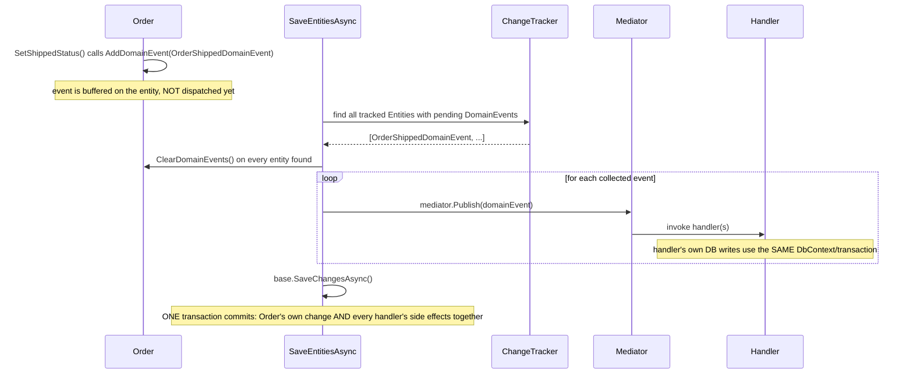

**TL;DR:** If a domain event handler fails, does the order status change still get saved? No — domain events are dispatched right before `SaveChanges`, in the same transaction as the state change, so if a handler throws, the commit never runs and the order's own change is rolled back along with it.

**Real repo:** [`dotnet/eShop`](https://github.com/dotnet/eShop)

## 1. The Engineering Problem: "this happened" needs to reach other code without the aggregate calling that code directly

When an `Order` transitions to `Shipped`, other parts of the system legitimately need to react — but `Order` itself shouldn't be the one deciding *who* reacts or calling into their code directly. If `SetShippedStatus()` had to know about every downstream consumer of "an order shipped," the aggregate would be coupled to infrastructure concerns (notifications, other bounded contexts, logging) that have nothing to do with what makes an order valid. Something needs to record "this meaningful thing happened" as a fact, decoupled from who's listening or what they'll do about it — and a separate, sharper question needs an explicit answer: if a handler reacting to that fact fails, should the state change that triggered it still get saved?

---

## 2. The Technical Solution: buffer events on the entity, then dispatch them in-process before the same transaction commits

A domain event is a plain object implementing `INotification`, and an entity's own `AddDomainEvent(...)` method (inherited from the shared `Entity` base) just appends it to an in-memory list — no dispatch happens at the moment the event is added. Dispatch happens later, at the *persistence* boundary: right before `SaveChanges` is called, every tracked entity with pending events is found via the EF Core change tracker, all their events are collected and immediately cleared from the entities (so nothing gets published twice), and only *then* is each event published through an in-process mediator — with handlers running, and potentially writing further changes, **before** the database commit actually happens.



The consequence directly answers the opening question: if a handler throws, `SaveChangesAsync` never runs — the order's own status change is rolled back along with whatever the failed handler was doing, because both live in the same transaction. This is a deliberate design choice, not the only possible one — dispatching *after* commit instead would mean the order's change is already durable regardless of what handlers do, at the cost of needing compensating actions if a handler later fails.

---

## 3. The clean example (concept in isolation)

```csharp
public abstract class Entity {
    private List<INotification> _domainEvents;
    public IReadOnlyCollection<INotification> DomainEvents => _domainEvents?.AsReadOnly();
    public void AddDomainEvent(INotification e) => (_domainEvents ??= new()).Add(e);
    public void ClearDomainEvents() => _domainEvents?.Clear();
}

async Task<bool> SaveEntitiesAsync() {
    var entitiesWithEvents = ChangeTracker.Entries<Entity>()
        .Where(e => e.Entity.DomainEvents?.Any() == true)
        .Select(e => e.Entity).ToList();

    var events = entitiesWithEvents.SelectMany(e => e.DomainEvents).ToList();
    entitiesWithEvents.ForEach(e => e.ClearDomainEvents());   // clear BEFORE publishing

    foreach (var evt in events) await _mediator.Publish(evt);  // handlers run first...
    return await base.SaveChangesAsync() > 0;                  // ...THEN commit
}
```

---

## 4. Production reality (from `dotnet/eShop`)

```csharp
// Ordering.Infrastructure/MediatorExtension.cs
static class MediatorExtension
{
    public static async Task DispatchDomainEventsAsync(this IMediator mediator, OrderingContext ctx)
    {
        var domainEntities = ctx.ChangeTracker
            .Entries<Entity>()
            .Where(x => x.Entity.DomainEvents != null && x.Entity.DomainEvents.Any());

        var domainEvents = domainEntities.SelectMany(x => x.Entity.DomainEvents).ToList();

        domainEntities.ToList().ForEach(entity => entity.Entity.ClearDomainEvents());

        foreach (var domainEvent in domainEvents)
            await mediator.Publish(domainEvent);
    }
}
```

```csharp
// Ordering.Infrastructure/OrderingContext.cs
public async Task<bool> SaveEntitiesAsync(CancellationToken cancellationToken = default)
{
    // Dispatch Domain Events collection.
    // Choices:
    // A) Right BEFORE committing data (EF SaveChanges) into the DB will make a single transaction
    //    including side effects from the domain event handlers which are using the same DbContext
    //    with "InstancePerLifetimeScope" or "scoped" lifetime
    // B) Right AFTER committing data (EF SaveChanges) into the DB will make multiple transactions.
    //    You will need to handle eventual consistency and compensatory actions in case of failures
    //    in any of the Handlers.
    await _mediator.DispatchDomainEventsAsync(this);

    // After executing this line all the changes (from the Command Handler and Domain Event Handlers)
    // performed through the DbContext will be committed
    _ = await base.SaveChangesAsync(cancellationToken);
    return true;
}
```

```csharp
// Ordering.Domain/Events/OrderShippedDomainEvent.cs
public class OrderShippedDomainEvent : INotification
{
    public Order Order { get; }
    public OrderShippedDomainEvent(Order order) => Order = order;
}
```

What this teaches that a hello-world can't:

- **The comment in `SaveEntitiesAsync` names both options (A/B) explicitly and states which one this codebase chose, and why.** This isn't an implicit consequence a reader has to infer from the code's behavior — the team documented the tradeoff directly at the point of decision, including the specific risk of the alternative ("you will need to handle eventual consistency and compensatory actions").
- **`ClearDomainEvents()` runs *before* `mediator.Publish`, not after.** If a handler itself calls `AddDomainEvent` on the same or another entity as part of its own logic (a legitimate, common pattern — one event's handler raising a further event), clearing first means the *original* batch can't be accidentally re-collected and re-published in the same dispatch pass; only a genuinely new call to `SaveEntitiesAsync` would pick up newly-added events.
- **`modelBuilder.UseIntegrationEventLogs()` appears in the same `OrderingContext`, right next to the domain-event dispatch logic — but it's a completely separate mechanism.** Domain events here are in-process, same-transaction, handled via MediatR. Integration events (published to other *services*, not just other handlers within this same process) go through a logged outbox table instead, specifically because crossing a process/service boundary can't share this transaction the way an in-process `mediator.Publish` call can.

Known-stale fact: "domain event" and "integration event" are sometimes used interchangeably, since both represent "something happened." This codebase keeps them structurally distinct on purpose: a domain event (`INotification`, dispatched via MediatR, handled in-process, inside the *same* transaction as the state change) is not the same mechanism as an integration event (persisted to an event log table via `UseIntegrationEventLogs()`, published to other services after commit, consumed asynchronously). Conflating them leads to either publishing cross-service messages inside a database transaction that might roll back, or expecting in-process, same-transaction guarantees from a mechanism that's actually eventually consistent.

---

## Source

- **Concept:** Domain events (tactical modeling)
- **Domain:** ddd
- **Repo:** [dotnet/eShop](https://github.com/dotnet/eShop) → [`src/Ordering.Infrastructure/MediatorExtension.cs`](https://github.com/dotnet/eShop/blob/main/src/Ordering.Infrastructure/MediatorExtension.cs), [`OrderingContext.cs`](https://github.com/dotnet/eShop/blob/main/src/Ordering.Infrastructure/OrderingContext.cs), [`src/Ordering.Domain/Events/OrderShippedDomainEvent.cs`](https://github.com/dotnet/eShop/blob/main/src/Ordering.Domain/Events/OrderShippedDomainEvent.cs) — a real, actively maintained DDD reference implementation.
