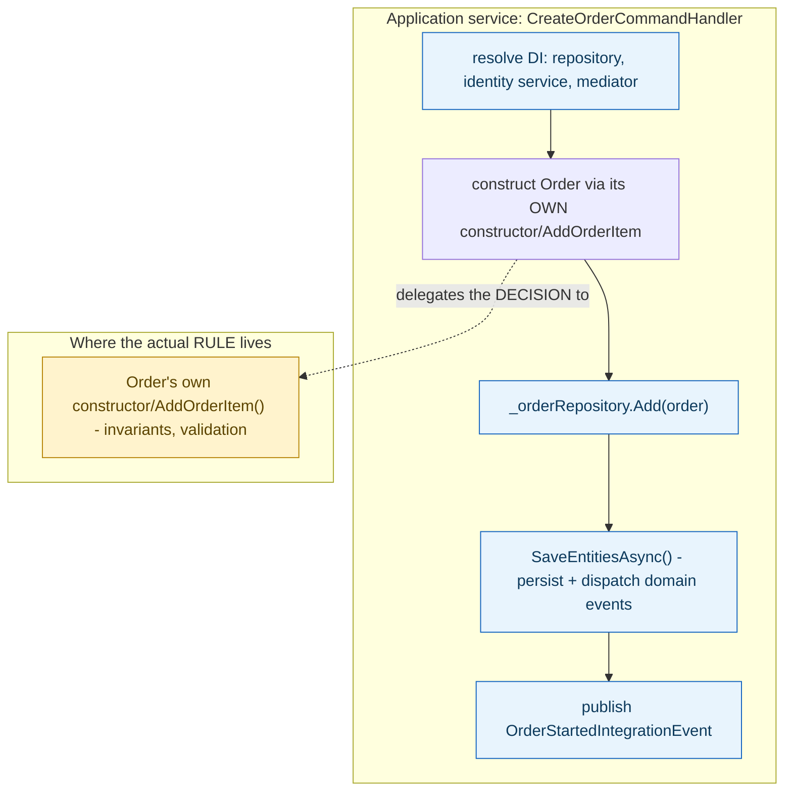

**TL;DR:** A command handler orchestrates — so who decides an order's grace period expired? In theory, a domain service should; in this codebase's actual production code, it's a raw SQL query run from a separate background worker, while the command handler itself only sequences steps and delegates every real decision to the aggregate's own constructor and methods.
> **In plain English (30 sec):** Think of this like concepts you already use, but in a production system at scale.


**Real repo:** [`dotnet/eShop`](https://github.com/dotnet/eShop)

## 1. The Engineering Problem: not all logic fits neatly "on" one aggregate, and orchestration isn't a business rule either

Some logic clearly belongs on a single aggregate — "does this order transition validly from Paid to Shipped?" is `Order`'s own business to decide. But other logic doesn't fit any one instance: "which submitted orders have sat unconfirmed past their grace period?" isn't a question any single `Order` can answer about itself — it's a policy over the whole collection. Meanwhile, a completely different kind of logic — "load the repository, construct the aggregate, save it, publish an integration event, log it" — is real work every use case needs, but none of *it* is a business rule either; it's coordination. Conflating these three (single-aggregate rule, cross-aggregate policy, and pure orchestration) into one layer makes it hard to tell, later, which parts encode the actual business meaning and which parts are just plumbing.

---

## 2. The Technical Solution: an application service coordinates and delegates; domain logic — even logic that doesn't fit one aggregate — is a separate concern

An **application service** (a MediatR command handler, here) coordinates a use case: it resolves dependencies via DI, loads/creates the aggregate, calls the aggregate's own methods (never re-implementing what the aggregate should decide for itself), persists the result, and handles cross-cutting concerns like logging and publishing integration events. It deliberately contains *no* business rules of its own — every actual decision is delegated to the aggregate's constructor or methods. A **domain service**, by contrast, would hold logic that's genuinely part of the domain but doesn't belong to any single aggregate instance — logic that has to reason across many instances or coordinate between different aggregate types.



The sharper, more honest lesson is what happens to policy logic that spans a whole collection rather than one aggregate — like "which orders exceeded their grace period." Textbook DDD says this belongs in a domain service, reasoning over aggregates loaded through the repository. Real production code doesn't always draw that line cleanly.

---

## 3. The clean example (concept in isolation)

```csharp
// application service: orchestration only
public class CreateOrderCommandHandler : IRequestHandler<CreateOrderCommand, bool>
{
    public async Task<bool> Handle(CreateOrderCommand cmd, CancellationToken ct)
    {
        var order = new Order(cmd.UserId, cmd.Address, ...);   // decision delegated to Order
        foreach (var item in cmd.OrderItems)
            order.AddOrderItem(item.ProductId, item.UnitPrice, item.Discount, item.Units);

        _repository.Add(order);
        return await _repository.UnitOfWork.SaveEntitiesAsync(ct);   // orchestration, not a rule
    }
}
```

---

## 4. Production reality (from `dotnet/eShop`)

```csharp
// Ordering.API/Application/Commands/CreateOrderCommandHandler.cs
public async Task<bool> Handle(CreateOrderCommand message, CancellationToken cancellationToken)
{
    var orderStartedIntegrationEvent = new OrderStartedIntegrationEvent(message.UserId);
    await _orderingIntegrationEventService.AddAndSaveEventAsync(orderStartedIntegrationEvent);

    // DDD patterns comment: Add child entities and value-objects through the Order Aggregate-Root
    // methods and constructor so validations, invariants and business logic
    // make sure that consistency is preserved across the whole aggregate
    var address = new Address(message.Street, message.City, message.State, message.Country, message.ZipCode);
    var order = new Order(message.UserId, message.UserName, address, message.CardTypeId, ...);

    foreach (var item in message.OrderItems)
        order.AddOrderItem(item.ProductId, item.ProductName, item.UnitPrice, item.Discount, item.PictureUrl, item.Units);

    _orderRepository.Add(order);
    return await _orderRepository.UnitOfWork.SaveEntitiesAsync(cancellationToken);
}
```

Now the cross-aggregate policy — "orders past their grace period" — from a *different* service in the same solution:

```csharp
// OrderProcessor/Services/GracePeriodManagerService.cs (a BackgroundService)
private async Task CheckConfirmedGracePeriodOrders()
{
    var orderIds = await GetConfirmedGracePeriodOrders();
    foreach (var orderId in orderIds)
    {
        var confirmGracePeriodEvent = new GracePeriodConfirmedIntegrationEvent(orderId);
        await eventBus.PublishAsync(confirmGracePeriodEvent);
    }
}

private async ValueTask<List<int>> GetConfirmedGracePeriodOrders()
{
    using var conn = dataSource.CreateConnection();
    using var command = conn.CreateCommand();
    command.CommandText = """
        SELECT "Id" FROM ordering.orders
        WHERE CURRENT_TIMESTAMP - "OrderDate" >= @GracePeriodTime AND "OrderStatus" = 'Submitted'
        """;
    // ... executes raw SQL directly against the orders table, then publishes an event per match
}
```

What this teaches that a hello-world can't:

- **`CreateOrderCommandHandler` never decides *whether* an order is valid — it constructs `Order` and calls `AddOrderItem`, and whatever those do IS the decision.** The handler's own logic is entirely sequencing: publish an integration event, build the aggregate, save it. Every line that could be described as "a business rule" is actually a call *into* the aggregate, not code written at the application layer.
- **The grace-period policy — genuinely cross-aggregate domain logic ("which submitted orders exceeded a time threshold") — is NOT implemented as a domain service reasoning over `Order` aggregates loaded through `IOrderRepository`.** It's a raw SQL query (`WHERE CURRENT_TIMESTAMP - "OrderDate" >= @GracePeriodTime`) run directly against the `ordering.orders` table from a background polling worker in a *separate* process (`OrderProcessor`), bypassing the aggregate and repository entirely.
- **This is a genuinely honest, real-world gap worth naming rather than glossing over**: the business rule "what counts as grace-period expiry" exists in exactly one place (the SQL predicate), but nothing about `Order` itself enforces or even represents that rule — a future change to what "expired" means has to be made in a raw SQL string in an unrelated microservice, not in the domain model a reader would naturally look to first.

Known-stale fact: many introductions to DDD present domain services as a routinely-used, clean abstraction sitting neatly beside aggregates and repositories. In real production codebases — this one included — logic that textbook DDD would put in a domain service often ends up as pragmatic infrastructure code instead (a background worker with a raw SQL query, here), especially when it's cross-cutting, performance-sensitive, or was written before the team fully modeled that part of the domain. The absence of a clean `IGracePeriodPolicy` domain service in this codebase isn't a mistake to fix reflexively — it's evidence that "where should this logic live" is a real, ongoing design tension, not a rule with one universally correct answer.

---

## Source

- **Concept:** Domain services vs application services
- **Domain:** ddd
- **Repo:** [dotnet/eShop](https://github.com/dotnet/eShop) → [`src/Ordering.API/Application/Commands/CreateOrderCommandHandler.cs`](https://github.com/dotnet/eShop/blob/main/src/Ordering.API/Application/Commands/CreateOrderCommandHandler.cs), [`src/OrderProcessor/Services/GracePeriodManagerService.cs`](https://github.com/dotnet/eShop/blob/main/src/OrderProcessor/Services/GracePeriodManagerService.cs) — a real, actively maintained DDD reference implementation.


