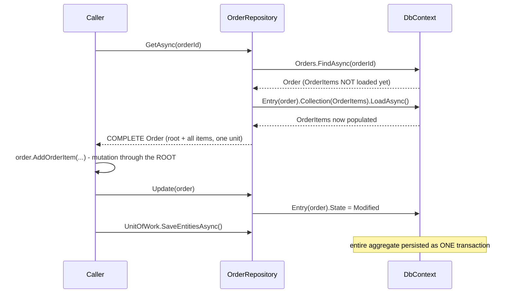

**TL;DR:** Why can't a repository fetch just the `OrderItems`, without their `Order`? Because `IOrderRepository` only ever speaks in terms of `Order` — there is no `OrderItemRepository` and no method returns an item on its own — so the persistence layer mirrors the same consistency boundary the domain model already enforces, loading and saving the whole aggregate as one unit.

**Real repo:** [`dotnet/eShop`](https://github.com/dotnet/eShop)

## 1. The Engineering Problem: "always load and save the whole aggregate together" needs an enforcement point, not just a convention

An earlier rule established that an aggregate's internals should only ever be mutated through its root — but that guarantee is worthless if the *persistence* layer doesn't honor the same boundary. If any code path can independently query `OrderItem` rows directly (a raw SQL query, a generic `DbSet<OrderItem>` LINQ query, a separate `OrderItemRepository`), it can load, mutate, and save items without ever touching the `Order` that owns them — silently bypassing every invariant `AddOrderItem` was supposed to enforce. The consistency boundary drawn in the domain model has to be mirrored by an equally strict boundary at the persistence layer, or it's not really a boundary at all.

---

## 2. The Technical Solution: the repository's vocabulary is the aggregate root's type, and loading pulls the whole graph at once

`IOrderRepository` only ever speaks in terms of `Order` — `Add(Order)`, `Update(Order)`, `GetAsync(int orderId) → Order`. There is no `OrderItemRepository` anywhere in the codebase, and no method anywhere returns an `OrderItem` on its own — the *only* way to reach one is through an `Order` that's already been loaded. The concrete implementation's `GetAsync` doesn't stop at fetching the `Order` row: it explicitly loads the `OrderItems` collection as part of the same call, so a caller never receives a "partial" aggregate — either the whole graph comes back together, or nothing does.



`Update` itself does no field-by-field diffing or reconstruction — it just flips the EF Core entity's tracked state to `Modified`. All the actual decision-making already happened earlier, through the aggregate's own methods; the repository's job at save time is purely mechanical.

---

## 3. The clean example (concept in isolation)

```csharp
public interface IOrderRepository {
    Order Add(Order order);
    void Update(Order order);
    Task<Order> GetAsync(int orderId);   // returns the WHOLE aggregate, never a partial one
    // no GetOrderItemAsync(int itemId) - items aren't reachable independently
}

public class OrderRepository : IOrderRepository {
    public async Task<Order> GetAsync(int orderId) {
        var order = await _context.Orders.FindAsync(orderId);
        if (order != null)
            await _context.Entry(order).Collection(o => o.OrderItems).LoadAsync();  // load the WHOLE graph
        return order;
    }
}
```

---

## 4. Production reality (from `dotnet/eShop`)

```csharp
// Ordering.Infrastructure/Repositories/OrderRepository.cs
public class OrderRepository : IOrderRepository
{
    private readonly OrderingContext _context;
    public IUnitOfWork UnitOfWork => _context;   // the DbContext itself IS the unit of work

    public Order Add(Order order) => _context.Orders.Add(order).Entity;

    public async Task<Order> GetAsync(int orderId)
    {
        var order = await _context.Orders.FindAsync(orderId);
        if (order != null)
        {
            await _context.Entry(order)
                .Collection(i => i.OrderItems).LoadAsync();
        }
        return order;
    }

    public void Update(Order order)
    {
        _context.Entry(order).State = EntityState.Modified;
    }
}
```

```csharp
// AggregatesModel/OrderAggregate/IOrderRepository.cs
public interface IOrderRepository : IRepository<Order>
{
    Order Add(Order order);
    void Update(Order order);
    Task<Order> GetAsync(int orderId);
    // notice: every method signature mentions Order, never OrderItem
}
```

What this teaches that a hello-world can't:

- **`GetAsync` performs two separate calls to the `DbContext` — `FindAsync` for the root, then an explicit `.Collection(...).LoadAsync()` for the items — rather than relying on EF Core's default lazy-loading to fetch items only when first accessed.** That's a deliberate choice: lazy loading would let a caller receive an `Order` that *looks* complete but silently issues another database round-trip the first time `.OrderItems` is touched — possibly outside the original transaction or `DbContext` lifetime. Eagerly loading inside `GetAsync` guarantees the caller always has the *entire* aggregate before the repository call even returns.
- **`UnitOfWork => _context` exposes the same `DbContext` instance the repository itself uses, rather than a separate unit-of-work abstraction.** This is what makes `SaveEntitiesAsync()` (the method that dispatches domain events before committing, covered in the domain-events lesson) available directly from `_orderRepository.UnitOfWork` — repository and unit-of-work aren't two competing patterns here; the repository literally hands back the same context it operates through.
- **There is no generic `Repository<T>` used directly against `OrderItem` anywhere in this codebase, and no interface exposes one.** This isn't just a missing convenience method — it's the structural consequence of lesson 3's aggregate boundary applied specifically to the persistence layer: if `OrderItem` had its own repository, nothing would stop code from loading and saving items independently of the `Order` that's supposed to govern their consistency.

Known-stale fact: repositories are sometimes designed generically — one repository per database table or entity type, regardless of whether that entity is an aggregate root. That pattern optimizes for CRUD convenience, not for consistency enforcement, and it's precisely what this codebase avoids: a repository exists *only* for `Order` (the aggregate root), never for `OrderItem`, `Address`, or any other type reachable only through it. The absence of those extra repositories is the enforcement mechanism, not an oversight.

---

## Source

- **Concept:** Repositories as aggregate persistence boundaries
- **Domain:** ddd
- **Repo:** [dotnet/eShop](https://github.com/dotnet/eShop) → [`src/Ordering.Infrastructure/Repositories/OrderRepository.cs`](https://github.com/dotnet/eShop/blob/main/src/Ordering.Infrastructure/Repositories/OrderRepository.cs), [`src/Ordering.Domain/AggregatesModel/OrderAggregate/IOrderRepository.cs`](https://github.com/dotnet/eShop/blob/main/src/Ordering.Domain/AggregatesModel/OrderAggregate/IOrderRepository.cs) — a real, actively maintained DDD reference implementation.


