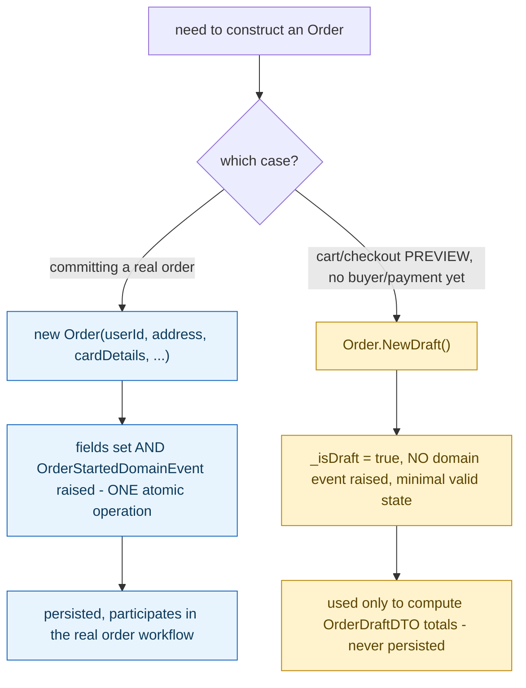

**TL;DR:** Why does `Order` have both a constructor and a separate `NewDraft()` method? Because a fully-committed order (buyer, address, payment, plus a raised domain event) and a checkout-preview draft (no buyer, no event, minimal state) are two genuinely different valid starting states, so each gets its own construction path — a normal constructor for the real order, a static factory method for the draft — while both still reuse the same `AddOrderItem` logic.

**Real repo:** [`dotnet/eShop`](https://github.com/dotnet/eShop)

## 1. The Engineering Problem: constructing a valid aggregate can require more than one path, and both need to stay valid

Sometimes constructing an aggregate needs multiple, genuinely different valid starting states — not just optional parameters on one constructor. A real order needs a buyer, a shipping address, and verified payment details before it's a real, committed order. But a shopping-cart preview needs to compute item totals and discounts *before* any of that information exists — there is no buyer, address, or payment method to pass yet. Cramming both cases into one constructor means either accepting null/placeholder values for fields that genuinely don't apply yet, or building a second, parallel object type just to represent "not-yet-a-real-order" — both of which leak the distinction between these two states into every caller instead of keeping it inside the aggregate itself.

---

## 2. The Technical Solution: a static factory method for each genuinely distinct construction path, alongside the "real" constructor

`Order` exposes its normal public constructor for the case that matters most — creating a fully-specified, committed order, complete with buyer, address, and payment details — and that constructor does more than just assign fields: it also raises `OrderStartedDomainEvent` as an atomic part of construction, so "an order was created" and "an order was created *and the rest of the system was told*" can never happen as two separate, forgettable steps. A second, static factory method — `Order.NewDraft()` — builds an `Order` in a deliberately incomplete state (`_isDraft = true`, no buyer, no address, no domain event raised at all) specifically for the checkout-preview case, where only line items and totals matter.



Both paths still go through `AddOrderItem` for line items — the factory methods differ only in what identity/payment/event state gets set up *before* items are added, not in how items themselves get validated and merged. The aggregate's core invariants (covered in the aggregates lesson) apply identically no matter which construction path was used to reach them.

---

## 3. The clean example (concept in isolation)

```csharp
public class Order : Entity, IAggregateRoot
{
    private bool _isDraft;

    protected Order() { _orderItems = new(); }

    public Order(string userId, Address address, /* payment details */) : this()
    {
        Address = address;
        OrderStatus = OrderStatus.Submitted;
        AddOrderStartedDomainEvent(userId, /* ... */);   // event raised AS PART of construction
    }

    public static Order NewDraft()   // a DIFFERENT valid starting state - no event, no buyer
    {
        var order = new Order { _isDraft = true };
        return order;
    }
}
```

---

## 4. Production reality (from `dotnet/eShop`)

```csharp
// AggregatesModel/OrderAggregate/Order.cs - the "real order" constructor
public Order(string userId, string userName, Address address, int cardTypeId, string cardNumber,
    string cardSecurityNumber, string cardHolderName, DateTime cardExpiration,
    int? buyerId = null, int? paymentMethodId = null) : this()
{
    BuyerId = buyerId;
    PaymentId = paymentMethodId;
    OrderStatus = OrderStatus.Submitted;
    OrderDate = DateTime.UtcNow;
    Address = address;

    // Add the OrderStarterDomainEvent to the domain events collection
    // to be raised/dispatched when committing changes into the Database [ After DbContext.SaveChanges() ]
    AddOrderStartedDomainEvent(userId, userName, cardTypeId, cardNumber,
                                cardSecurityNumber, cardHolderName, cardExpiration);
}

private void AddOrderStartedDomainEvent(string userId, string userName, int cardTypeId, string cardNumber,
        string cardSecurityNumber, string cardHolderName, DateTime cardExpiration)
{
    var orderStartedDomainEvent = new OrderStartedDomainEvent(this, userId, userName, cardTypeId,
                                                                cardNumber, cardSecurityNumber,
                                                                cardHolderName, cardExpiration);
    this.AddDomainEvent(orderStartedDomainEvent);
}

// a DIFFERENT construction path entirely, for cart/checkout previews
public static Order NewDraft()
{
    var order = new Order
    {
        _isDraft = true
    };
    return order;
}
```

```csharp
// Ordering.API/Application/Commands/CreateOrderDraftCommandHandler.cs - where NewDraft() gets used
public Task<OrderDraftDTO> Handle(CreateOrderDraftCommand message, CancellationToken cancellationToken)
{
    var order = Order.NewDraft();
    var orderItems = message.Items.Select(i => i.ToOrderItemDTO());
    foreach (var item in orderItems)
    {
        order.AddOrderItem(item.ProductId, item.ProductName, item.UnitPrice, item.Discount, item.PictureUrl, item.Units);
    }
    return Task.FromResult(OrderDraftDTO.FromOrder(order));   // this Order is NEVER persisted
}
```

What this teaches that a hello-world can't:

- **`NewDraft()` produces an `Order` that is never saved through `IOrderRepository` at all.** `CreateOrderDraftCommandHandler` builds it, adds items to compute totals via `AddOrderItem`'s existing merge logic, converts it straight into a DTO, and discards it — the factory method exists purely to reuse `Order`'s own item-handling logic (avoiding a duplicate implementation of "merge duplicate product lines, apply the higher discount") for a case that has nothing to do with actually creating an order in the database.
- **The "real" constructor raises `OrderStartedDomainEvent` from inside itself, not as a step the caller has to remember to perform afterward.** Compare this to `NewDraft()`, which raises no domain event at all — a draft order was never "started" in any sense the rest of the system should react to, and the *absence* of that event call is just as deliberate as its presence in the other constructor.
- **Both construction paths converge on the exact same `AddOrderItem` method for adding items** — the factory methods differ only in what identity, payment, and event-raising happens *before* items are ever added, proving the aggregate's core invariants (covered separately) are independent of which valid starting state was used to reach them.

Known-stale fact: "Factory" in DDD is sometimes assumed to require a dedicated, separate `OrderFactory` class implementing some `IFactory<T>` interface, mirroring the classic Gang-of-Four Factory Method pattern's typical presentation. In practice, a factory can be as simple as a static method directly on the aggregate type itself — `Order.NewDraft()` is a real, working factory in every sense that matters (it encapsulates a specific, valid construction path and hides the details of reaching it), without any separate factory class or interface existing anywhere in the codebase.

---

## Source

- **Concept:** Factories (complex aggregate construction)
- **Domain:** ddd
- **Repo:** [dotnet/eShop](https://github.com/dotnet/eShop) → [`src/Ordering.Domain/AggregatesModel/OrderAggregate/Order.cs`](https://github.com/dotnet/eShop/blob/main/src/Ordering.Domain/AggregatesModel/OrderAggregate/Order.cs), [`src/Ordering.API/Application/Commands/CreateOrderDraftCommandHandler.cs`](https://github.com/dotnet/eShop/blob/main/src/Ordering.API/Application/Commands/CreateOrderDraftCommandHandler.cs) — a real, actively maintained DDD reference implementation.
