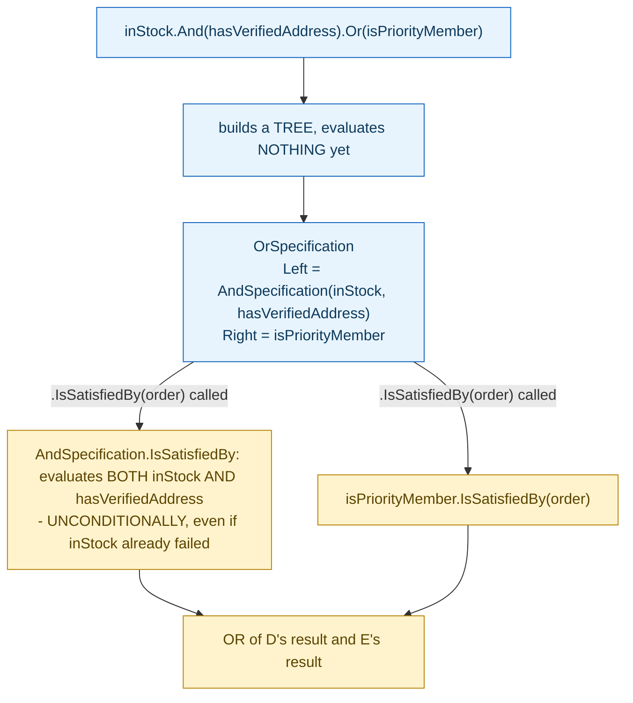

**TL;DR:** Why does `AndSpecification` evaluate its right side even after its left side already fails? Because it doesn't short-circuit like `&&` on purpose — a visitor walks the same specification tree afterward to collect validation errors from every node, and a node that was never evaluated has no result to collect, so skipping it would silently produce incomplete error reporting.

**Real repo:** [`BrighterCommand/Brighter`](https://github.com/BrighterCommand/Brighter)

## 1. The Engineering Problem: business rules combine, but scattering the combinations as ad hoc `if` chains makes them unreusable and untestable in isolation

A real domain rule like "eligible for expedited shipping" is rarely one atomic check — it's several smaller rules combined: in-stock inventory, a verified address, an account in good standing. Writing this as one big `if` statement inside whatever method happens to need it works once, but the moment a *second* place in the codebase needs "in-stock AND verified address" without the account-standing check, or needs to reuse just the "verified address" rule on its own, the logic either gets copy-pasted (and drifts) or the method gets an awkward boolean parameter to toggle pieces off. Each individual rule needs to be its own reusable, testable object — and rules need a way to combine into bigger rules without collapsing back into one big conditional.

---

## 2. The Technical Solution: each rule is an object with `IsSatisfiedBy`, and AND/OR/NOT combinators return new specification objects, not booleans

A **Specification** wraps one rule behind a single method, `IsSatisfiedBy(T entity) → bool`. The composition operators — `And`, `Or`, `Not` — don't evaluate anything immediately; each one returns a *new* specification object (`AndSpecification<T>`, `OrSpecification<T>`, a negated wrapper) that holds references to the specifications it composes. Calling `.IsSatisfiedBy(...)` on that combined object is what triggers evaluation, recursively, down through whatever tree of AND/OR/NOT nodes was built.



The sharp, non-obvious mechanism: `AndSpecification.IsSatisfiedBy` evaluates *both* its `Left` and `Right` children unconditionally — it doesn't short-circuit the way `&&` would, stopping at the first failure. This isn't an oversight; it's required by a second capability layered on top of the boolean result: an `Accept(visitor)` method lets a separate visitor walk the *same* specification tree afterward and collect validation errors from every node — a node that was never evaluated has no stored result to collect, so skipping it would silently produce incomplete error reporting even though the boolean pass/fail answer was still technically correct.

---

## 3. The clean example (concept in isolation)

```csharp
public interface ISpecification<T> {
    bool IsSatisfiedBy(T entity);
    ISpecification<T> And(ISpecification<T> other);
    ISpecification<T> Or(ISpecification<T> other);
    ISpecification<T> Not();
}

public class AndSpecification<T>(ISpecification<T> left, ISpecification<T> right) : ISpecification<T> {
    public bool IsSatisfiedBy(T entity) {
        var l = left.IsSatisfiedBy(entity);
        var r = right.IsSatisfiedBy(entity);   // BOTH evaluated, no short-circuit
        return l && r;
    }
    public ISpecification<T> And(ISpecification<T> other) => new AndSpecification<T>(this, other);
    // Or(), Not() similarly return new composed objects
}

// usage: rules compose without collapsing into one big if-statement
var eligible = inStock.And(hasVerifiedAddress).Or(isPriorityMember);
bool result = eligible.IsSatisfiedBy(order);
```

---

## 4. Production reality (from `BrighterCommand/Brighter`)

```csharp
// AndSpecification.cs
/// <summary>
/// Composes two specifications with logical AND, evaluating both sides unconditionally
/// so the visitor can collect errors from both children.
/// </summary>
public class AndSpecification<T>(ISpecification<T> left, ISpecification<T> right) : ISpecification<T>
{
    public ISpecification<T> Left { get; } = left;
    public ISpecification<T> Right { get; } = right;

    public bool IsSatisfiedBy(T entity)
    {
        var l = Left.IsSatisfiedBy(entity);
        var r = Right.IsSatisfiedBy(entity);
        return l && r;
    }

    public ISpecification<T> And(ISpecification<T> other) => new AndSpecification<T>(this, other);
    public ISpecification<T> Or(ISpecification<T> other) => new OrSpecification<T>(this, other);
    public ISpecification<T> Not() => new Specification<T>(x => !IsSatisfiedBy(x));
    public ISpecification<T> Not(Func<T, ValidationError> errorFactory) => new NotSpecification<T>(this, errorFactory);
}
```

```csharp
// ValidationResultCollector.cs - the visitor that WALKS the specification tree afterward
public class ValidationResultCollector<TData> : ISpecificationVisitor<TData, IEnumerable<ValidationResult>>
{
    public IEnumerable<ValidationResult> Visit(Specification<TData> specification)
        => specification.LastResults;

    public IEnumerable<ValidationResult> Visit(AndSpecification<TData> specification)
        => specification.Left.Accept(this).Concat(specification.Right.Accept(this));

    public IEnumerable<ValidationResult> Visit(OrSpecification<TData> specification)
        => specification.Left.Accept(this).Concat(specification.Right.Accept(this));
}
```

What this teaches that a hello-world can't:

- **The unconditional-evaluation choice is documented directly in the XML comment on `AndSpecification`, not left implicit** — "evaluating both sides unconditionally so the visitor can collect errors from both children." A reader who assumed AND behaves like `&&` (short-circuiting) would write code that quietly loses error information the moment they add a visitor-based error-collection pass on top of a boolean-only mental model.
- **`ValidationResultCollector.Visit(AndSpecification<TData>)` calls `.Accept(this)` on *both* `Left` and `Right` unconditionally, concatenating their results.** This is the literal reason the unconditional evaluation in step one matters: if `Right.IsSatisfiedBy` had never run because `Left` already failed, `Right`'s `LastResults` would be stale or empty, and this collector would report an incomplete picture of *why* the combined specification failed — exactly the failure mode the class comment calls out.
- **`Not()` (no arguments) and `Not(errorFactory)` are two genuinely different operations, not overloads of the same behavior.** The parameterless version degrades to a plain `Specification<T>` wrapping a raw predicate — it loses the ability to report a specific validation error on failure. The `errorFactory` overload returns a full `NotSpecification<T>`, preserving error-reporting through the visitor. Composing with the wrong one silently drops error detail without any compiler warning.

Known-stale fact: the classic Specification pattern write-ups (Eric Evans, Martin Fowler's original paper) present `IsSatisfiedBy` returning a plain boolean as the entire contract — "does this entity satisfy the rule, yes or no." Real production implementations, like this one, often need more: not just *whether* a composed rule failed, but a full breakdown of *which* leaf rules failed and why, across an entire AND/OR/NOT tree. That requirement — not the basic combinator logic — is what forces the unconditional-evaluation design and the parallel visitor-based result-collection machinery; a pure boolean-only implementation could safely short-circuit and would need none of this.

---

## Source

- **Concept:** Specification pattern
- **Domain:** ddd
- **Repo:** [BrighterCommand/Brighter](https://github.com/BrighterCommand/Brighter) → [`src/Paramore.Brighter/AndSpecification.cs`](https://github.com/BrighterCommand/Brighter/blob/master/src/Paramore.Brighter/AndSpecification.cs), [`OrSpecification.cs`](https://github.com/BrighterCommand/Brighter/blob/master/src/Paramore.Brighter/OrSpecification.cs), [`NotSpecification.cs`](https://github.com/BrighterCommand/Brighter/blob/master/src/Paramore.Brighter/NotSpecification.cs), [`ValidationResultCollector.cs`](https://github.com/BrighterCommand/Brighter/blob/master/src/Paramore.Brighter/ValidationResultCollector.cs) — a real, actively maintained .NET messaging framework.


