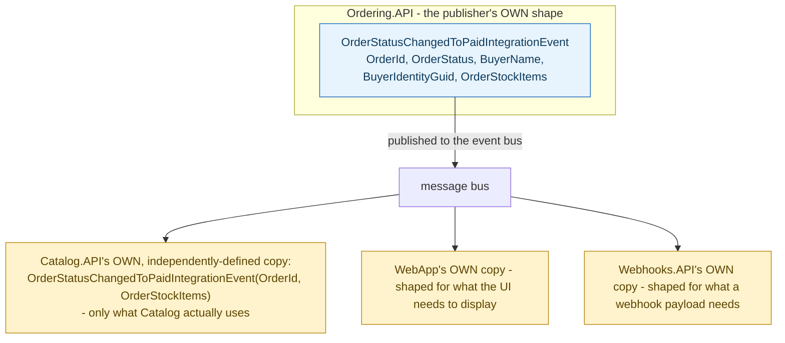

## 1. The Engineering Problem: once two bounded contexts need to talk, *whose* model governs the shape of what crosses the boundary?

When one bounded context needs to tell another "this happened," a specific power question follows immediately: does the downstream context adopt the upstream context's exact data shape wholesale, or does it define its own? Adopting the upstream shape wholesale seems efficient — no duplication — but it means every field the upstream team adds, for reasons entirely internal to their own model, silently becomes part of the downstream context's dependency surface too, whether the downstream context needs that field or not. Strategic DDD names this decision explicitly as a **context mapping** relationship, and different relationship types answer it differently — a **Conformist** relationship has the downstream context accept the upstream shape as-is; an **Open Host Service** with a **Published Language** has the upstream context expose a stable public contract, but leaves each consumer free to define its own local translation of only the parts it actually needs.

---

## 2. The Technical Solution: the same conceptual event gets a genuinely different shape in each service that touches it

In a real, multi-service system, "an order was marked paid" isn't one shared class referenced across service boundaries — it's *multiple, independently defined* record types, one per context, each shaped around what that specific context needs to know. `Ordering.API` (the publisher, and the aggregate that actually owns "what does it mean for an order to be paid") defines the full event with every field its own domain produced. `Catalog.API` (a consumer that only needs to release reserved stock) defines its *own*, much smaller version of "the same" event — dropping every field it has no use for.



No consumer references Ordering's `OrderStatusChangedToPaidIntegrationEvent` class directly — there's no shared assembly reference at all. Each service independently declares a type with the *same conceptual meaning* and the *same field names it chooses to keep*, matched against the publisher only by a shared event-name/routing convention on the message bus. This is what makes it a Published-Language relationship rather than a Conformist one: the *meaning* is shared and stable, but the *representation* is deliberately re-declared, locally, by whoever needs it.

---

## 3. The clean example (concept in isolation)

```csharp
// Ordering (publisher) - the FULL shape, everything Ordering's own domain produced
public record OrderPaidEvent(int OrderId, string BuyerName, string BuyerIdentityGuid,
    OrderStatus Status, IEnumerable<StockItem> Items);

// Catalog (consumer) - its OWN, independently-declared, SMALLER shape
public record OrderPaidEvent(int OrderId, IEnumerable<StockItem> Items);
// no reference to Ordering's assembly - matched by event name/routing key on the bus
```

---

## 4. Production reality (from `dotnet/eShop`)

```csharp
// Ordering.API/Application/IntegrationEvents/Events/OrderStatusChangedToPaidIntegrationEvent.cs
public record OrderStatusChangedToPaidIntegrationEvent : IntegrationEvent
{
    public int OrderId { get; }
    public OrderStatus OrderStatus { get; }
    public string BuyerName { get; }
    public string BuyerIdentityGuid { get; }
    public IEnumerable<OrderStockItem> OrderStockItems { get; }
    // constructor sets all five fields
}
```

```csharp
// Catalog.API/IntegrationEvents/Events/OrderStatusChangedToPaidIntegrationEvent.cs
// SAME conceptual event, DECLARED INDEPENDENTLY, keeping only what Catalog needs
public record OrderStatusChangedToPaidIntegrationEvent(int OrderId, IEnumerable<OrderStockItem> OrderStockItems)
    : IntegrationEvent;
```

```csharp
// Catalog.API/IntegrationEvents/EventHandling/OrderStatusChangedToPaidIntegrationEventHandler.cs
public async Task Handle(OrderStatusChangedToPaidIntegrationEvent @event)
{
    // we're not blocking stock/inventory
    foreach (var orderStockItem in @event.OrderStockItems)
    {
        var catalogItem = catalogContext.CatalogItems.Find(orderStockItem.ProductId);
        catalogItem?.RemoveStock(orderStockItem.Units);
    }
    await catalogContext.SaveChangesAsync();
}
```

What this teaches that a hello-world can't:

- **Catalog's copy drops `OrderStatus`, `BuyerName`, and `BuyerIdentityGuid` entirely — not because those fields were removed from the message on the wire, but because Catalog's *deserializer* simply never asks for them.** The handler's own logic only ever touches `OrderStockItems`; the class declaration reflects exactly and only that usage. If Ordering later adds a sixth field to its own event for its own internal reasons, Catalog's code doesn't need to change at all, because it was never coupled to Ordering's full shape in the first place.
- **The same conceptual event exists as *four separately declared classes* across this one codebase** (`Ordering.API`, `Catalog.API`, `WebApp`, `Webhooks.API`) — this isn't duplication to be refactored away into one shared type. Each declaration is a deliberate, local translation of the same upstream fact into exactly the shape that consumer's own logic needs, which is the concrete mechanism an Open Host Service / Published Language relationship actually looks like in code, as opposed to a diagram-level description of it.
- **Nothing links these four classes at the type-system level — no shared interface beyond the generic `IntegrationEvent` base, no shared assembly reference between the publisher and any consumer.** The connection is entirely by convention: an event-name/routing-key match on the message bus. This is what makes each consumer genuinely free to shape its own contract; a Conformist relationship, by contrast, would have consumers directly referencing and depending on the publisher's own type.

Known-stale fact: context mapping is sometimes taught as choosing exactly one labeled relationship (Shared Kernel, Customer/Supplier, Conformist, Anti-Corruption Layer, Open Host Service) per pair of bounded contexts, as if it were a single dropdown selection made once. A real system frequently runs multiple relationship types *simultaneously* even between the same two contexts — Ordering and Catalog share a Published-Language integration-event contract for "order paid," while a completely different piece of shared code (a common `IntegrationEvent` base type, shared infrastructure libraries) might function more like a lightweight Shared Kernel at the same time. The relationship types are a vocabulary for describing what's actually happening in different parts of an integration, not a single classification that has to apply uniformly everywhere two contexts touch.

---

## Source

- **Concept:** Context mapping (strategic DDD relationships)
- **Domain:** ddd
- **Repo:** [dotnet/eShop](https://github.com/dotnet/eShop) → [`src/Ordering.API/Application/IntegrationEvents/Events/OrderStatusChangedToPaidIntegrationEvent.cs`](https://github.com/dotnet/eShop/blob/main/src/Ordering.API/Application/IntegrationEvents/Events/OrderStatusChangedToPaidIntegrationEvent.cs), [`src/Catalog.API/IntegrationEvents/Events/OrderStatusChangedToPaidIntegrationEvent.cs`](https://github.com/dotnet/eShop/blob/main/src/Catalog.API/IntegrationEvents/Events/OrderStatusChangedToPaidIntegrationEvent.cs), [`OrderStatusChangedToPaidIntegrationEventHandler.cs`](https://github.com/dotnet/eShop/blob/main/src/Catalog.API/IntegrationEvents/EventHandling/OrderStatusChangedToPaidIntegrationEventHandler.cs) — a real, actively maintained multi-service reference application.
