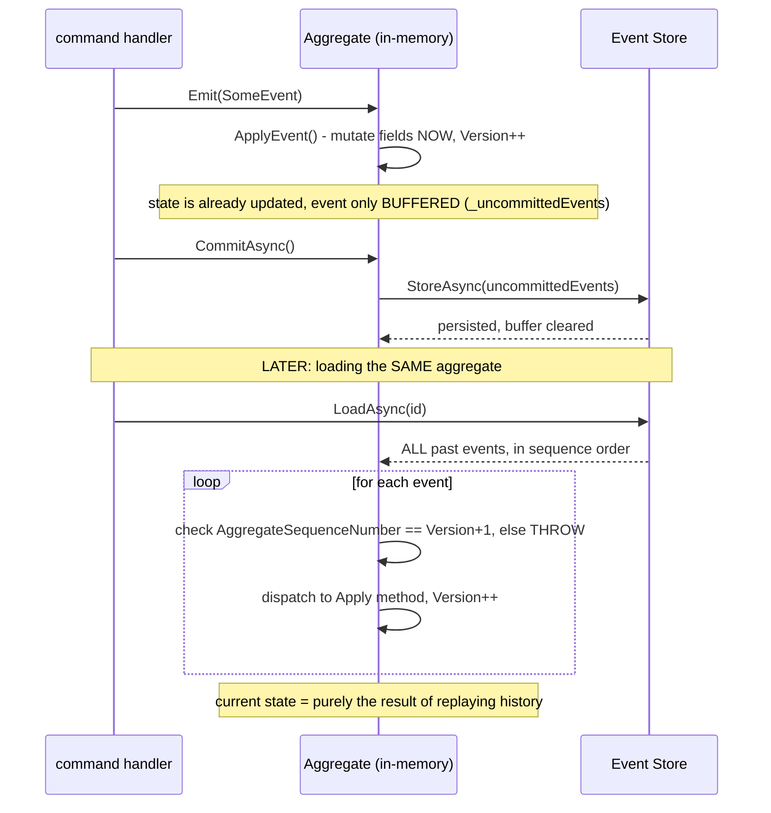

> **In plain English (30 sec):** A focused deep-dive on a specific mechanism or problem pattern.

## 1. The Engineering Problem: keeping only "current state" throws away the history a lot of real questions need

A normal, state-stored aggregate keeps only its latest values — an UPDATE overwrites whatever was there before, and the history of *how* it got there is gone. Event sourcing flips that: the append-only log of everything that happened *is* the only source of truth, not a row of current values. But that raises an immediate, sharper engineering question: if nothing stores "current state" directly, how does loading an aggregate ever produce its current field values fast — without either duplicating state redundantly (defeating the entire point) or replaying every event from the very first one, every single time, which gets slower forever as an aggregate's history grows?

---

## 2. The Technical Solution: mutate in-memory immediately on emit, reconstruct purely by replay on load, and snapshot to bound replay cost

Adding a new fact to an aggregate (`Emit(event)`) does two things atomically: it stamps the event with a sequence number (`Version + 1`) and immediately applies it *in-memory* via `ApplyEvent` — so the aggregate's fields reflect the change right away, before anything is even persisted. Loading an aggregate does the reverse: fetch its full stored event history, and for each event, dispatch it to a convention-matched `Apply` method that mutates fields exactly the way the original `Emit` call did — current state is *derived*, never stored directly. A strict integrity check enforces the log's shape: replaying rejects any event whose `AggregateSequenceNumber` isn't exactly `Version + 1` — a gap, duplicate, or out-of-order event throws rather than silently corrupting state.



Replaying from event #1 forever gets more expensive as history grows — the fix is snapshotting: periodically persist a serialized copy of the aggregate's state alongside the sequence number it represents. Loading then checks for a snapshot first; if one exists, `Version` is set directly from the snapshot's own recorded sequence number, and only the events *after* that point are fetched and replayed — the full history before the snapshot is never touched again.

---

## 3. The clean example (concept in isolation)

```csharp
protected virtual void Emit<TEvent>(TEvent aggregateEvent) {
    var sequenceNumber = Version + 1;
    ApplyEvent(aggregateEvent);              // mutate state NOW
    _uncommittedEvents.Add(new UncommittedEvent(aggregateEvent, sequenceNumber));
}

public virtual void ApplyEvents(IReadOnlyCollection<IDomainEvent> domainEvents) {
    foreach (var e in domainEvents) {
        if (e.AggregateSequenceNumber != Version + 1)
            throw new InvalidOperationException("gap or out-of-order event in the log");
        ApplyEvent(e.GetAggregateEvent());   // dispatch to the matching Apply(...) method
    }
}

// with a snapshot: skip straight to Version = snapshot.SequenceNumber, replay only what's AFTER
```

---

## 4. Production reality (from `eventflow/EventFlow`)

```csharp
// Aggregates/AggregateRoot.cs
protected virtual void Emit<TEvent>(TEvent aggregateEvent, IMetadata metadata = null)
{
    var aggregateSequenceNumber = Version + 1;
    // ... build metadata with this sequence number ...
    var uncommittedEvent = new UncommittedEvent(aggregateEvent, eventMetadata);

    ApplyEvent(aggregateEvent);              // mutate in-memory state IMMEDIATELY
    _uncommittedEvents.Add(uncommittedEvent); // persistence happens LATER, on CommitAsync
}

public virtual void ApplyEvents(IReadOnlyCollection<IDomainEvent> domainEvents)
{
    foreach (var domainEvent in domainEvents)
    {
        if (domainEvent.AggregateSequenceNumber != Version + 1)
            throw new InvalidOperationException(
                $"Cannot apply aggregate event of type '{domainEvent.GetType().PrettyPrint()}' " +
                $"with SequenceNumber {domainEvent.AggregateSequenceNumber} on aggregate " +
                $"with version {Version}");

        ApplyEvent(domainEvent.GetAggregateEvent() as IAggregateEvent<TAggregate, TIdentity>);
    }
}

protected virtual void ApplyEvent(IAggregateEvent<TAggregate, TIdentity> aggregateEvent)
{
    // ... dispatch to a registered handler or convention-matched Apply(...) method ...
    Version++;
}
```

```csharp
// Snapshots/SnapshotAggregateRoot.cs
public override async Task LoadAsync(IEventStore eventStore, ISnapshotStore snapshotStore, CancellationToken ct)
{
    var snapshot = await snapshotStore.LoadSnapshotAsync<TAggregate, TIdentity, TSnapshot>(Id, ct);
    if (snapshot == null)
    {
        await base.LoadAsync(eventStore, snapshotStore, ct);   // no snapshot - replay everything
        return;
    }

    await LoadSnapshotContainerAsync(snapshot, ct);
    Version = snapshot.Metadata.AggregateSequenceNumber;         // skip straight to snapshot's version
    var domainEvents = await eventStore.LoadEventsAsync<TAggregate, TIdentity>(Id, Version + 1, ct); // only events AFTER it

    ApplyEvents(domainEvents);
}

public override async Task<IReadOnlyCollection<IDomainEvent>> CommitAsync(
    IEventStore eventStore, ISnapshotStore snapshotStore, ISourceId sourceId, CancellationToken ct)
{
    var domainEvents = await base.CommitAsync(eventStore, snapshotStore, sourceId, ct);
    if (!await SnapshotStrategy.ShouldCreateSnapshotAsync(this, ct))
        return domainEvents;   // strategy decides WHEN a new snapshot is worth writing

    var snapshotContainer = await CreateSnapshotContainerAsync(sourceId, ct);
    await snapshotStore.StoreSnapshotAsync<TAggregate, TIdentity, TSnapshot>(Id, snapshotContainer, ct);
    return domainEvents;
}
```

What this teaches that a hello-world can't:

- **`Emit` calls `ApplyEvent` before the event is ever sent anywhere near the database.** State mutation and persistence are two genuinely separate steps: an aggregate's in-memory fields reflect a change the instant `Emit` runs, while `_uncommittedEvents` merely buffers what still needs to be written; `CommitAsync` is what actually persists and clears that buffer. A caller inspecting the aggregate's properties right after calling a method that emits an event sees the *already-updated* state, with nothing written to storage yet.
- **`ApplyEvents`' sequence-number check is not a defensive nicety — it's the mechanism that makes "current state = replay of history" a safe claim at all.** Without verifying `AggregateSequenceNumber == Version + 1` on every single event, a corrupted, duplicated, or reordered event stream would silently produce a wrong final state with no error at all; the check turns a silent corruption into a loud, immediate failure at load time.
- **`SnapshotAggregateRoot.LoadAsync` sets `Version` directly from the snapshot's metadata, then fetches events starting at exactly `Version + 1`** — not from the beginning of time. This is the literal mechanism that keeps loading an aggregate with 100,000 historical events roughly as fast as loading one with 100: the snapshot absorbs everything before it, and only the (bounded, strategy-controlled) tail actually gets replayed.

Known-stale fact: event sourcing is sometimes assumed to require CQRS as a package deal — "you can't have one without the other." EventFlow's `AggregateRoot`/`SnapshotAggregateRoot` classes shown here implement complete event-sourcing mechanics (emit, replay, snapshot) with no reference to a separate read model, query side, or CQRS infrastructure anywhere in this code — an aggregate can be fully event-sourced and still be queried the ordinary way, directly, through the same object. CQRS (splitting reads and writes into separate models) is a genuinely separate architectural decision that often pairs well with event sourcing for performance reasons, but nothing about reconstructing state via replay *requires* it.

---

## Source

- **Concept:** Event sourcing (aggregate state as an event log)
- **Domain:** ddd
- **Repo:** [eventflow/EventFlow](https://github.com/eventflow/EventFlow) → [`Source/EventFlow/Aggregates/AggregateRoot.cs`](https://github.com/eventflow/EventFlow/blob/develop-v1/Source/EventFlow/Aggregates/AggregateRoot.cs), [`Source/EventFlow/Snapshots/SnapshotAggregateRoot.cs`](https://github.com/eventflow/EventFlow/blob/develop-v1/Source/EventFlow/Snapshots/SnapshotAggregateRoot.cs) — a real, dedicated .NET CQRS+ES framework.


