## 1. The Engineering Problem: having a behavior method doesn't guarantee it's the *only* way to reach that state

A domain model can look rich — it has real methods with real guard clauses (`RemoveStock` throwing when stock is empty) — and still be anemic in the way that actually matters, if the fields those methods protect are also reachable through an ordinary public setter. "This class has behavior" and "this class enforces its own invariants" are two different claims; a class can satisfy the first while quietly failing the second, and the failure won't show up by reading the behavior methods in isolation — it only shows up by checking whether anything *else* in the codebase can reach the same fields a different way.

---

## 2. The Technical Solution: the real test is whether every mutation path goes through the behavior, not whether behavior exists at all

`dotnet/eShop`'s own `Order` aggregate (covered separately) is genuinely rich: every field that matters has a `private set`, and the only way to change order status or items is through `Order`'s own methods. The *same repository*, in its Catalog service, tells a different story: `CatalogItem.RemoveStock()` and `AddStock()` are real behavior methods with real guard clauses — but `AvailableStock` itself is declared `{ get; set; }`, publicly settable, and nothing in the class stops that setter from being used directly, invariant checks and all, from anywhere else in the codebase.

```mermaid
flowchart TD
    subgraph Rich["Order (rich) - covered in the aggregates lesson"]
        R1["private set on every field"] --> R2["ONLY reachable via AddOrderItem(), SetShippedStatus(), etc."]
    end
    subgraph Leaky["CatalogItem (partially rich, partially leaky)"]
        L1["RemoveStock() / AddStock() - real guard clauses exist"]
        L2["AvailableStock { get; set; } - PUBLIC setter, same field"]
        L3["Catalog API's UpdateItem endpoint:<br/>catalogEntry.CurrentValues.SetValues(productToUpdate)"]
        L3 -->|"bulk-copies EVERY property from the HTTP request body"| L2
        L2 -.->|"RemoveStock's guard clause NEVER RUNS on this path"| L1
    end

    classDef ok fill:#e8f4fd,stroke:#1565c0,color:#0d3a5c;
    classDef leak fill:#fdecea,stroke:#c0392b,color:#5c1a13;
    class R1,R2 ok;
    class L2,L3 leak;
```



The distinguishing question isn't "does this class have methods with logic in them" — it's "is there any code path, anywhere, that can change this field *without* going through those methods." `Order` answers no. `CatalogItem` answers yes, and the codebase's own API layer is the code path that does it.

---

## 3. The clean example (concept in isolation)

```csharp
// Looks rich - has a guard clause...
public class Item {
    public int Stock { get; set; }   // ...but ANYONE can bypass RemoveStock entirely
    public void RemoveStock(int qty) {
        if (Stock < qty) throw new InvalidOperationException("insufficient stock");
        Stock -= qty;
    }
}

item.Stock = -500;          // compiles fine, guard clause never runs
context.Entry(item).CurrentValues.SetValues(untrustedInput);  // same problem, at scale
```

---

## 4. Production reality (from `dotnet/eShop`)

```csharp
// Catalog.API/Model/CatalogItem.cs
public class CatalogItem
{
    public int AvailableStock { get; set; }   // PUBLIC setter - same field RemoveStock protects
    public int RestockThreshold { get; set; }
    public int MaxStockThreshold { get; set; }

    public int RemoveStock(int quantityDesired)
    {
        if (AvailableStock == 0)
            throw new CatalogDomainException($"Empty stock, product item {Name} is sold out");
        if (quantityDesired <= 0)
            throw new CatalogDomainException($"Item units desired should be greater than zero");

        int removed = Math.Min(quantityDesired, this.AvailableStock);
        this.AvailableStock -= removed;
        return removed;
    }
}
```

```csharp
// Catalog.API/Apis/CatalogApi.cs - UpdateItem endpoint
public static async Task<Results<Created, BadRequest<ProblemDetails>, NotFound<ProblemDetails>>> UpdateItem(
    HttpContext httpContext, int id, [AsParameters] CatalogServices services, CatalogItem productToUpdate)
{
    var catalogItem = await services.Context.CatalogItems.SingleOrDefaultAsync(i => i.Id == id);

    // Update current product
    var catalogEntry = services.Context.Entry(catalogItem);
    catalogEntry.CurrentValues.SetValues(productToUpdate);   // copies EVERY field from the request body

    // ... price-change event logic, then SaveChangesAsync() ...
}
```

What this teaches that a hello-world can't:

- **`CurrentValues.SetValues(productToUpdate)` is an EF Core convenience method that reflects over every scalar property on `productToUpdate` (bound directly from the incoming HTTP request body) and copies each one onto the tracked entity — including `AvailableStock`.** `RemoveStock`'s guard clause (`if (AvailableStock == 0) throw`) is defined in the same class, but this code path never calls it at all; a client submitting an update with a negative or nonsensical stock value would have it written straight to the database.
- **This is directly comparable to the `Order` aggregate covered in an earlier lesson, in the *exact same repository*, written by the same team** — `Order`'s fields are `private set`, reachable only through methods like `AddOrderItem`. `CatalogItem` was not built to the same standard. This isn't a hypothetical anti-pattern quoted from a textbook; it's a real, checkable difference between two domain models sitting a few folders apart in one real, actively maintained application.
- **The gap isn't necessarily a bug in the sense the team would call urgent** — `CatalogItem` may simply not have needed the same rigor `Order` does, since catalog data is arguably lower-stakes than committed financial orders. But it's real, demonstrable evidence that "rich vs. anemic" isn't decided once for a whole codebase; it's decided per class, and even a well-regarded reference architecture can land inconsistently across its own domain models.

Known-stale fact: the Anemic Domain Model anti-pattern is often described as an all-or-nothing property — a class either has behavior or it doesn't. Real code more often falls in between: `CatalogItem` genuinely has behavior methods with real guard clauses, which would pass a superficial "does it have logic" check, while still leaving its core invariant bypassable through an ordinary public setter and a generic ORM convenience method. The presence of behavior methods is necessary but not sufficient evidence of a rich domain model — the sufficient test is whether every mutation path is forced through them, which requires checking the *rest* of the codebase, not just the class itself.

---

## Source

- **Concept:** Rich domain model vs anemic domain model
- **Domain:** ddd
- **Repo:** [dotnet/eShop](https://github.com/dotnet/eShop) → [`src/Catalog.API/Model/CatalogItem.cs`](https://github.com/dotnet/eShop/blob/main/src/Catalog.API/Model/CatalogItem.cs), [`src/Catalog.API/Apis/CatalogApi.cs`](https://github.com/dotnet/eShop/blob/main/src/Catalog.API/Apis/CatalogApi.cs) — a real, actively maintained reference application.
