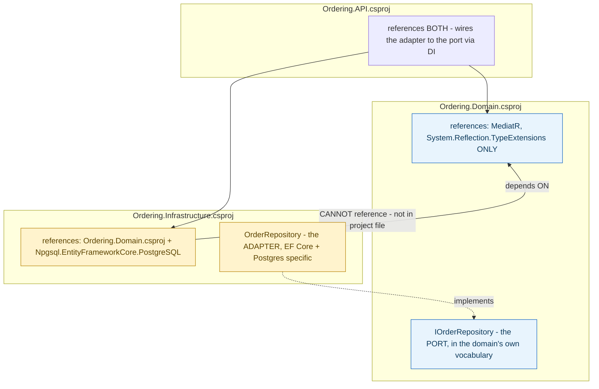

**TL;DR:** What actually stops someone from importing EF Core into the domain layer? Not a naming convention or code-review habit — the domain project's own `.csproj` has zero package or project reference to EF Core or the infrastructure project at all, so the import fails to compile rather than merely looking wrong in review.

**Real repo:** [`dotnet/eShop`](https://github.com/dotnet/eShop)

## 1. The Engineering Problem: "the domain shouldn't depend on infrastructure" is easy to say and easy to violate by accident

Everyone agrees business logic shouldn't be coupled to a specific database technology — in principle. In practice, a single `using Microsoft.EntityFrameworkCore;` typed into a domain class by someone in a hurry compiles fine, as long as nothing at the *project* level actually stops it. Nobody necessarily notices right away — the code still builds, tests still pass — until the domain model can no longer be unit-tested without spinning up a real database, or swapping database technology means touching business logic that had no reason to know a database existed at all. A naming convention or a code-review habit ("we call these Ports, those Adapters") can be forgotten under deadline pressure. Something needs to make the violation impossible to *compile*, not just easy to spot in review.

---

## 2. The Technical Solution: the domain's own project has no reference to the infrastructure it's decoupled from — enforced by the build, not by discipline

Hexagonal Architecture names the domain layer's own interfaces **ports** — what the domain *needs*, expressed entirely in its own vocabulary — and the infrastructure-layer implementations that satisfy them **adapters** — *how* a specific technology fulfills that need. The mechanism that actually enforces this isn't the interface/implementation split alone (an interface can still live in a project that also references the database package, even unused) — it's which *project* references which. `Ordering.Domain`'s own `.csproj` has zero package or project reference to Entity Framework Core, PostgreSQL, or `Ordering.Infrastructure` at all.



The dependency arrow points inward, from infrastructure toward domain, never the reverse — and this isn't just a diagram convention, it's the literal shape of the `<ProjectReference>` elements in each `.csproj`. If someone tried adding `using Microsoft.EntityFrameworkCore;` inside `Ordering.Domain`, the build would fail immediately: that assembly simply isn't referenced from that project. The same structure is what makes the domain independently testable — a unit test project referencing only `Ordering.Domain` can construct an `Order`, call `AddOrderItem`, and assert on the result, with no database, no EF Core, and no `Ordering.Infrastructure` reference anywhere in its own dependency graph.

---

## 3. The clean example (concept in isolation)

```xml
<!-- Domain.csproj - the PORT lives here, zero infrastructure references -->
<ItemGroup>
  <PackageReference Include="MediatR" />
</ItemGroup>
```
```csharp
// Domain project
public interface IOrderRepository { Task<Order> GetAsync(int id); }
```

```xml
<!-- Infrastructure.csproj - the ADAPTER lives here -->
<ItemGroup>
  <ProjectReference Include="..\Domain\Domain.csproj" />          <!-- depends ON domain -->
  <PackageReference Include="Npgsql.EntityFrameworkCore.PostgreSQL" />
</ItemGroup>
```
```csharp
// Infrastructure project - the ONLY place that knows about EF Core/Postgres
public class OrderRepository : IOrderRepository {
    public async Task<Order> GetAsync(int id) => await _context.Orders.FindAsync(id);
}
```

---

## 4. Production reality (from `dotnet/eShop`)

```xml
<!-- src/Ordering.Domain/Ordering.Domain.csproj - the FULL file -->
<Project Sdk="Microsoft.NET.Sdk">
  <PropertyGroup>
    <TargetFramework>net10.0</TargetFramework>
  </PropertyGroup>
  <ItemGroup>
    <PackageReference Include="MediatR" />
    <PackageReference Include="System.Reflection.TypeExtensions" />
  </ItemGroup>
</Project>
```

```xml
<!-- src/Ordering.Infrastructure/Ordering.Infrastructure.csproj -->
<Project Sdk="Microsoft.NET.Sdk">
  <ItemGroup>
    <ProjectReference Include="..\IntegrationEventLogEF\IntegrationEventLogEF.csproj" />
    <ProjectReference Include="..\Ordering.Domain\Ordering.Domain.csproj" />
  </ItemGroup>
  <ItemGroup>
    <PackageReference Include="Npgsql.EntityFrameworkCore.PostgreSQL" />
  </ItemGroup>
</Project>
```

```
src/
├── Ordering.Domain/                 # the PORT: IOrderRepository, Order, OrderItem - ZERO EF Core reference
│   └── AggregatesModel/OrderAggregate/IOrderRepository.cs
├── Ordering.Infrastructure/         # the ADAPTER: EF Core + Postgres specific
│   └── Repositories/OrderRepository.cs
└── Ordering.API/                    # composition root - references BOTH, wires via DI
```

What this teaches that a hello-world can't:

- **`Ordering.Domain.csproj`'s entire `<ItemGroup>` for package references has exactly two entries — `MediatR` and `System.Reflection.TypeExtensions` — neither of which has anything to do with persistence.** This isn't a curated example built to prove a point; it's the literal, complete dependency list of a real, actively maintained domain project. There is no partial reference, no "just the abstractions package" — EF Core is entirely absent.
- **`Ordering.Infrastructure.csproj` references `Ordering.Domain.csproj`, not the other way around** — the `<ProjectReference>` element's direction *is* the dependency rule, made mechanically checkable rather than asserted in a diagram or a README. A build server enforces this on every single compile, with no additional tooling (a linter, an architecture-testing library) required to catch a violation.
- **This structure is exactly what makes `Order`'s own unit tests (covered in earlier lessons on aggregates and value objects) possible without a database at all** — a test project that references only `Ordering.Domain` inherits that project's own restricted reference list. It's not that the tests *choose* not to touch the database; the project graph makes touching it something they structurally can't do by accident.

Known-stale fact: Ports & Adapters is sometimes treated as satisfied purely by "the domain depends on an interface, not a concrete class" — true as far as it goes, but incomplete. An interface can live in a project that *also* references the infrastructure package, even if nothing in that project currently uses it — nothing stops a future edit from importing infrastructure types directly into domain code sitting right next to that interface. The stronger, compiler-enforced version of the pattern requires a genuine project/assembly boundary with a restricted reference list, like the one shown here — that's the difference between a violation being *discouraged* and a violation being *impossible to compile*.

---

## Source

- **Concept:** Hexagonal architecture (ports & adapters)
- **Domain:** architecture
- **Repo:** [dotnet/eShop](https://github.com/dotnet/eShop) → [`src/Ordering.Domain/Ordering.Domain.csproj`](https://github.com/dotnet/eShop/blob/main/src/Ordering.Domain/Ordering.Domain.csproj), [`src/Ordering.Infrastructure/Ordering.Infrastructure.csproj`](https://github.com/dotnet/eShop/blob/main/src/Ordering.Infrastructure/Ordering.Infrastructure.csproj), [`IOrderRepository.cs`](https://github.com/dotnet/eShop/blob/main/src/Ordering.Domain/AggregatesModel/OrderAggregate/IOrderRepository.cs) — a real, actively maintained multi-project reference application.
