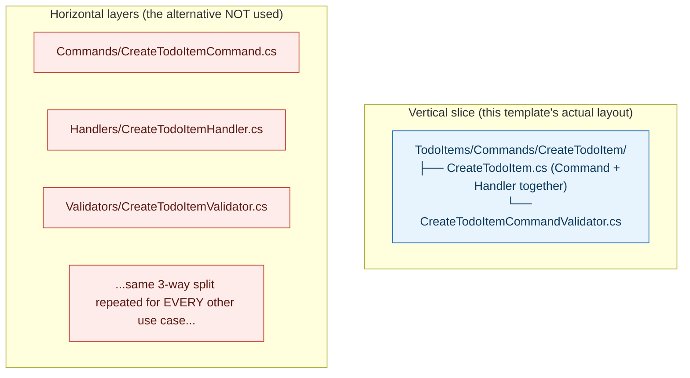

## 1. The Engineering Problem: organizing code by technical layer scatters a single use case across the codebase, and "no infrastructure dependency" is more nuanced than it sounds

Two related problems. First: folders named `Controllers/`, `Services/`, `Repositories/` group code by *technical role*, so understanding one complete use case — "create a todo item" — means jumping across three or four separate folders that also contain dozens of unrelated use cases. Second, and more subtle: "the application layer shouldn't depend on infrastructure" sounds like an absolute rule, but a real application layer routinely needs *some* shape from its persistence technology — a way to describe "a queryable set of entities," for instance — without needing to know *which* database engine actually backs it. Drawing that line precisely (which parts of "the database" are abstraction, which parts are a swappable detail) is harder than a blanket "no EF Core in Application" rule can express.

---

## 2. The Technical Solution: fold each use case into its own folder, and let the dependency rule separate the *shape* of persistence from the specific *provider*

Clean Architecture's use-case-centric organization puts each command or query in its own folder, containing everything specific to that one use case together — the request record, its handler, and its validator all live side by side in a folder named after the use case itself, rather than being split across separate `Commands/`, `Handlers/`, `Validators/` folders shared by every use case in the application.



The dependency rule, applied precisely rather than as a blanket ban: `Domain` has zero package references beyond a minimal contracts library — no EF Core in any form. `Application` references the *base* `Microsoft.EntityFrameworkCore` package — enough to describe `DbSet<TodoItem>` as an abstraction inside its own `IApplicationDbContext` interface — but references *none* of the actual database provider packages. Those (SQL Server, PostgreSQL, SQLite) are referenced exclusively from `Infrastructure`, alongside the concrete `ApplicationDbContext` class that implements the interface. The abstraction (an ORM-shaped, provider-agnostic contract) is a dependency Application is allowed to carry; the specific provider is not.

---

## 3. The clean example (concept in isolation)

```
TodoItems/Commands/CreateTodoItem/
├── CreateTodoItem.cs                    # Command record + Handler, TOGETHER
└── CreateTodoItemCommandValidator.cs    # this use case's OWN validation rules
```

```csharp
// Application layer - references base EF Core (DbSet<T> is provider-agnostic), NOT a provider package
public interface IApplicationDbContext {
    DbSet<TodoItem> TodoItems { get; }
    Task<int> SaveChangesAsync(CancellationToken ct);
}
```
```xml
<!-- Infrastructure.csproj - the ONLY project referencing an actual database provider -->
<PackageReference Include="Npgsql.EntityFrameworkCore.PostgreSQL" />
```

---

## 4. Production reality (from `jasontaylordev/CleanArchitecture`)

```csharp
// Application/TodoItems/Commands/CreateTodoItem/CreateTodoItem.cs - Command + Handler in ONE file
public record CreateTodoItemCommand : IRequest<int>
{
    public int ListId { get; init; }
    public string? Title { get; init; }
}

public class CreateTodoItemCommandHandler : IRequestHandler<CreateTodoItemCommand, int>
{
    private readonly IApplicationDbContext _context;
    public CreateTodoItemCommandHandler(IApplicationDbContext context) => _context = context;

    public async Task<int> Handle(CreateTodoItemCommand request, CancellationToken cancellationToken)
    {
        var entity = new TodoItem { ListId = request.ListId, Title = request.Title, Done = false };
        _context.TodoItems.Add(entity);
        await _context.SaveChangesAsync(cancellationToken);
        return entity.Id;
    }
}
```

```xml
<!-- Domain.csproj - ZERO EF Core, in any form -->
<ItemGroup>
  <PackageReference Include="MediatR.Contracts" />
</ItemGroup>
```

```xml
<!-- Application.csproj - base EF Core (abstraction), no provider -->
<ItemGroup>
  <PackageReference Include="Microsoft.EntityFrameworkCore" />
  <PackageReference Include="FluentValidation.DependencyInjectionExtensions" />
  <PackageReference Include="MediatR" />
</ItemGroup>
<ItemGroup>
  <ProjectReference Include="..\Domain\Domain.csproj" />
</ItemGroup>
```

```xml
<!-- Infrastructure.csproj - the ACTUAL provider packages -->
<ItemGroup>
  <PackageReference Include="Microsoft.EntityFrameworkCore" />
  <PackageReference Include="Npgsql.EntityFrameworkCore.PostgreSQL" />
  <PackageReference Include="Microsoft.EntityFrameworkCore.Sqlite" />
</ItemGroup>
<ItemGroup>
  <ProjectReference Include="..\Application\Application.csproj" />
</ItemGroup>
```

What this teaches that a hello-world can't:

- **`IApplicationDbContext` exposes `DbSet<TodoItem>` directly in its interface signature — meaning `Application.csproj` genuinely needs the base EF Core package to even compile, not as an oversight but as a deliberate design choice.** The alternative (hiding `DbSet<T>` behind a fully custom, hand-rolled repository interface) would remove even that reference, at the cost of reimplementing querying capabilities EF Core already provides. This template accepts a narrow, ORM-shaped dependency in exchange for not reinventing query composition.
- **Not one of the three database provider packages (`Npgsql.EntityFrameworkCore.PostgreSQL`, `Microsoft.EntityFrameworkCore.Sqlite`, the SQL Server package) appears anywhere in `Application.csproj`'s reference list — only in `Infrastructure.csproj`.** This is the precise line the dependency rule actually draws here: not "no EF Core anywhere outside Infrastructure," but "no *specific database engine* anywhere outside Infrastructure." Swapping PostgreSQL for SQL Server touches only `Infrastructure`'s package references and its concrete `DbContext` — `Application`'s code, including every command and query handler, is untouched.
- **`CreateTodoItemCommand`, its handler, and its validator all live in the same folder, sharing a name with the use case they implement** — a developer opening `TodoItems/Commands/CreateTodoItem/` sees the complete behavior of that one use case in two files, rather than needing to trace references across `Commands/`, `Handlers/`, and `Validators/` folders each containing every other use case's files interleaved with the one they're actually trying to understand.

Known-stale fact: Clean Architecture and Hexagonal Architecture are frequently presented as competing, different approaches — they're the same dependency-inversion idea (business logic at the center, infrastructure detail at the edges) described with different vocabulary and, as shown here, sometimes drawn with a slightly different granularity (Clean Architecture's Application layer here tolerates a base ORM abstraction package that a stricter Hexagonal reading might exclude entirely). The mechanism — inward-pointing project references, a compiler-enforced boundary rather than a documented convention — is identical; what differs between real codebases claiming either label is exactly how strictly that boundary is drawn, not whether the underlying principle is different.

---

## Source

- **Concept:** Clean architecture (dependency rule, use-case-centric design)
- **Domain:** architecture
- **Repo:** [jasontaylordev/CleanArchitecture](https://github.com/jasontaylordev/CleanArchitecture) → [`src/Application/TodoItems/Commands/CreateTodoItem/CreateTodoItem.cs`](https://github.com/jasontaylordev/CleanArchitecture/blob/main/src/Application/TodoItems/Commands/CreateTodoItem/CreateTodoItem.cs), [`Domain.csproj`](https://github.com/jasontaylordev/CleanArchitecture/blob/main/src/Domain/Domain.csproj), [`Application.csproj`](https://github.com/jasontaylordev/CleanArchitecture/blob/main/src/Application/Application.csproj), [`Infrastructure.csproj`](https://github.com/jasontaylordev/CleanArchitecture/blob/main/src/Infrastructure/Infrastructure.csproj) — the most widely adopted real Clean Architecture template in the .NET ecosystem; a reference template, not one company's live production app.
