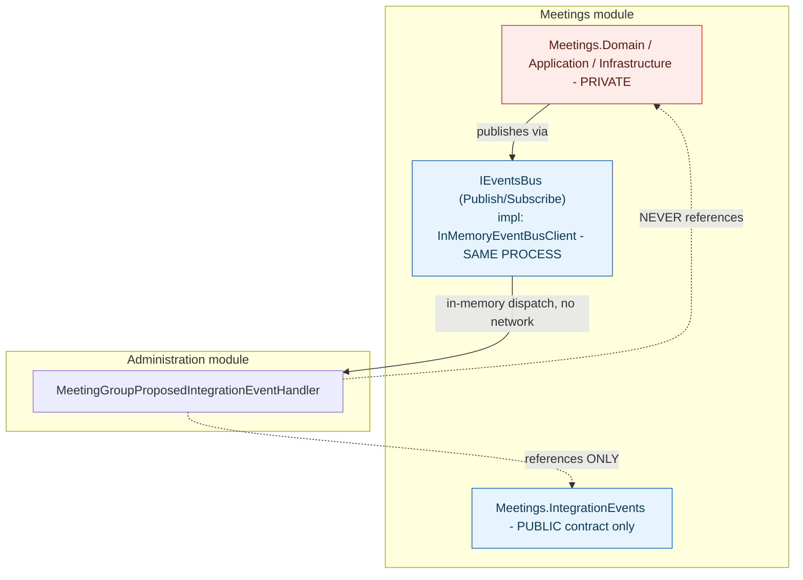

**TL;DR:** What would actually have to change to split this modular monolith into real microservices? Only the concrete class wired to `IEventsBus` — modules already communicate solely through published integration-event contracts and an event-bus interface, so swapping `InMemoryEventBusClient` for a real network client (RabbitMQ, Kafka) is a composition-root-only change, with no module's business logic touched.
> **In plain English (30 sec):** Think of this like concepts you already use, but in a production system at scale.


**Real repo:** [`kgrzybek/modular-monolith-with-ddd`](https://github.com/kgrzybek/modular-monolith-with-ddd)

## 1. The Engineering Problem: splitting into microservices too early pays a real distributed-systems tax for a boundary problem that doesn't need one yet

A team convinced their system needs microservices often hasn't actually validated the *boundaries* they'd split along — and getting those boundaries wrong across a network is far more expensive to fix than getting them wrong within one process. Real network calls between services mean real failure modes (timeouts, partial failures, retries, eventual consistency) that don't exist when two pieces of code are just two objects in the same process calling each other directly. The question worth asking isn't "monolith or microservices" as a permanent, upfront choice — it's whether a codebase can enforce genuine module boundaries *now*, in a single deployable, in a way that would make an eventual real split mechanical rather than a rewrite.

---

## 2. The Technical Solution: modules communicate only through published contracts and an event bus interface — swap the bus implementation, not the modules, to actually go distributed

Each module (`Meetings`, `Registrations`, `Administration`, `Payments`, `UserAccess`) exposes its own separate `IntegrationEvents` project — a small, public contract assembly containing only event classes, entirely independent of that module's internal `Domain`, `Application`, and `Infrastructure` projects. Other modules reference *only* this contracts project when they need to react to something happening elsewhere — never the originating module's actual implementation. Cross-module communication happens exclusively through a shared `IEventsBus` interface (`Publish<T>`, `Subscribe<T>`), and in this codebase, the concrete implementation wired into that interface is `InMemoryEventBusClient` — an actual in-memory publish/subscribe mechanism, not a network call to any message broker.



The critical property: `Administration`'s handler code, and the `IEventsBus` interface it depends on, would compile and run *identically* whether the bus behind that interface is `InMemoryEventBusClient` or a real network client for RabbitMQ or Kafka. The event-driven contract between modules was designed as if the modules were already separate services — the only thing keeping this a monolith today is which concrete class satisfies `IEventsBus`, decided once, at composition-root registration time.

---

## 3. The clean example (concept in isolation)

```csharp
public interface IEventsBus {
    Task Publish<T>(T @event) where T : IntegrationEvent;
    void Subscribe<T>(IIntegrationEventHandler<T> handler) where T : IntegrationEvent;
}

// TODAY: in-process, one deployable
public class InMemoryEventBusClient : IEventsBus {
    public Task Publish<T>(T @event) where T : IntegrationEvent
        => InMemoryEventBus.Instance.Publish(@event);   // a plain in-memory pub/sub, no network
}

// LATER (if ever needed): same interface, a genuinely different transport
public class RabbitMqEventBusClient : IEventsBus {
    public Task Publish<T>(T @event) where T : IntegrationEvent
        => _channel.BasicPublish(/* real network call */);
}
// modules that only depend on IEventsBus need ZERO code changes either way
```

---

## 4. Production reality (from `kgrzybek/modular-monolith-with-ddd`)

```
src/Modules/
├── Meetings/
│   ├── Domain/            # private
│   ├── Application/       # private
│   ├── Infrastructure/    # private
│   └── IntegrationEvents/ # PUBLIC - the only thing other modules may reference
│       └── MeetingGroupProposedIntegrationEvent.cs
└── Administration/
    └── Application/MeetingGroupProposals/
        └── MeetingGroupProposedIntegrationEventHandler.cs   # reacts to Meetings' event
```

```csharp
// Registrations/Application/....csproj - a module's OWN reference list
<ItemGroup>
  <ProjectReference Include="..\..\..\BuildingBlocks\Application\...Application.csproj" />
</ItemGroup>
// notice: no reference to any OTHER module's Application/Domain/Infrastructure project at all
```

```csharp
// Administration/Infrastructure/Configuration/EventsBus/EventsBusStartup.cs
private static void SubscribeToIntegrationEvents(ILogger logger)
{
    var eventBus = AdministrationCompositionRoot.BeginLifetimeScope().Resolve<IEventsBus>();
    SubscribeToIntegrationEvent<MeetingGroupProposedIntegrationEvent>(eventBus, logger);
    SubscribeToIntegrationEvent<NewUserRegisteredIntegrationEvent>(eventBus, logger);
}
```

```csharp
// BuildingBlocks/Infrastructure/EventBus/InMemoryEventBusClient.cs
public class InMemoryEventBusClient : IEventsBus
{
    public async Task Publish<T>(T @event) where T : IntegrationEvent
    {
        _logger.Information("Publishing {Event}", @event.GetType().FullName);
        await InMemoryEventBus.Instance.Publish(@event);   // in-process, no network hop
    }

    public void Subscribe<T>(IIntegrationEventHandler<T> handler) where T : IntegrationEvent
        => InMemoryEventBus.Instance.Subscribe(handler);
}
```

What this teaches that a hello-world can't:

- **`Administration`'s handler references `Meetings.IntegrationEvents` — a small contracts-only project — and never `Meetings.Domain`, `Meetings.Application`, or `Meetings.Infrastructure`.** This is checkable directly from the `.csproj` reference lists: the module boundary isn't a naming convention or a folder grouping, it's an enforceable project-reference restriction, exactly like the domain/infrastructure boundary covered in the Hexagonal Architecture lesson — applied here *between peer modules* rather than between layers.
- **`InMemoryEventBusClient.Publish` calls `InMemoryEventBus.Instance.Publish(@event)` — a static, in-process singleton, not a socket, not an HTTP client, not a message-broker SDK.** Every module communicating "across a boundary" is, mechanically, just an ordinary method call within the same .NET process. The event-driven *shape* of the code (publish, subscribe, integration events) is identical to what a real microservices system would use — only the transport underneath is different.
- **`EventsBusStartup.SubscribeToIntegrationEvents` resolves `IEventsBus` from the DI container rather than constructing `InMemoryEventBusClient` directly** — this is the exact seam where a future split would happen. Changing which concrete class gets registered against `IEventsBus` is a composition-root-only change; no module's own business logic, handler code, or event contracts would need to change to start actually crossing a network instead of a method call.

Known-stale fact: "microservices" and "good architecture" are often treated as synonyms, with a modular monolith seen as a stepping-stone or a compromise rather than a legitimate, deliberately-chosen end state. This codebase demonstrates the opposite framing: strict module isolation, published-contract-only cross-module communication, and a swappable transport abstraction are exactly the disciplines that make microservices *safe* to adopt later — and a team that has all of that in a single deployable has already solved the hard boundary-design problem, with none of a distributed system's operational cost, until (or unless) an actual scaling or team-ownership need justifies paying for the network hop.

---

## Source

- **Concept:** Modular monolith vs microservices (when to actually split a system)
- **Domain:** architecture
- **Repo:** [kgrzybek/modular-monolith-with-ddd](https://github.com/kgrzybek/modular-monolith-with-ddd) → [`src/Modules/Meetings/IntegrationEvents/`](https://github.com/kgrzybek/modular-monolith-with-ddd/tree/master/src/Modules/Meetings/IntegrationEvents), [`src/Modules/Administration/Infrastructure/Configuration/EventsBus/EventsBusStartup.cs`](https://github.com/kgrzybek/modular-monolith-with-ddd/blob/master/src/Modules/Administration/Infrastructure/Configuration/EventsBus/EventsBusStartup.cs), [`src/BuildingBlocks/Infrastructure/EventBus/InMemoryEventBusClient.cs`](https://github.com/kgrzybek/modular-monolith-with-ddd/blob/master/src/BuildingBlocks/Infrastructure/EventBus/InMemoryEventBusClient.cs) — a real, widely cited, actively maintained modular monolith reference application.


