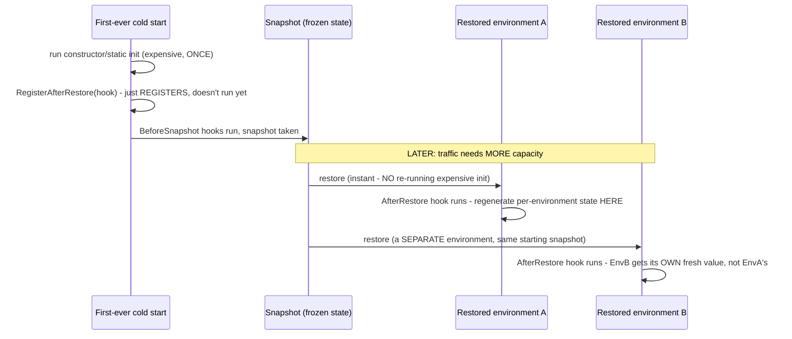

**TL;DR:** Eliminating cold starts by cloning an already-initialized function creates a new bug class — what breaks? Anything meant to be unique per environment (a random identifier, a fresh network handle) — every environment restored from the same snapshot would otherwise share the exact same value, unless application code registers an explicit "after restore" hook to regenerate it.
> **In plain English (30 sec):** Think of this like concepts you already use, but in a production system at scale.


**Real repo:** [`aws/aws-lambda-dotnet`](https://github.com/aws/aws-lambda-dotnet)

## 1. The Engineering Problem: expensive one-time init helps warm reuse but hurts every cold start — until you snapshot it, which creates a new problem

Serverless platforms encourage moving expensive setup — opening a database connection, loading configuration, generating an instance identifier — *outside* the request handler, so a "warm" execution environment reuses that work across many invocations instead of repeating it every time. That's a real win for warm traffic, but a brand-new, "cold" execution environment still has to pay that full initialization cost once before it can serve its first request — a serious latency tax under bursty or scaled-out traffic. Eliminating that tax by snapshotting an *already-initialized* environment and instantly restoring copies of it for new invocations sounds like it solves the problem outright — until you notice that some of what got initialized was supposed to be unique *per environment* (a random identifier, a fresh network handle), and every restored copy of one snapshot would otherwise share that exact same value.

---

## 2. The Technical Solution: an explicit hook lets application code distinguish "initialized once, ever" from "must regenerate every time a NEW environment is restored from a snapshot"

AWS Lambda's SnapStart takes a frozen snapshot of a fully initialized execution environment — static state, opened resources, everything the constructor and static initializers already ran — and restores fresh copies of that *same* snapshot to serve future cold-start-equivalent traffic, skipping re-running that initialization entirely. The correctness problem this creates gets a dedicated fix: a registry of "after restore" hooks that run *specifically* at the moment a new execution environment is materialized from a snapshot — not during the original initialization that produced the snapshot, and not on ordinary warm reuse of an environment that was never snapshotted at all.



Without this hook, `EnvA` and `EnvB` would both start with the *exact* value that existed at snapshot time — identical, because they're literally restored from the same frozen state — which is silently wrong for anything meant to identify or distinguish one running environment from another.

---

## 3. The clean example (concept in isolation)

```csharp
public class SnapstartExample
{
    private Guid _executionEnvironmentId;

    public SnapstartExample()
    {
        _executionEnvironmentId = Guid.NewGuid();          // runs ONCE, before the snapshot
        Amazon.Lambda.Core.SnapshotRestore.RegisterAfterRestore(RegenerateId);
    }

    private ValueTask RegenerateId()
    {
        _executionEnvironmentId = Guid.NewGuid();           // runs AGAIN, per RESTORED environment
        return ValueTask.CompletedTask;
    }

    public string Handler() => $"Environment: {_executionEnvironmentId}";
}
```

---

## 4. Production reality (from `aws/aws-lambda-dotnet`)

```csharp
// SnapshotRestore.Registry/RestoreHooksRegistry.cs
public class RestoreHooksRegistry
{
    private readonly ConcurrentStack<Func<ValueTask>> _beforeSnapshotRegistry = new();
    private readonly ConcurrentQueue<Func<ValueTask>> _afterRestoreRegistry = new();

    public void RegisterBeforeSnapshot(Func<ValueTask> func) => _beforeSnapshotRegistry.Push(func);
    public void RegisterAfterRestore(Func<ValueTask> func) => _afterRestoreRegistry.Enqueue(func);

    public async Task InvokeBeforeSnapshotCallbacks()
    {
        while (_beforeSnapshotRegistry.TryPop(out var beforeSnapshotCallable))
            await beforeSnapshotCallable();
    }

    public async Task InvokeAfterRestoreCallbacks()
    {
        while (_afterRestoreRegistry.TryDequeue(out var afterRestoreCallable))
            await afterRestoreCallable();
    }
}
```

```csharp
// the library's own documented usage example
public class SnapstartExample
{
    private Guid _myExecutionEnvironmentGuid;
    public SnapstartExample()
    {
        // This GUID is set for non-restore use-cases such as testing or if SnapStart is turned off
        _myExecutionEnvironmentGuid = new Guid();
        Amazon.Lambda.Core.SnapshotRestore.RegisterAfterRestore(MyAfterRestore);
    }

    private ValueTask MyAfterRestore()
    {
        // After we restore this snapshot to a NEW execution environment, update the GUID
        _myExecutionEnvironmentGuid = new Guid();
        return ValueTask.CompletedTask;
    }
}
```

What this teaches that a hello-world can't:

- **`_beforeSnapshotRegistry` is a `ConcurrentStack` (LIFO) while `_afterRestoreRegistry` is a `ConcurrentQueue` (FIFO) — a deliberate, opposite ordering choice for the two hook types.** Before-snapshot hooks run in reverse-registration order (the most recently registered cleanup-style hook runs first — a common "unwind in reverse" pattern for teardown-adjacent logic), while after-restore hooks run in the order they were originally registered, matching the order dependencies were likely initialized in.
- **The comment "This GUID is set for non-restore use-cases such as testing or if SnapStart is turned off" is directly in the library's own sample** — the constructor's initial value assignment isn't dead code once the after-restore hook exists; it's what makes the class behave correctly even when SnapStart isn't active at all (local testing, or a deployment with the feature disabled), where `RegisterAfterRestore`'s callback simply never fires.
- **This entire mechanism exists because "the code runs once at cold start" — a very common mental model of serverless initialization — becomes actively false under SnapStart.** Code in a constructor or static initializer might now run once *per snapshot taken*, but be silently reused, unchanged, across an unbounded number of independently-restored environments — a distinction with zero equivalent in a traditional long-running server process, where "process starts" and "this code ran" are always the same event.

Known-stale fact: serverless/FaaS is sometimes pitched as architecture-agnostic — "just deploy a function, the platform handles the rest," implying a function's code doesn't need to reason about the execution environment's lifecycle at all. Real serverless platforms impose genuine architectural constraints that shape how code has to be written — cold starts, execution time limits, and, as shown here, even performance features meant to *help* (SnapStart) introduce their own new correctness requirement: application code has to explicitly distinguish state that's safe to reuse across an unbounded number of restored environments from state that must be regenerated freshly in each one.

---

## Source

- **Concept:** Serverless architecture (FaaS-centric system design)
- **Domain:** architecture
- **Repo:** [aws/aws-lambda-dotnet](https://github.com/aws/aws-lambda-dotnet) → [`Libraries/src/SnapshotRestore.Registry/RestoreHooksRegistry.cs`](https://github.com/aws/aws-lambda-dotnet/blob/master/Libraries/src/SnapshotRestore.Registry/RestoreHooksRegistry.cs), [`README.md`](https://github.com/aws/aws-lambda-dotnet/blob/master/Libraries/src/SnapshotRestore.Registry/README.md) — AWS's own official .NET Lambda tooling.


