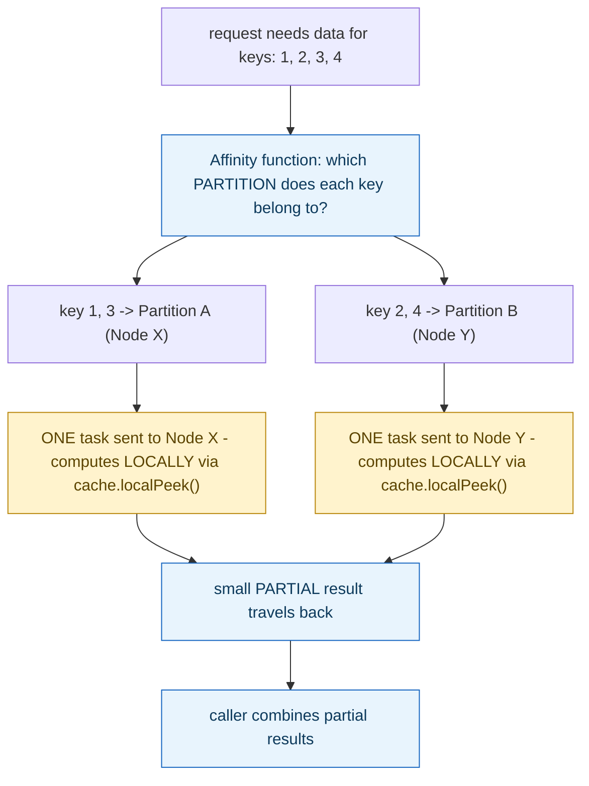

**TL;DR:** Why does this code group keys by partition before running a single query? Because space-based architecture routes computation to wherever the data already lives — grouping keys by partition first turns N individual network round trips into one task per node that actually holds relevant data, each computing a local partial answer in parallel.

> **In plain English (30 sec):** Code you already write — Map, function, API call, just bigger.

**Real repo:** [`apache/ignite`](https://github.com/apache/ignite)

## 1. The Engineering Problem: a central database becomes the bottleneck no amount of app-tier scaling can fix

A traditional architecture funnels every read and write through one shared database — scale the application tier out to as many instances as you want, and they still all compete for the same database's connection pool, disk I/O, and lock contention. Under extreme scale — a huge in-memory working set, huge request volume — that shared database becomes the ceiling the rest of the system can't scale past. Simply caching data closer to the application doesn't fully solve this either: a naive cache still requires *pulling* the relevant piece of data across the network to wherever the computation is happening, one round trip per piece of data needed.

---

## 2. The Technical Solution: partition the data across many nodes' memory, and send the computation to whichever node already holds it

Space-based architecture (implemented here by an in-memory data grid) partitions a dataset across a cluster of nodes' RAM using a deterministic function — given a key, the function always identifies exactly which partition (and therefore which node) owns it. The defining move isn't just storing data in memory closer to compute; it's routing the *computation itself* to wherever the relevant data already lives, so most work becomes a local, in-process memory read rather than a network call.



The alternative this avoids: fetching each of the four keys individually across the network to wherever the caller happens to be running — four round trips instead of two, and the ratio only gets worse as the key count grows. Grouping by partition first means exactly one task per node that actually holds relevant data, each computing its own local partial answer in parallel, with only the small combined results crossing the network at all.

---

## 3. The clean example (concept in isolation)

```java
// naive: pull data TO the compute, one round trip per key
for (long key : keys) {
    Person p = cache.get(key);       // network call, EVERY key
    sum = sum.add(p.getSalary());
}

// space-based: send compute TO the data, grouped by partition
Map<Integer, Set<Long>> byPartition = groupKeysByPartition(keys, affinityFunc);
for (var entry : byPartition.entrySet()) {
    // ONE task per partition - runs ON the node that owns it
    BigDecimal partial = compute.affinityCall(cacheName, entry.getKey(), () -> {
        BigDecimal localSum = new BigDecimal(0);
        for (long k : entry.getValue())
            localSum = localSum.add(cache.localPeek(k).getSalary());  // LOCAL memory read
        return localSum;
    });
    total = total.add(partial);
}
```

---

## 4. Production reality (from `apache/ignite`)

```java
// docs/_docs/code-snippets/.../CollocatedComputations.java
void collocatingByKey(Ignite ignite) {
    IgniteCache<Integer, String> cache = ignite.cache("myCache");
    IgniteCompute compute = ignite.compute();
    int key = 1;

    // This closure will execute on the remote node where
    // data for the given 'key' is located.
    compute.affinityRun("myCache", key, () -> {
        // Peek is a local memory lookup.
        System.out.println("Co-located [key= " + key + ", value= " + cache.localPeek(key) + ']');
    });
}
```

```java
public static void calculateAverage(Ignite ignite, Set<Long> keys) {
    Affinity<Long> affinityFunc = ignite.affinity("person");

    // group keys by which PARTITION they belong to, BEFORE sending any task
    HashMap<Integer, Set<Long>> partMap = new HashMap<>();
    keys.forEach(k -> {
        int partId = affinityFunc.partition(k);
        partMap.computeIfAbsent(partId, key -> new HashSet<Long>()).add(k);
    });

    IgniteCompute compute = ignite.compute();
    BigDecimal total = new BigDecimal(0);

    // ONE task PER PARTITION, not one call per key
    for (Map.Entry<Integer, Set<Long>> pair : partMap.entrySet()) {
        BigDecimal sum = compute.affinityCall(
            Arrays.asList("person"), pair.getKey(), new SumTask(pair.getValue()));
        total = total.add(sum);
    }
}

private static class SumTask implements IgniteCallable<BigDecimal> {
    private Set<Long> keys;
    @IgniteInstanceResource private Ignite ignite;

    public BigDecimal call() {
        IgniteCache<Long, BinaryObject> cache = ignite.cache("person").withKeepBinary();
        BigDecimal sum = new BigDecimal(0);
        for (long k : keys) {
            BinaryObject person = cache.localPeek(k, CachePeekMode.PRIMARY);  // LOCAL, not network
            if (person != null) sum = sum.add(new BigDecimal((float) person.field("salary")));
        }
        return sum;
    }
}
```

What this teaches that a hello-world can't:

- **`calculateAverage` calls `affinityFunc.partition(k)` for every key *before* sending a single task** — this upfront grouping is what turns "N keys" into "however many distinct partitions those keys actually span" tasks, which is almost always far fewer than N. The code explicitly avoids the naive one-request-per-key pattern by doing the partition math locally, in memory, before any network communication happens at all.
- **`cache.localPeek(key)` inside `SumTask.call()` is guaranteed to be a local memory read, never a network call — but only because `compute.affinityCall` already routed this exact task to the node that owns `pair.getKey()`'s partition.** `localPeek` isn't inherently safe to call anywhere; its correctness here depends entirely on the affinity-routing guarantee that placed this code on the right node in the first place.
- **`SumByPartitionTask`'s `ScanQuery<>(partId).setLocal(true)` explicitly constrains the scan to one partition, running locally** — without `setLocal(true)`, the same scan query could fan out across the entire cluster from wherever it was issued, defeating the entire point of having already routed the task to the correct node.

Known-stale fact: space-based architecture is sometimes equated with "put a cache in front of the database," treating any in-memory caching layer as equivalent to a data grid. A read-through cache still funnels the actual *computation* through one central place, even if the data it reads is cached closer by — every request still does its work wherever the application code happens to be running. The defining trait shown here is the opposite direction: `affinityRun`/`affinityCall` route the *computation itself* out to wherever the data already lives, so most work never leaves the node that owns the relevant partition — a genuinely different programming model, not just a faster read path.

---

## Source

- **Concept:** Space-based architecture (in-memory data grid for extreme scale)
- **Domain:** architecture
- **Repo:** [apache/ignite](https://github.com/apache/ignite) → [`docs/_docs/code-snippets/java/src/main/java/org/apache/ignite/snippets/CollocatedComputations.java`](https://github.com/apache/ignite/blob/master/docs/_docs/code-snippets/java/src/main/java/org/apache/ignite/snippets/CollocatedComputations.java) — the Apache Software Foundation's own official in-memory data grid project, code samples maintained directly in its documentation source tree.


