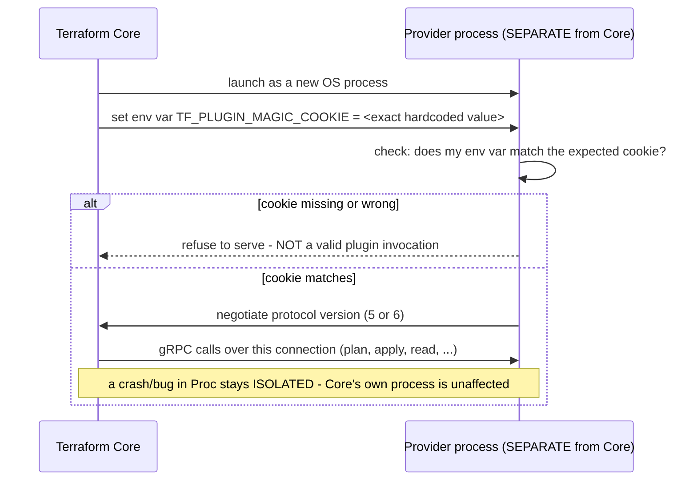

## 1. The Engineering Problem: hundreds of independently-developed extensions can't all be bundled into one binary, or trusted to share its process

Terraform Core needs to support hundreds of independently developed, independently versioned cloud providers — AWS, GCP, Azure, and hundreds more — without three specific failure modes: bundling every provider's code directly into Core (bloating the binary and forcing every provider to release in lockstep with Core's own release schedule); letting a bug or crash inside *one* provider's code take down the entire Terraform process running dozens of other providers' resources; and letting a provider binary be invoked by the wrong host program, or a malicious substitute silently impersonate a real provider. A plugin architecture solves the first problem in principle — but doing it safely requires answering the second and third problems too, not just splitting code into separate files.

---

## 2. The Technical Solution: plugins run as genuinely separate processes, and a handshake secret gates whether one will even start serving

Terraform Core is a minimal microkernel: it defines a stable, *versioned* plugin protocol and launches each provider as its own independent operating-system process — not a library loaded into Core's own memory space — communicating over gRPC across that process boundary. Before a provider binary will agree to start serving requests at all, it checks for a specific environment variable (`TF_PLUGIN_MAGIC_COOKIE`) set to an exact, hardcoded value; if that variable is missing or wrong, the binary refuses to behave as a plugin server.



Isolating each provider in its own process means a provider that panics, leaks memory, or hangs affects only its own process — Core detects the failure at the RPC boundary and can report a clean error, rather than the whole `terraform` command crashing outright. The magic-cookie handshake exists for a narrower, sharper reason: a provider binary is, from the operating system's perspective, just an executable — running it directly (`./terraform-provider-aws`) or having some unrelated program invoke it by accident shouldn't cause it to start speaking a plugin protocol to whatever happens to be listening; the cookie check is what tells the binary "you were specifically launched as a Terraform plugin, by Terraform, on purpose."

---

## 3. The clean example (concept in isolation)

```go
var Handshake = plugin.HandshakeConfig{
    ProtocolVersion:  4,
    MagicCookieKey:   "TF_PLUGIN_MAGIC_COOKIE",
    MagicCookieValue: "d602bf8f...",  // must match EXACTLY, or the plugin refuses to serve
}

func Serve(opts *ServeOpts) {
    plugin.Serve(&plugin.ServeConfig{
        HandshakeConfig: Handshake,
        VersionedPlugins: map[int]plugin.PluginSet{
            5: {"provider": &GRPCProviderPlugin{...}},  // protocol v5 support
            6: {"provider": &GRPCProviderPluginV6{...}}, // protocol v6 support, SAME binary can offer both
        },
        GRPCServer: plugin.DefaultGRPCServer,
    })
}
```

---

## 4. Production reality (from `hashicorp/terraform`)

```go
// internal/plugin/serve.go
var Handshake = plugin.HandshakeConfig{
    // The ProtocolVersion is the version that must match between TF core
    // and TF plugins. This should be bumped whenever a change happens in
    // one or the other that makes it so that they can't safely communicate.
    ProtocolVersion: DefaultProtocolVersion,

    // The magic cookie values should NEVER be changed.
    MagicCookieKey:   "TF_PLUGIN_MAGIC_COOKIE",
    MagicCookieValue: "d602bf8f470bc67ca7faa0386276bbdd4330efaf76d1a219cb4d6991ca9872b2",
}

func Serve(opts *ServeOpts) {
    plugin.Serve(&plugin.ServeConfig{
        HandshakeConfig:  Handshake,
        VersionedPlugins: pluginSet(opts),
        GRPCServer:       plugin.DefaultGRPCServer,
    })
}
```

```go
// internal/plugin/plugin.go - the CORE side: which protocol versions it understands
var VersionedPlugins = map[int]plugin.PluginSet{
    5: {
        "provider":    &GRPCProviderPlugin{},
        "provisioner": &GRPCProvisionerPlugin{},
    },
    6: {
        "provider": &plugin6.GRPCProviderPlugin{},
    },
}
```

What this teaches that a hello-world can't:

- **`MagicCookieValue` is a long, meaningless-looking hardcoded string, explicitly commented "should NEVER be changed."** It isn't a secret in the security-credential sense — it's checked in plaintext, visible in the plugin's own source — but it doesn't need to be secret to do its job: its only purpose is proving the process was launched *specifically as a Terraform plugin*, not that the launcher is trustworthy. A provider binary run directly from a terminal, without that exact environment variable set, will refuse to serve — a cheap, effective guard against accidental or confused invocation.
- **`VersionedPlugins` is keyed by protocol version number (5 and 6), and Core registers plugin sets for *both* simultaneously.** This is what lets Core negotiate down to whichever protocol version a given provider binary actually supports — an older provider built only against protocol 5 keeps working with a newer Core, and a newer provider can opt into protocol 6's capabilities, without every provider needing to be rebuilt in lockstep every time Core's plugin protocol evolves.
- **The plugin communicates over gRPC, across an actual OS process boundary, not through an in-process interface call.** This is a deliberately more expensive choice than loading a shared library into Core's own process (`.so`/`.dll`-style plugins) — it costs IPC serialization overhead on every call — but it buys genuine fault isolation: a provider that panics terminates its own process; Core observes a broken connection and can report a clean error, rather than the entire `terraform` invocation crashing because of a bug in one specific provider out of dozens active in a given run.

Known-stale fact: plugin/microkernel architectures are sometimes assumed to mean "plugins loaded as shared libraries into the host process" — the classic DLL-based extensibility model. Terraform's provider system deliberately does the opposite: each provider is a fully separate operating-system process, communicating with Core only through a defined RPC protocol. The tradeoff is real IPC overhead per call versus a shared-library approach, but it buys something a shared-library plugin architecture structurally cannot: a crash inside one plugin is contained to that plugin's own process and cannot corrupt or take down the host process's memory space at all.

---

## Source

- **Concept:** Plugin/micro-kernel architecture
- **Domain:** architecture
- **Repo:** [hashicorp/terraform](https://github.com/hashicorp/terraform) → [`internal/plugin/serve.go`](https://github.com/hashicorp/terraform/blob/main/internal/plugin/serve.go), [`internal/plugin/plugin.go`](https://github.com/hashicorp/terraform/blob/main/internal/plugin/plugin.go) — a large, real, production infrastructure-as-code tool with hundreds of independently maintained plugin providers.
