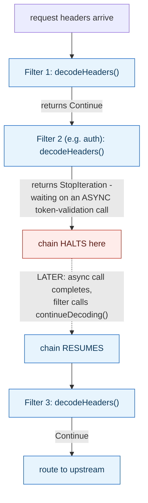

**TL;DR:** How does a filter in a request pipeline pause the whole chain to wait on an async auth call? Each filter returns an explicit status — `StopIteration` halts the chain right where it is until the filter later calls `continueDecoding()` from within its async callback, resuming the chain from outside the original synchronous flow.

> **In plain English (30 sec):** Code you already write — Map, function, API call, just bigger.

**Real repo:** [`envoyproxy/envoy`](https://github.com/envoyproxy/envoy)

## 1. The Engineering Problem: many independent processing steps need to compose without coupling to each other, and some need to pause the whole pipeline

A proxy has to apply many independent processing steps to every request — authentication, rate limiting, routing decisions, compression, logging — without hardcoding how each one calls into the next, or coupling any two steps to each other's implementation. Each step should be addable, removable, and reorderable independently. But a purely synchronous, always-flows-straight-through mental model of "pipe and filter" (the Unix `cat file | grep x | sort` picture) breaks down the moment one step needs to do something asynchronous — an authentication filter waiting on a network call to a token-validation service can't let the request's body keep flowing to the next filter before that answer comes back, but it also can't block the whole proxy process while it waits.

---

## 2. The Technical Solution: each filter returns an explicit status that controls whether the pipe advances, halts, or buffers

Envoy structures request processing as an ordered chain of **filters** — its own literal terminology for the pattern — where each filter's callback (`decodeHeaders`, for instance) processes the data it's handed and returns a status value that the filter chain's own manager uses to decide what happens next. `Continue` means "done with this filter, advance the pipe to the next one in the chain." `StopIteration` means "halt the chain right here" — used exactly for cases like an in-flight async call, where the filter isn't ready to hand data onward yet. `StopAllIterationAndBuffer` goes further: halt the chain *and* retain whatever data has arrived so far, rather than letting it be discarded while the filter waits.



Each filter only needs to know about the data handed to it and the status it returns — never which other filters exist, what they individually do, or how many steps come before or after it beyond its configured position in the chain. That decoupling is what makes filters independently composable; the status-driven flow control is what makes that composability survive contact with genuinely asynchronous processing steps, not just synchronous ones.

---

## 3. The clean example (concept in isolation)

```cpp
enum class FilterStatus { Continue, StopIteration };

FilterStatus AuthFilter::decodeHeaders(RequestHeaders& headers) {
    if (cachedTokenValid(headers)) {
        return FilterStatus::Continue;          // pipe advances immediately
    }
    startAsyncTokenValidation(headers, [this]() {
        this->continueDecoding();               // called LATER, resumes the halted chain
    });
    return FilterStatus::StopIteration;          // pipe halts HERE until the callback fires
}
```

---

## 4. Production reality (from `envoyproxy/envoy`)

```cpp
// source/common/http/filter_manager.cc
bool ActiveStreamFilterBase::commonHandleAfterHeadersCallback(FilterHeadersStatus status,
                                                                bool& end_stream) {
    switch (status) {
    case FilterHeadersStatus::StopIteration:
        iteration_state_ = IterationState::StopSingleIteration;
        break;
    case FilterHeadersStatus::StopAllIterationAndBuffer:
        iteration_state_ = IterationState::StopAllBuffer;
        break;
    case FilterHeadersStatus::StopAllIterationAndWatermark:
        iteration_state_ = IterationState::StopAllWatermark;
        break;
    case FilterHeadersStatus::ContinueAndDontEndStream:
        end_stream = false;
        headers_continued_ = true;
        break;
    case FilterHeadersStatus::Continue:
        headers_continued_ = true;
        break;
    }

    handleMetadataAfterHeadersCallback();

    if (stoppedAll() || status == FilterHeadersStatus::StopIteration) {
        return false;   // do NOT advance to the next filter yet
    } else {
        return true;    // advance the pipe
    }
}
```

```cpp
// ActiveStreamDecoderFilter::continueDecoding() - how a HALTED chain resumes later
void ActiveStreamDecoderFilter::continueDecoding() { commonContinue(); }
```

What this teaches that a hello-world can't:

- **`FilterHeadersStatus` has more than a binary Continue/Stop — `StopAllIterationAndBuffer` and `StopAllIterationAndWatermark` are distinct halted states, not variations of the same thing.** A filter halting because it's waiting on an async call (and will resume the *same* filter's position later) is a different situation from a filter that needs the *entire remaining request body* buffered before it can proceed at all — the framework tracks these as genuinely different `iteration_state_` values, not one generic "paused" flag, because resuming from each looks different.
- **`continueDecoding()` is a completely separate method from the `decodeHeaders` callback that returned `StopIteration` in the first place** — it's called later, from *outside* the normal synchronous flow, typically from within an async callback (a completed network call, a timer firing). This is the concrete mechanism that makes "pause the pipe, then resume it later, from unrelated code" possible at all: the filter chain's state persists across that pause, waiting for exactly this call.
- **The switch statement's `default`/missing-case handling is absent — every enum value is explicitly handled, and Envoy's codebase elsewhere uses `PANIC_DUE_TO_CORRUPT_ENUM` for unhandled cases in equivalent switches.** For a proxy processing untrusted network traffic through dozens of filter combinations, silently falling through an unhandled status value would be a genuinely dangerous class of bug — explicit exhaustive handling turns "we forgot a case" into an immediate, loud failure during development rather than an obscure runtime inconsistency.

Known-stale fact: pipe-and-filter architecture is sometimes taught purely through its simplest form — Unix shell pipes, where data always flows straight through from one filter to the next with no pausing, branching, or buffering. Real production pipe-and-filter systems, like Envoy's HTTP filter chain, need substantially richer flow-control semantics: any filter can halt the entire pipeline mid-flight for an arbitrary length of time (an async call, a rate-limit check, a WAF inspection), optionally retain buffered data while halted, and resume later from code that has nothing to do with the original synchronous call stack. The simple mental model is a correct starting point, not the full picture a real implementation has to handle.

---

## Source

- **Concept:** Pipe-and-filter/pipeline architecture
- **Domain:** architecture
- **Repo:** [envoyproxy/envoy](https://github.com/envoyproxy/envoy) → [`source/common/http/filter_manager.cc`](https://github.com/envoyproxy/envoy/blob/main/source/common/http/filter_manager.cc) — a large, real, widely deployed production edge/service proxy.


