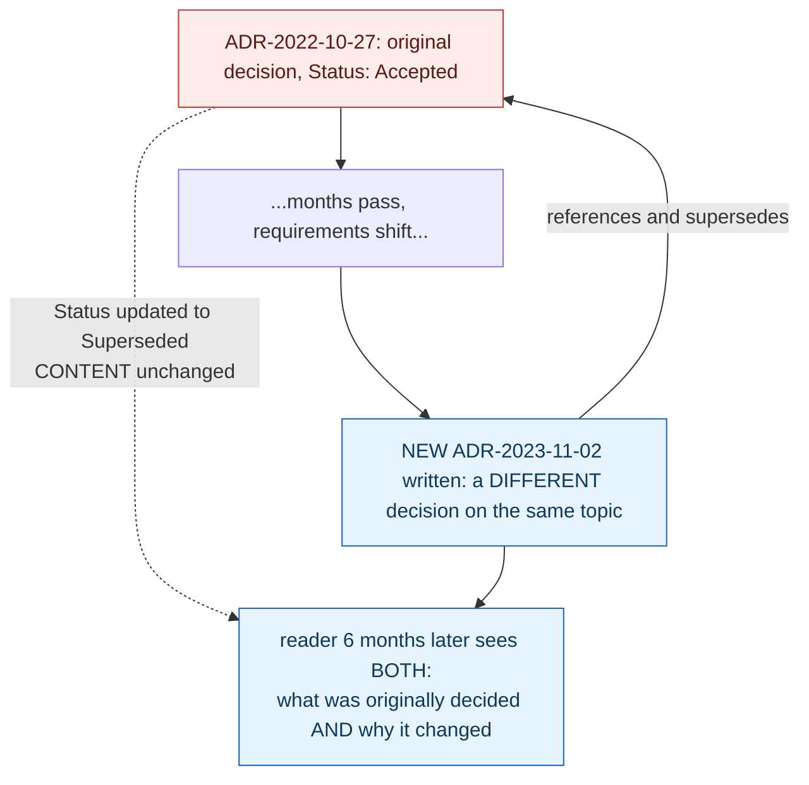

> **In plain English (30 sec):** A focused deep-dive on a specific mechanism or problem pattern.

## 1. The Engineering Problem: current code shows *what* was decided, never *why*, and design docs drift or get silently rewritten

Six months after a subtle architectural decision — say, redefining what a configuration field actually means — a new engineer reading the current code sees only the *current* behavior. Nothing visible tells them what the field used to mean, why it changed, what alternative was considered and rejected, or what tradeoff was accepted along the way. A code comment can capture some of this, but comments get deleted the moment the code they annotate changes again. A design doc written before implementation often drifts out of sync with what actually shipped, or gets silently edited in place as understanding evolves — collapsing the *history* of reasoning into whatever the page happens to say today, with no trace of what it used to say or why it changed.

---

## 2. The Technical Solution: a small, dated, immutable record per decision — superseded by a new one, never rewritten in place

An Architecture Decision Record follows a fixed, minimal structure: a **Title** (an imperative sentence — what's being decided), a **Status** (`Proposed`, `Accepted`, `Rejected`, `Superseded`, or `Deprecated`), **Context** (the situation that made this decision necessary — the background a future reader needs, not the decision itself), **Decision** (what was chosen, and how it's implemented), and **Consequences** (what becomes easier or harder as a result — including real downsides, not just benefits). The discipline that makes this genuinely different from a wiki page: once accepted, an ADR is never edited to reflect a later change of mind — a new decision gets a *new*, separately dated ADR, which can reference and supersede the old one, but the old one's content stays intact.



The value isn't the individual document — it's the *sequence*. A reader six months later doesn't just see the current rule; they can trace the actual history of reasoning that led to it, including decisions that were later reversed and exactly why.

---

## 3. The clean example (concept in isolation)

```markdown
# Redefine what field X means

**Status**: Accepted

## Context
_What situation made this decision necessary — background a future reader needs._

## Decision
_What was chosen, and how it's implemented._

## Consequences
_What becomes easier or harder as a result — including real downsides._
```

---

## 4. Production reality (from `actions/actions-runner-controller`)

```markdown
<!-- docs/adrs/yyyy-mm-dd-TEMPLATE.md - the project's own enforced structure -->
# Title
<!-- ADR titles should typically be imperative sentences. -->
**Status**: (Proposed|Accepted|Rejected|Superceded|Deprecated)

## Context
_What is the issue or background knowledge necessary for future readers
to understand why this ADR was written?_

## Decision
_**What** is the change being proposed? **How** will it be implemented?_

## Consequences
_What becomes easier or more difficult to do because of this change?_
```

```markdown
<!-- docs/adrs/2023-11-02-min-runners-semantics.md - a REAL, filled-out ADR -->
# Changing semantics of the `minRunners` field

**Status**: Accepted

## Context

Current implementation treats the `minRunners` field as the number of runners
that should be running on your cluster. They can be busy running the job,
starting up, idle. This ensures faster cold startup time when workflows are
acquired as well as trying to use the minimum amount of runners needed to
fulfill the scaling requirement.

However, especially large and busy clusters could benefit having `minRunners`
as minimum idle runners. When jobs are comming in large batches, the
`AutoscalingRunnerSet` should pre-emptively increase the number of idle
runners to further decrease the startup time for the next batch.

## Decision

We will redefine the minRunners field to represent the minimum number of idle
runners instead. The total number of runners would then be the sum of jobs
assigned to the scale set and the minRunners value. The change in the
behavior is completely internal, it does not require any modifications on
the user side.

## Consequences

Changing the semantics of the `minRunners` field should result in faster job
startup times on spikes as well as on cold startups.
```

What this teaches that a hello-world can't:

- **The filename itself is dated (`2023-11-02-...`) and immutable — the folder holds a chronological sequence of these files, not one page that gets edited.** A reader browsing `docs/adrs/` sees thirteen separately dated decisions spanning over a year, each preserved exactly as accepted; nothing here is a "living document" that could silently read differently tomorrow than it does today.
- **The Context section explains a real, specific operational problem (large/busy clusters needing pre-emptive idle capacity for job spikes) — not a restatement of the decision itself.** A future reader who only cares "what does `minRunners` mean today" can read the Decision section alone; a reader debugging *why* runners aren't scaling the way they expect can go straight to Context and find the actual operational scenario that motivated the change, in the maintainers' own words, not a reconstruction from a code comment or a commit message.
- **Consequences names a real, specific outcome ("faster job startup times on spikes as well as cold startups") without claiming the change is free** — even a short ADR entry states what becomes better, giving a future reader a concrete way to judge, months later, whether the decision actually delivered what it promised, rather than a bare declaration that a change happened.

Known-stale fact: ADRs are sometimes treated as a bureaucratic formality — a checkbox filled in once and then ignored — or confused with a general design/wiki document that gets updated in place as understanding evolves. The discipline that makes an ADR genuinely useful later is specifically that it *doesn't* get updated in place: a changed decision produces a new, separately dated record rather than a silent edit to the old one, which is what preserves the actual sequence of reasoning across a project's life instead of collapsing it into whatever the current page happens to say.

---

## Source

- **Concept:** Architecture Decision Records (ADRs)
- **Domain:** architecture
- **Repo:** [actions/actions-runner-controller](https://github.com/actions/actions-runner-controller) → [`docs/adrs/yyyy-mm-dd-TEMPLATE.md`](https://github.com/actions/actions-runner-controller/blob/master/docs/adrs/yyyy-mm-dd-TEMPLATE.md), [`docs/adrs/2023-11-02-min-runners-semantics.md`](https://github.com/actions/actions-runner-controller/blob/master/docs/adrs/2023-11-02-min-runners-semantics.md) — a real, actively maintained Kubernetes controller project with a real, dated ADR log.


