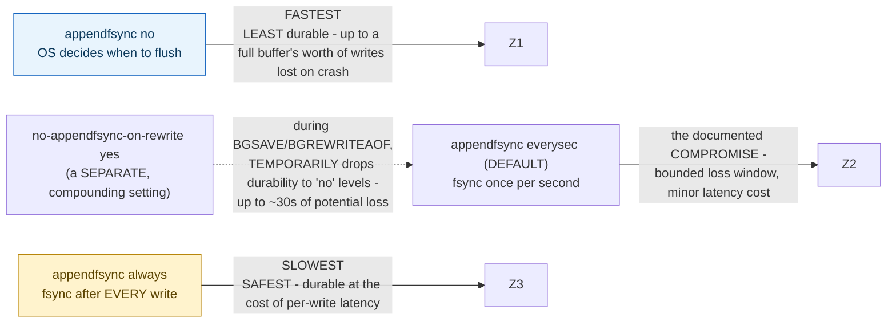

## 1. The Engineering Problem: "fast" and "durable" are in direct tension, and different applications need genuinely different answers

"Make it fast" and "make it durable" (survive a crash without losing recently written data) are often in direct tension at the exact same point in a system, and there's no single universally correct answer — a session cache can tolerate losing the last second of writes after a crash; a financial ledger typically cannot. A system that hardcodes one answer forces every deployment onto the same tradeoff regardless of what that specific application actually needs. Exposing the tradeoff as a configuration knob helps, but only if the knob's real consequences are explained clearly enough that someone can make a deliberate, informed choice — an unlabeled setting just moves the same problem one level up without actually solving it.

---

## 2. The Technical Solution: name each option's exact consequence in the config itself, and default to a documented compromise, not an extreme

Redis's `appendfsync` setting controls exactly when the operating system is told to actually flush write-ahead-log data to disk, rather than leaving it in a buffer — and the shipped configuration file documents all three options with their real consequence spelled out, not just their name: `no` ("don't fsync, just let the OS flush the data when it wants. **Faster.**"), `always` ("fsync after every write to the append only log. **Slow, Safest.**"), and `everysec` ("fsync only one time every second. **Compromise.**") — and `everysec` is the documented default, chosen explicitly and by name as "the right compromise between speed and data safety," not silently defaulted to whichever extreme is easiest to implement.



The tradeoff isn't fully described by `appendfsync` in isolation, either — a second, related setting shows how quality-attribute tradeoffs *compound*. `no-appendfsync-on-rewrite`, when set to `yes`, temporarily suspends fsync entirely during a background save or AOF rewrite (to avoid disk I/O contention from hurting foreground write latency during that window) — meaning the *effective* durability guarantee at any given moment depends not just on `appendfsync`'s value, but on whether a background save happens to be running right now.

---

## 3. The clean example (concept in isolation)

```
# three modes, each with a NAMED consequence, not just a name:
appendfsync no        # fastest, least durable - OS decides when to flush
appendfsync everysec  # DEFAULT - documented as "the right compromise"
appendfsync always    # slowest, safest - fsync after every single write
```

---

## 4. Production reality (from `redis/redis`)

```conf
# redis.conf
# The fsync() call tells the Operating System to actually write data on disk
# instead of waiting for more data in the output buffer. Some OS will really
# flush data on disk, some other OS will just try to do it ASAP.
#
# Redis supports three different modes:
#
# no: don't fsync, just let the OS flush the data when it wants. Faster.
# always: fsync after every write to the append only log. Slow, Safest.
# everysec: fsync only one time every second. Compromise.
#
# The default is "everysec", as that's usually the right compromise between
# speed and data safety. It's up to you to understand if you can relax this
# to "no" that will let the operating system flush the output buffer when
# it wants, for better performances (but if you can live with the idea of
# some data loss consider the default persistence mode that's snapshotting),
# or on the contrary, use "always" that's very slow but a bit safer than
# everysec.
#
# If unsure, use "everysec".
appendfsync everysec
```

```conf
# a SEPARATE setting that compounds with the above
# When the AOF fsync policy is set to always or everysec, and a background
# saving process is performing a lot of I/O against the disk, in some Linux
# configurations Redis may block too long on the fsync() call...
#
# This means that while another child is saving, the durability of Redis is
# the same as "appendfsync no". In practical terms, this means that it is
# possible to lose up to 30 seconds of log in the worst scenario.
#
# If you have latency problems turn this to "yes". Otherwise leave it as
# "no" that is the safest pick from the point of view of durability.
no-appendfsync-on-rewrite no
```

What this teaches that a hello-world can't:

- **Every option's comment states the actual consequence, not just a label** — "Faster," "Slow, Safest," "Compromise" appear directly next to each mode name, in the file an operator actually edits. A reader doesn't need to consult external documentation to understand what they're choosing; the tradeoff is legible at the point of decision.
- **The default isn't the fastest option, and isn't the safest option — it's a named, deliberate middle ground, with the reasoning stated explicitly ("that's usually the right compromise between speed and data safety").** This is a real signal about how to design a tradeoff-exposing setting: defaulting to an extreme optimizes for one quality attribute at the total expense of the other for anyone who doesn't customize it; this default is chosen to be reasonable for the *common* case while still leaving both extremes available for applications with genuinely different needs.
- **`no-appendfsync-on-rewrite`'s own comment explicitly states its effective consequence in terms of the *other* setting** — "the durability of Redis is the same as 'appendfsync no'" — rather than describing itself in isolation. This is a real, precise example of quality-attribute tradeoffs compounding: the actual durability guarantee active at any moment depends on the interaction between two settings and the system's current operational state (is a background save running right now), not on reading either setting alone.

Known-stale fact: non-functional requirement tradeoffs are sometimes treated as a single, one-time global decision — "we chose eventual consistency" or "we prioritize durability," as if one statement fully describes the system's behavior everywhere. Redis's own configuration shows the tradeoff is neither singular nor static: `appendfsync` sets a baseline, but `no-appendfsync-on-rewrite` can silently and temporarily degrade that guarantee during specific operational windows (an active background save), meaning the real, effective quality-attribute posture at any given moment depends on how multiple settings interact and what the system happens to be doing right now — not a fact fully captured by any single configuration line read in isolation.

---

## Source

- **Concept:** Non-functional requirements & quality attribute tradeoffs
- **Domain:** architecture
- **Repo:** [redis/redis](https://github.com/redis/redis) → [`redis.conf`](https://github.com/redis/redis/blob/unstable/redis.conf) — the actual shipped configuration file of a real, widely deployed production data store.
