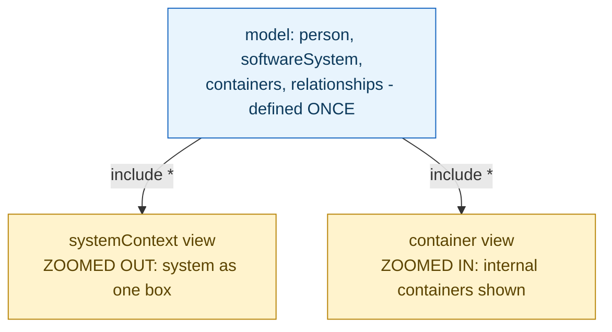

## 1. The Engineering Problem: hand-drawn diagrams at different zoom levels inevitably drift apart

A system needs documentation at different zoom levels — a high-level picture for a stakeholder who just needs to know what talks to what, and a detailed picture for an engineer who needs to see the internal pieces of one specific system. Drawing these as separate diagrams (in a general-purpose tool — a slide deck, a whiteboard export) means maintaining two or more independent pictures of the *same* underlying reality by hand. The moment one changes — a new container added, a relationship renamed — nothing forces the other diagrams to update too. Diagrams drift out of sync with each other and with the actual system, silently, with no mechanism that would ever catch the mismatch.

---

## 2. The Technical Solution: define the model once; every diagram is a filtered view generated from that same model, never drawn independently

The C4 model's actual technical mechanism, as implemented by Structurizr's DSL, is to describe the system's elements and relationships exactly once — people, software systems, the containers inside a system, relationships between them — as a single structured **model**. Diagrams are then declared as **views** *of* that model: a `systemContext` view and a `container` view aren't separately drawn pictures, they're different *filters and zoom levels* applied to the same underlying data. Change an element or relationship once in the model, and every view that includes it reflects the change automatically — there is no second place for the same fact to drift out of sync with.



`include *` in each view is a filter expression, not a redraw — it says "show everything relevant to this view's scope from the model," at whichever zoom level that view is declared at. A `systemContext` view shows systems and people as single boxes; a `container` view for the *same* system expands it to show the containers inside, using the exact same underlying element and relationship definitions.

---

## 3. The clean example (concept in isolation)

```
workspace "Name" "Description" {
    model {
        u = person "User"
        ss = softwareSystem "System" {
            web = container "Web App"
            db = container "Database"
        }
        u -> ss.web "Uses"
        ss.web -> ss.db "Reads/writes"
    }

    views {
        systemContext ss "Diagram1" { include * }   # zoomed OUT
        container ss "Diagram2" { include * }        # zoomed IN - SAME model
    }
}
```

---

## 4. Production reality (from `structurizr/structurizr.github.io`)

```
# dsl/tutorial/1.dsl - Level 1: system context only
workspace "Name" "Description" {
    model {
        u = person "User"
        ss = softwareSystem "Software System"
        u -> ss "Uses"
    }
    views {
        systemContext ss "Diagram1" {
            include *
        }
    }
}
```

```
# dsl/tutorial/5.dsl - the SAME core model, now WITH containers - BOTH views generated
workspace "Name" "Description"
    !identifiers hierarchical
    model {
        u = person "User"
        ss = softwareSystem "Software System" {
            wa = container "Web Application"
            db = container "Database Schema" {
                tags "Database"
            }
        }
        u -> ss.wa "Uses"
        ss.wa -> ss.db "Reads from and writes to"
    }

    views {
        systemContext ss "Diagram1" {
            include *
        }
        container ss "Diagram2" {
            include *
        }
        styles {
            element "Person" { shape person }
            element "Database" { shape cylinder }
        }
    }
```

What this teaches that a hello-world can't:

- **`ss.wa -> ss.db` is declared exactly once, in the model, and both `Diagram1` (system context) and `Diagram2` (container) can reflect it without redeclaring the relationship separately per diagram.** In `Diagram1`, this relationship is invisible entirely — it's internal to the collapsed `ss` box; in `Diagram2`, the same underlying relationship becomes a visible arrow between two containers. The relationship's *existence* is a fact about the model, stated once; each view decides independently whether and how to render it, based on its own zoom level.
- **`styles` are declared once, in the `views` block, and apply consistently across whichever diagrams render those elements** — `element "Person" { shape person }` doesn't need to be repeated per diagram; a person icon renders identically wherever a person element appears, in any view, because the style rule targets the *element type* in the model, not a specific diagram's drawing.
- **`!identifiers hierarchical` and the `ss.wa` / `ss.db` reference syntax show containers are addressed as children of their software system, not as flat, independently-named elements** — this is what makes "define once, filter into multiple views" structurally possible: the model's own nesting (a system *contains* containers) mirrors C4's own zoom-level hierarchy (context contains containers contains components), rather than the diagramming tool needing separate, disconnected concepts for "logical structure" and "which diagram this appears on."

Known-stale fact: architecture diagrams are sometimes treated as a documentation *artifact* — a picture exported once and pasted into a wiki page, expected to be manually kept up to date by whoever remembers to update it next. The C4 model, implemented via a DSL like this one, treats diagrams as a *generated projection* of a single source-of-truth model instead — closer to how a compiler generates multiple outputs from one source file than to how a designer maintains multiple independent image files. The practical consequence: two diagrams at different zoom levels genuinely cannot drift apart from each other in the ways hand-maintained diagrams routinely do, because they're views of the same data, not separate artifacts describing the same thing twice.

---

## Source

- **Concept:** C4 model & architecture diagramming
- **Domain:** architecture
- **Repo:** [structurizr/structurizr.github.io](https://github.com/structurizr/structurizr.github.io) → [`dsl/tutorial/1.dsl`](https://github.com/structurizr/structurizr.github.io/blob/master/dsl/tutorial/1.dsl), [`dsl/tutorial/5.dsl`](https://github.com/structurizr/structurizr.github.io/blob/master/dsl/tutorial/5.dsl) — the official tutorial source from the creators of the C4 model and Structurizr, the reference DSL/tooling implementation.


