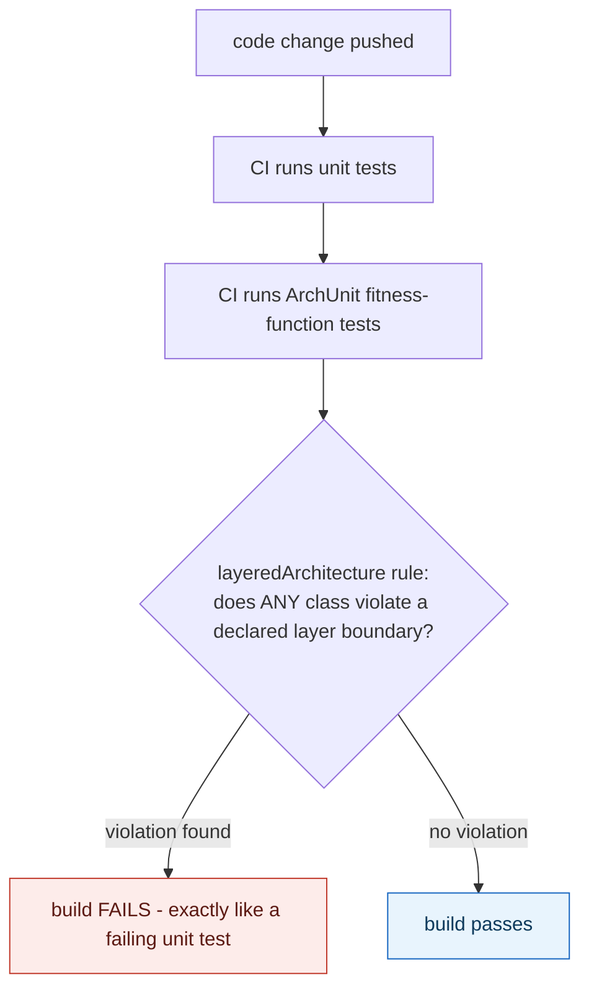

## 1. The Engineering Problem: an architecture rule enforced only by human vigilance decays the moment vigilance lapses once

"Controllers shouldn't be called directly by the persistence layer" or "package X should never depend on package Y" is easy to state in a design doc or an ADR — and just as easy to silently violate months later. A new engineer adds a convenient import that crosses the forbidden boundary; code review misses it, especially in a large diff; the rule quietly stops being true, with nothing anywhere signaling that it happened. A codebase changes on every single commit — an architecture rule verified true on day one has no guarantee of staying true on day two, unless *something* checks it again on day two, and every day after.

---

## 2. The Technical Solution: express architecture rules as automated tests that run in the same pipeline as every other test — a "fitness function"

An architecture fitness function turns a structural rule into an executable test, run automatically on every build, that fails exactly like any other failing test when the rule is violated. ArchUnit implements this for Java by analyzing actual *compiled bytecode* — real class dependencies, not just source text or naming conventions that could be worked around — and expressing the rule in a fluent API that reads close to how the rule would be stated in English: which packages form which layer, and which layers may or may not be accessed by which others.



The critical property: this check runs on *every* build, not periodically or manually — the same way a unit test does. An architecture rule expressed this way can't decay silently, because the very next commit that violates it produces an immediate, specific, loud failure naming exactly which class broke which rule — rather than a violation sitting undetected until someone happens to notice, possibly much later, possibly never.

---

## 3. The clean example (concept in isolation)

```java
@AnalyzeClasses(packages = "com.example")
public class ArchitectureTest {
    @ArchTest
    static final ArchRule layers_are_respected = layeredArchitecture()
        .layer("Controllers").definedBy("..controller..")
        .layer("Services").definedBy("..service..")
        .layer("Persistence").definedBy("..persistence..")

        .whereLayer("Controllers").mayNotBeAccessedByAnyLayer()
        .whereLayer("Services").mayOnlyBeAccessedByLayers("Controllers")
        .whereLayer("Persistence").mayOnlyBeAccessedByLayers("Services");
}
// this is a REAL, EXECUTABLE JUnit test - runs and can FAIL the build, like any other test
```

---

## 4. Production reality (from `TNG/ArchUnit`)

```java
// archunit-example/example-junit5/.../LayeredArchitectureTest.java
@AnalyzeClasses(packages = "com.tngtech.archunit.example.layers")
public class LayeredArchitectureTest {
    @ArchTest
    static final ArchRule layer_dependencies_are_respected = layeredArchitecture().consideringAllDependencies()

        .layer("Controllers").definedBy("com.tngtech.archunit.example.layers.controller..")
        .layer("Services").definedBy("com.tngtech.archunit.example.layers.service..")
        .layer("Persistence").definedBy("com.tngtech.archunit.example.layers.persistence..")

        .whereLayer("Controllers").mayNotBeAccessedByAnyLayer()
        .whereLayer("Services").mayOnlyBeAccessedByLayers("Controllers")
        .whereLayer("Persistence").mayOnlyBeAccessedByLayers("Services");
}
```

ArchUnit dogfoods its own tool against its own source — the project's own internal layering is verified by ArchUnit itself, on every build:

```java
// archunit-self-test/.../ArchUnitArchitectureTest.java
@AnalyzeClasses(
    packagesOf = ArchUnitArchitectureTest.class,
    importOptions = ArchUnitArchitectureTest.ArchUnitProductionCode.class)
public class ArchUnitArchitectureTest {
    @ArchTest
    public static final ArchRule layers_are_respected = layeredArchitecture().consideringAllDependencies()
        .layer("Root").definedBy("com.tngtech.archunit")
        .layer("Base").definedBy("com.tngtech.archunit.base..")
        .layer("Core").definedBy("com.tngtech.archunit.core..")
        .layer("Lang").definedBy("com.tngtech.archunit.lang..")
        .layer("Library").definedBy("com.tngtech.archunit.library..")
        .layer("JUnit").definedBy("com.tngtech.archunit.junit..")

        .whereLayer("JUnit").mayNotBeAccessedByAnyLayer()
        .whereLayer("Library").mayOnlyBeAccessedByLayers("JUnit")
        .whereLayer("Lang").mayOnlyBeAccessedByLayers("Library", "JUnit")
        .whereLayer("Core").mayOnlyBeAccessedByLayers("Lang", "Library", "JUnit")
        .whereLayer("Base").mayOnlyBeAccessedByLayers("Root", "Core", "Lang", "Library", "JUnit");
}
```

What this teaches that a hello-world can't:

- **`@ArchTest` fields are picked up and executed by a real JUnit test engine (`ArchUnitTestEngine`), just like `@Test` methods** — an architecture rule violation shows up in exactly the same test report, the same red/green CI status, and the same "which test failed" output as a broken unit test. There's no separate architecture-review process to remember to run; it's inseparable from the ordinary test suite.
- **ArchUnit's own codebase enforces its own six-layer internal structure (`Root`, `Base`, `Core`, `Lang`, `Library`, `JUnit`) using the exact same tool it publishes** — `mayOnlyBeAccessedByLayers` chains show a strict, one-directional dependency order (`Base` can be reached from almost everywhere, `JUnit` can be reached by nothing). This isn't a demo rule written to look good in documentation; it's the actual constraint the maintainers rely on to keep their own multi-module project from degrading as real contributors submit real changes.
- **`.consideringAllDependencies()` and the layer rules operate on compiled class relationships, not source-level imports or folder names alone.** A class that dynamically references another via reflection, or that's structured to *look* compliant in its file path while its actual bytecode dependencies violate the rule, would still be caught — the check operates on what the code actually does at the class-dependency level, not what its file organization merely suggests.

Known-stale fact: architecture is sometimes treated as a static, one-time analysis — a diagram drawn once, an ADR accepted once, both assumed to remain true indefinitely afterward. Evolutionary architecture specifically names the gap this creates: a codebase changes on every commit, and without an automated check running on every one of those commits, there's no way to know *when* an architecture rule stopped being true — only, eventually, that it no longer is, discovered however and whenever someone happens to notice. A fitness function closes that gap by making the check as continuous as the change itself.

---

## Source

- **Concept:** Evolutionary/fitness-function-driven architecture
- **Domain:** architecture
- **Repo:** [TNG/ArchUnit](https://github.com/TNG/ArchUnit) → [`archunit-example/example-junit5/.../LayeredArchitectureTest.java`](https://github.com/TNG/ArchUnit/blob/main/archunit-example/example-junit5/src/test/java/com/tngtech/archunit/exampletest/junit5/LayeredArchitectureTest.java), [`archunit-self-test/.../ArchUnitArchitectureTest.java`](https://github.com/TNG/ArchUnit/blob/main/archunit-self-test/src/test/java/com/tngtech/archunit/ArchUnitArchitectureTest.java) — a real, widely used Java architecture-testing library that enforces its own architecture with itself.
