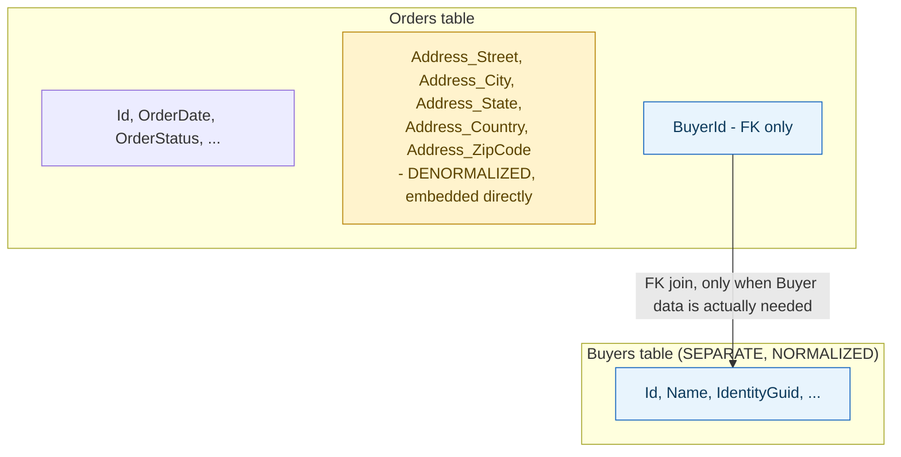

**TL;DR:** Why does Address live as columns on the Orders table, but Buyer gets its own table? Address is a value object with no identity of its own and is never shared across orders, so EF Core's `.OwnsOne` embeds its fields directly as columns on Orders; Buyer has its own identity and is referenced by many orders over time, so it's mapped with `.HasOne().WithMany().HasForeignKey()` as a genuinely separate, normalized table.

> **In plain English (30 sec):** Code you already write — Map, function, API call, just bigger.

**Real repo:** [`dotnet/eShop`](https://github.com/dotnet/eShop)

## 1. The Engineering Problem: every relationship COULD be its own table, but blindly normalizing everything adds real cost for data that's never actually shared

Textbook normalization says eliminate duplication: if two rows could theoretically share the same related data, put that data in its own table and reference it by foreign key. But applying that rule uniformly, everywhere, adds a real cost — an extra table, an extra join on every read — for data that will *never* actually be shared or looked up independently of the one row that owns it. The right question isn't "could this data theoretically live in its own table" — it's "does this data have its own identity, and will more than one owner ever actually reference the same instance of it?"

---

## 2. The Technical Solution: the answer is decided per-relationship, and a single real entity configuration shows both answers side by side

`Order`'s own persistence mapping makes two genuinely different choices for two different kinds of related data, in the same file. `Address` — a value object with no identity of its own, covered in an earlier lesson — is mapped with `.OwnsOne(o => o.Address)`: its five fields (`Street`, `City`, `State`, `Country`, `ZipCode`) become columns directly on the `Orders` table itself. No separate `Addresses` table exists; no join is ever needed to read an order's address. `Buyer`, by contrast, is a real entity with its own identity, referenced by potentially *many* orders over time — it's mapped with `.HasOne(o => o.Buyer).WithMany().HasForeignKey(o => o.BuyerId)`, a genuinely separate, normalized table joined by foreign key.



The deciding factor is visible directly in the domain model, not an arbitrary DBA preference: `Address` has no identity field and is never reached from outside the one `Order` that owns it — embedding it costs nothing, because there was never a scenario where two different orders needed to *share* the exact same address row. `Buyer` has its own `Id`, gets looked up independently (by a buyer-facing account page, say), and the *same* buyer legitimately owns many different orders over time — normalizing it means updating a buyer's name once, in one row, rather than needing to update it redundantly across every order that buyer ever placed.

---

## 3. The clean example (concept in isolation)

```csharp
// value object, no identity, owned exclusively by ONE order -> DENORMALIZE (embed)
orderConfig.OwnsOne(o => o.Address);
// generates: Orders.Address_Street, Orders.Address_City, ... - no join, no separate table

// entity, has its OWN identity, referenced by MANY orders over time -> NORMALIZE (separate table)
orderConfig.HasOne(o => o.Buyer).WithMany().HasForeignKey(o => o.BuyerId);
// generates: Orders.BuyerId (FK) -> Buyers.Id - a real join when Buyer data is needed
```

---

## 4. Production reality (from `dotnet/eShop`)

```csharp
// Ordering.Infrastructure/EntityConfigurations/OrderEntityTypeConfiguration.cs
public void Configure(EntityTypeBuilder<Order> orderConfiguration)
{
    orderConfiguration.Property(o => o.Id).UseHiLo("orderseq");

    //Address value object persisted as owned entity type supported since EF Core 2.0
    orderConfiguration
        .OwnsOne(o => o.Address);

    orderConfiguration
        .Property(o => o.OrderStatus)
        .HasConversion<string>()
        .HasMaxLength(30);

    orderConfiguration.HasOne<PaymentMethod>()
        .WithMany()
        .HasForeignKey(o => o.PaymentId)
        .OnDelete(DeleteBehavior.Restrict);

    orderConfiguration.HasOne(o => o.Buyer)
        .WithMany()
        .HasForeignKey(o => o.BuyerId);
}
```

What this teaches that a hello-world can't:

- **Three relationships are configured in one method, and only one of them is embedded.** `Address` gets `.OwnsOne`; `PaymentMethod` and `Buyer` both get `.HasOne(...).WithMany().HasForeignKey(...)` — genuinely different mapping calls, chosen deliberately per relationship rather than applying one blanket strategy across the whole entity. The code itself is the evidence that this was a considered choice, not an oversight in either direction.
- **`PaymentMethod`'s foreign key relationship includes `.OnDelete(DeleteBehavior.Restrict)` — an explicit statement about what happens if someone tries to delete a referenced `PaymentMethod` row while orders still point to it.** This kind of referential-integrity concern only exists *because* the relationship is normalized into a separate table with a real foreign key; an embedded value object like `Address` has no equivalent concern, because there's nothing external for an order's embedded address to reference or lose.
- **`Address`'s embedded columns can only ever be read or written as part of loading or saving the `Order` row that owns them — there's no way to query "all orders sharing this exact address" as a join, because there's no separate address identity to join against.** This is the real, structural tradeoff of denormalizing: a query that only makes sense *because* the data is genuinely per-owner (read the order, get its address, no lookup needed) trades away a query pattern that was never actually needed (finding other rows that happen to share the same address) in exchange for eliminating a join on every single read.

Known-stale fact: normalization is sometimes taught as an unconditional goal — eliminate all duplication, target Third Normal Form as the default, treat every foreign-key-shaped relationship as something that belongs in its own table. This single real entity configuration shows the actual production practice is a per-relationship decision: `Address` (no identity, single owner, never independently queried) is deliberately denormalized into the owning table; `Buyer` and `PaymentMethod` (real identity, referenced by many rows, independently queryable) are deliberately kept normalized. The correct level of normalization isn't a global rule applied uniformly across a schema — it's a judgment made separately for each relationship, based on whether the related data has its own identity and is actually shared.

---

## Source

- **Concept:** Normalization vs denormalization
- **Domain:** databases
- **Repo:** [dotnet/eShop](https://github.com/dotnet/eShop) → [`src/Ordering.Infrastructure/EntityConfigurations/OrderEntityTypeConfiguration.cs`](https://github.com/dotnet/eShop/blob/main/src/Ordering.Infrastructure/EntityConfigurations/OrderEntityTypeConfiguration.cs) — a real, actively maintained reference application's actual EF Core mapping configuration.


