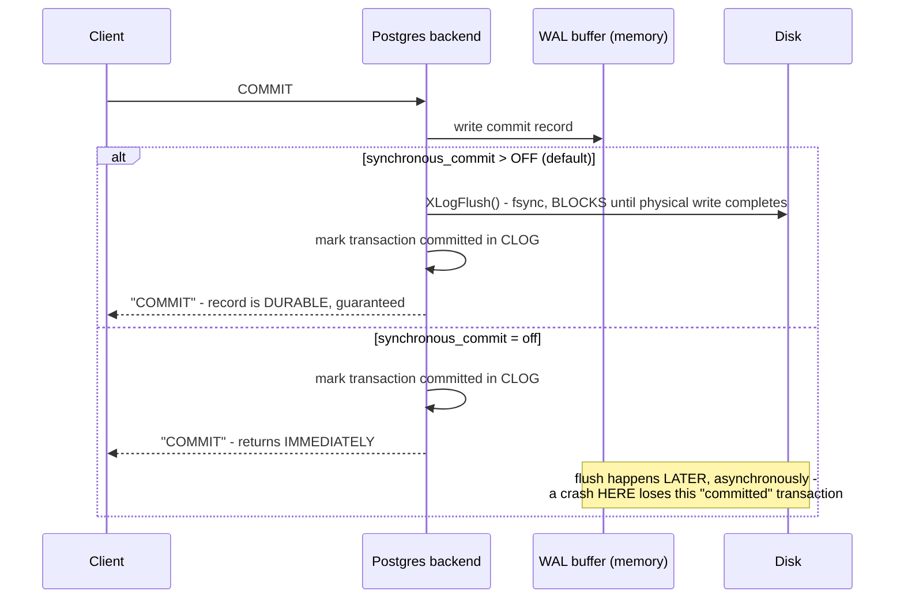

**TL;DR:** Postgres has a setting that can make a committed transaction not actually durable — why does that setting exist? Durability normally costs a real `fsync` flush to disk before the client is told "committed"; when `synchronous_commit` is set to `off`, Postgres skips that flush and returns immediately, trading guaranteed durability for lower write latency on workloads that can tolerate losing the last few transactions in a crash.
> **In plain English (30 sec):** Think of this like concepts you already use, but in a production system at scale.


**Real repo:** [`postgres/postgres`](https://github.com/postgres/postgres)

## 1. The Engineering Problem: durability has a real, measurable cost, and "always pay it" isn't free for everyone

"The transaction is durable once committed" sounds like a fixed, unconditional guarantee — but durability actually costs something real: an `fsync` call that forces data out of an in-memory buffer onto physical disk, which is slow relative to just writing to memory and returning. A database that unconditionally waits for that physical write on *every single* transaction before telling the client "committed" is maximally safe, but pays that latency cost even for workloads that could tolerate losing the last few transactions on a rare crash (an analytics ingestion pipeline re-fed from a durable source, say) in exchange for meaningfully lower write latency. The question isn't whether durability matters — it's whether every single transaction needs the *same* durability guarantee, paid for the same way, every time.

---

## 2. The Technical Solution: a single guard clause in the commit function decides whether the physical flush happens before or after telling the client "done"

Postgres's real commit function gates the actual disk flush behind one explicit condition. The write-ahead log (WAL) record for a transaction is always written first — but whether that record is forced out to physical disk via `XLogFlush` (which ultimately calls `fsync`) *before* the transaction is considered complete depends on the `synchronous_commit` setting. When it's above `SYNCHRONOUS_COMMIT_OFF` (the default), the flush happens synchronously — the client doesn't get "COMMIT" back until the WAL record is actually durable on disk. When it's set to `off`, that flush is skipped in this path entirely; the WAL record may still be sitting in an in-memory buffer, unflushed, at the exact moment the client is told the transaction succeeded.



Atomicity is enforced by a separate, ordered step tied to the same boundary: `TransactionIdCommitTree` marks the transaction's ID as committed in the CLOG (commit log) — the mechanism that determines whether the transaction's changes are visible to *other* sessions at all. That marking happens inside the same guarded block, after the flush decision, so a transaction's visibility to the rest of the system is bound to the exact same durability checkpoint its own WAL record crossed (or didn't).

---

## 3. The clean example (concept in isolation)

```c
// simplified from Postgres's real commit logic
if (wrote_xlog && markXidCommitted && synchronous_commit > SYNCHRONOUS_COMMIT_OFF) {
    XLogFlush(XactLastRecEnd);           // BLOCKS until WAL record is physically durable
    TransactionIdCommitTree(xid, ...);   // NOW mark committed - visible to other sessions
} else {
    // asynchronous commit: client told "done" WITHOUT waiting for the physical flush
    // a crash before the async flush completes LOSES this transaction
}
```

---

## 4. Production reality (from `postgres/postgres`)

```c
// src/backend/access/transam/xact.c - RecordTransactionCommit()

/*
 * However, if we're doing cleanup of any non-temp rels or committing any
 * command that wanted to force sync commit, then we must flush XLOG
 * immediately. ...
 */
if ((wrote_xlog && markXidCommitted &&
     synchronous_commit > SYNCHRONOUS_COMMIT_OFF) ||
    forceSyncCommit || nrels > 0)
{
    XLogFlush(XactLastRecEnd);

    /*
     * Now we may update the CLOG, if we wrote a COMMIT record above
     */
    if (markXidCommitted)
        TransactionIdCommitTree(xid, nchildren, children);
}
else
{
    /*
     * Asynchronous commit case:
     *
     * This enables possible committed transaction loss in the case of a
     * postmaster crash because WAL buffers are left unwritten. Ideally we
     * could issue the WAL write without the fsync, but some
     * wal_sync_methods do not allow separate write/fsync.
     */
}
```

What this teaches that a hello-world can't:

- **The comment inside the `else` branch says, in the maintainers' own words, "this enables possible committed transaction loss" — stated plainly, not hedged.** This is a database whose entire premise is strict transactional guarantees, shipping a documented, named configuration path where "committed" doesn't mean "guaranteed durable" — a precise, real counterexample to treating ACID's "D" as an unconditional property of any system that calls itself ACID-compliant.
- **`TransactionIdCommitTree` — the call that actually makes a transaction's changes visible to other sessions — runs *inside* the same conditional block as the WAL flush, not independently of it.** Atomicity (all-or-nothing visibility) and Durability (survives a crash) aren't two unrelated guarantees bolted together; in this real implementation, visibility is granted at the exact same checkpoint durability was (or wasn't) secured, which is why a crash before this point leaves the transaction as if it never happened at all — nothing partially applied, nothing partially visible.
- **`forceSyncCommit || nrels > 0` are separate override conditions that force the synchronous path even when `synchronous_commit` is off** — specifically because deleting files (`nrels > 0`, dropping tables) can't be safely made asynchronous: the comment elsewhere in this function explains that allowing async commit for a transaction that deletes non-temporary files risks deleting the files *before* the COMMIT record reaches disk, which would corrupt crash recovery. Some operations override the tunable durability knob because they have their own hard requirement it can't be relaxed for.

Known-stale fact: ACID's Durability guarantee is sometimes assumed to be a fixed, always-on property inherent to any database that markets itself as ACID-compliant — either a transaction is durable, or the database isn't really ACID. Postgres's own `synchronous_commit` setting demonstrates that durability is a real, deliberately *tunable* boundary even within a strictly transactional, genuinely ACID-compliant system — the same fundamental tradeoff shape as a setting like Redis's `appendfsync`, just applied inside a system whose core selling point is supposed to be the opposite of "eventually durable." Understanding ACID requires checking which specific guarantees a given configuration actually delivers, not assuming the label guarantees a fixed, non-negotiable set of properties.

---

## Source

- **Concept:** Transactions & ACID
- **Domain:** databases
- **Repo:** [postgres/postgres](https://github.com/postgres/postgres) → [`src/backend/access/transam/xact.c`](https://github.com/postgres/postgres/blob/master/src/backend/access/transam/xact.c) — the actual PostgreSQL server source, `RecordTransactionCommit()`.


