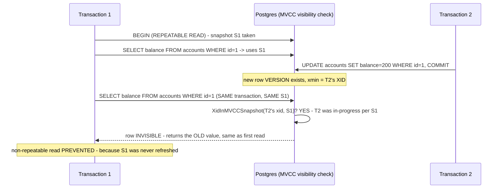

## 1. The Engineering Problem: concurrent transactions need a consistent view of data, but "consistent" has real degrees

Two transactions running at the same time need each to see a coherent picture of the data — but "coherent" isn't one fixed thing. A **dirty read** happens if transaction A sees B's *uncommitted* changes at all. A **non-repeatable read** happens if A runs the same query twice and gets different results because B committed a change in between. A **phantom read** happens if A's range query returns a *new* row on a second run because B inserted a matching row in between. Different applications tolerate different subsets of these anomalies at different performance costs — a database needs an actual mechanism that draws these lines precisely, not just a documented promise about what each isolation level means.

---

## 2. The Technical Solution: row visibility is decided against a frozen snapshot, and how often that snapshot refreshes is the entire difference between isolation levels

Postgres's real row-visibility function, `HeapTupleSatisfiesMVCC`, decides whether a specific stored row *version* is visible to a transaction by comparing that version's creating transaction ID against a **snapshot** — a frozen record of "which transaction IDs were still in-progress at some specific moment." The deciding check, `XidInMVCCSnapshot(...)`, returns invisible if the row's creator was still in-progress *according to that snapshot* — regardless of whether that transaction has, in real wall-clock time, actually committed since. This one mechanism, combined with a policy for *when a new snapshot gets taken*, is the entire implementation of isolation-level differences.



Under **READ COMMITTED**, Postgres takes a *fresh* snapshot for every individual statement — so a later query in the same transaction sees a newer snapshot, and T2's committed change becomes visible, which is exactly what allows a non-repeatable read. Under **REPEATABLE READ**, exactly one snapshot is taken for the entire transaction and reused for every query inside it — re-running the same query later sees the identical data, because it's still being checked against the same frozen snapshot, not a newer one.

---

## 3. The clean example (concept in isolation)

```c
bool RowVisibleTo(RowVersion row, Snapshot snap) {
    if (XidInMVCCSnapshot(row.creating_xid, snap))
        return false;   // creator was "in progress" per THIS snapshot - invisible
    return TransactionDidCommit(row.creating_xid);  // otherwise, visible iff it committed
}

// READ COMMITTED: snap = TakeSnapshot() called BEFORE EVERY statement
// REPEATABLE READ: snap = TakeSnapshot() called ONCE, reused for the WHOLE transaction
```

---

## 4. Production reality (from `postgres/postgres`)

```c
// src/backend/access/heap/heapam_visibility.c
/*
 * HeapTupleSatisfiesMVCC
 *      True iff heap tuple is valid for the given MVCC snapshot.
 *
 * Notice that here, we will not update the tuple status hint bits if the
 * inserting/deleting transaction is still running according to our
 * snapshot, even if in reality it's committed or aborted by now. This is
 * intentional.
 */
static inline bool
HeapTupleSatisfiesMVCC(HeapTuple htup, Snapshot snapshot,
                        Buffer buffer, SetHintBitsState *state)
{
    HeapTupleHeader tuple = htup->t_data;

    if (!HeapTupleHeaderXminCommitted(tuple))
    {
        // ... (cases for the CURRENT transaction's own inserts/deletes) ...

        else if (XidInMVCCSnapshot(HeapTupleHeaderGetRawXmin(tuple), snapshot))
            return false;   // creator was in-progress AT SNAPSHOT TIME - INVISIBLE

        else if (TransactionIdDidCommit(HeapTupleHeaderGetRawXmin(tuple)))
            SetHintBitsExt(tuple, buffer, HEAP_XMIN_COMMITTED, ...);
        else
        {
            /* it must have aborted or crashed */
            SetHintBitsExt(tuple, buffer, HEAP_XMIN_INVALID, ...);
            return false;
        }
    }
    // ...
}
```

What this teaches that a hello-world can't:

- **The check is against `XidInMVCCSnapshot`, not against the transaction's *current, real* commit state.** The function's own comment states this explicitly: it will treat a row as invisible "even if in reality it's committed or aborted by now." Visibility is a property of the *snapshot*, a value captured at one specific moment, not a live query against global transaction state — which is exactly why reusing the same snapshot across a whole transaction is what makes repeated reads within it stable.
- **`TransactionIdDidCommit` is only checked for transaction IDs that *aren't* in the snapshot at all** — meaning they're old enough to be unambiguously either committed or aborted by the time this snapshot was taken. This two-tier check (first: was it even running when my snapshot started; only then: did it actually commit) is what separates "too recent to have a settled answer yet, relative to me" from "old enough that only its real outcome matters."
- **No lock is taken to make any of this work.** A reader never blocks a writer and a writer never blocks a reader under MVCC — consistency comes from each transaction seeing its own private, frozen snapshot of "which versions existed and were committed as of some point," not from preventing other transactions from writing concurrently. This is a structurally different mechanism than isolation implemented via row or table locks.

Known-stale fact: preventing read anomalies (non-repeatable reads especially) is sometimes assumed to require locking rows to keep them from changing while a transaction is reading them. Postgres's MVCC implementation achieves the same guarantee without any read-side locking at all — `XidInMVCCSnapshot` makes a newly committed row version simply invisible to a transaction still working from an older snapshot, rather than physically preventing the write from happening. What differs between isolation levels isn't whether locks are taken on reads — it's how frequently a transaction's own snapshot gets refreshed.

---

## Source

- **Concept:** Isolation levels & concurrency anomalies (dirty/non-repeatable/phantom reads)
- **Domain:** databases
- **Repo:** [postgres/postgres](https://github.com/postgres/postgres) → [`src/backend/access/heap/heapam_visibility.c`](https://github.com/postgres/postgres/blob/master/src/backend/access/heap/heapam_visibility.c) — the actual PostgreSQL server source, `HeapTupleSatisfiesMVCC()`.
