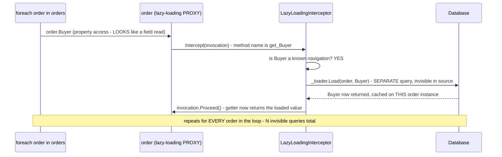

**TL;DR:** `order.Buyer` looks like a field access — why does it silently run a database query? EF Core's lazy-loading proxies wrap entities in a dynamically generated subclass that intercepts every property getter, and when a getter's compiler-generated name (`get_Buyer`) matches a known navigation property, the interceptor loads it from the database before the getter returns — invisible at the call site and repeated once per entity in a loop.

**Real repo:** [`dotnet/efcore`](https://github.com/dotnet/efcore)

## 1. The Engineering Problem: a query hidden inside what looks like ordinary property access is invisible at the call site

A `foreach` loop over N orders, each accessing `order.Buyer.Name`, reads like ordinary in-memory property access — nothing about the syntax signals "this line talks to the database." With lazy loading enabled, that assumption is false: every access to an unloaded navigation property can trigger its own separate query. A loop over N orders, each touching its `Buyer` navigation, produces one query to fetch the orders plus N more — one per order — to fetch each one's buyer, and every one of those N extra queries is invisible in the code's own control flow. Nothing about `order.Buyer` visually distinguishes it from reading a plain field that was already loaded in memory.

---

## 2. The Technical Solution: property access is intercepted below the level of ordinary C# code, and a getter's own compiled name is what triggers the query

EF Core's lazy-loading proxies work by wrapping an entity in a dynamically generated subclass (via Castle DynamicProxy) that intercepts *every* method call on it — including property getters, which the C# compiler itself names `get_PropertyName` under the hood. `LazyLoadingInterceptor.Intercept` checks whether the invoked method's name starts with `"get_"`; if the resulting property name matches a known navigation property, it calls the lazy loader's `Load` method *before* letting the actual getter return anything. The query happens beneath the level of visible application code — no line in the business logic calls anything that looks like a database operation; the mere act of reading a property is what triggers one.



A second navigation property call on the *same* already-loaded entity doesn't repeat the query — `IsLoaded` tracks per-entity, per-navigation loaded state — but that's exactly why the problem is easy to miss in a small test with one or two rows and only becomes visible once real data volume makes N separate queries obviously slow.

---

## 3. The clean example (concept in isolation)

```csharp
public class LazyLoadingInterceptor : IInterceptor {
    public void Intercept(IInvocation invocation) {
        var methodName = invocation.Method.Name;
        if (methodName.StartsWith("get_")) {
            var navigationName = methodName[4..];           // "get_Buyer" -> "Buyer"
            if (_navigations.Contains(navigationName)) {
                _loader.Load(invocation.Proxy, navigationName);  // query happens HERE
            }
        }
        invocation.Proceed();   // NOW return the (now-loaded) value
    }
}

// application code - looks innocent, ISN'T:
foreach (var order in orders)
    Console.WriteLine(order.Buyer.Name);   // one query PER iteration
```

---

## 4. Production reality (from `dotnet/efcore`)

```csharp
// src/EFCore.Proxies/Proxies/Internal/LazyLoadingInterceptor.cs
public virtual void Intercept(IInvocation invocation)
{
    var methodName = invocation.Method.Name;

    if (LazyLoaderGetter.Equals(invocation.Method))
    {
        invocation.ReturnValue = _loader;
    }
    else if (LazyLoaderSetter.Equals(invocation.Method))
    {
        _loader = (ILazyLoader)invocation.Arguments[0]!;
    }
    else
    {
        if (_loader != null
            && methodName.StartsWith("get_", StringComparison.Ordinal))
        {
            var navigationName = methodName[4..];
            if (_navigations.Contains(navigationName))
            {
                _loader.Load(invocation.Proxy, navigationName);
            }
        }

        invocation.Proceed();
    }
}
```

```csharp
// src/EFCore/Infrastructure/Internal/LazyLoader.cs
public virtual bool IsLoaded(object entity, string navigationName = "")
    => _loadedStates != null
        && _loadedStates.TryGetValue(navigationName, out var loaded)
        && loaded;
```

What this teaches that a hello-world can't:

- **The interceptor identifies a navigation property purely by string-matching a compiler-generated method name (`"get_" + propertyName`) — not by any explicit marker in the calling code.** This is precisely why the query is invisible at the call site: `order.Buyer` compiles to a call to `get_Buyer()`, which is indistinguishable, from the caller's perspective, from any other property read. The interception happens entirely inside the proxy's method-dispatch layer, a level below what application code can see or control without deliberately opting out.
- **`_navigations` is a precomputed set built once, from the entity type's metadata, in the interceptor's constructor** — the interceptor doesn't inspect the database or issue any query just to *decide* whether a given getter is a navigation; that decision is already known statically per entity type. Only the actual `Load` call — triggered once the decision is "yes, this is a navigation" — talks to the database.
- **`IsLoaded` (backed by `_loadedStates`, a per-entity-instance dictionary) is what prevents accessing the *same* navigation on the *same* entity twice from re-querying** — but this per-instance caching is exactly why the N+1 pattern is easy to miss in small-scale testing: a loop with one or two entities barely shows the cost, while the same code path against real production data volume issues one query per row, every time, because each row is a *different* entity instance with its own separate loaded-state tracking.

Known-stale fact: ORMs are sometimes assumed to "solve" the N+1 problem automatically simply by existing — as if using an ORM at all is sufficient protection against issuing excessive queries. EF Core's lazy-loading proxies do the *opposite* by default when enabled: they make triggering N separate queries as easy as writing what looks like ordinary property access, with no visual signal in the code that a query is about to run. Avoiding N+1 requires deliberately choosing eager loading (`Include()`) or a projection that fetches everything needed in one query — the ORM doesn't make that choice on the developer's behalf, and lazy loading, left on, actively works against it.

---

## Source

- **Concept:** ORMs & the N+1 query problem
- **Domain:** databases
- **Repo:** [dotnet/efcore](https://github.com/dotnet/efcore) → [`src/EFCore.Proxies/Proxies/Internal/LazyLoadingInterceptor.cs`](https://github.com/dotnet/efcore/blob/main/src/EFCore.Proxies/Proxies/Internal/LazyLoadingInterceptor.cs), [`src/EFCore/Infrastructure/Internal/LazyLoader.cs`](https://github.com/dotnet/efcore/blob/main/src/EFCore/Infrastructure/Internal/LazyLoader.cs) — the real, actively maintained Entity Framework Core source.
