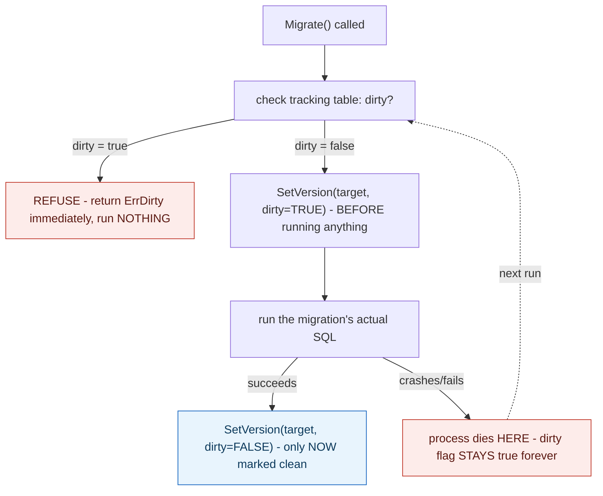

## 1. The Engineering Problem: a migration that crashes partway leaves the schema in an unknown, ambiguous state

A schema migration might run several DDL statements in sequence — add a column, backfill data, add a constraint. If the process crashes, loses its database connection, or the machine running it dies partway through, the schema is left in some state between "before" and "after" — and simply retrying the same migration from scratch is dangerous: some statements already ran and might fail or duplicate effort if run again, while the tracking table meant to record "which migration version is the schema currently at" may not accurately reflect what actually happened. Retrying blindly on top of an unknown, possibly half-applied state risks making things worse, not better.

---

## 2. The Technical Solution: mark the target version dirty *before* running it, and refuse to do anything else until a human resolves it

`golang-migrate`'s core migration loop marks the *target* version as dirty in its tracking table immediately before executing that migration's actual SQL — not after, before. Only once the migration body finishes without error does the tool mark that same version clean. Every subsequent call to run more migrations checks the dirty flag first, and if it's still set, refuses outright with a specific error rather than attempting anything — because "dirty" is exactly the signal that a previous migration started but never confirmed finishing, and nothing in the tool can know from that alone what state the schema is actually in.



This turns "did the last migration actually finish?" into a fact the tracking table itself records, rather than something that has to be inferred or assumed. A human has to explicitly inspect the situation and run a `force` command to declare a specific version clean again — the tool will never silently guess.

---

## 3. The clean example (concept in isolation)

```go
func (m *Migrate) Migrate(version uint) error {
    curVersion, dirty, err := m.databaseDrv.Version()
    if dirty {
        return ErrDirty{curVersion}   // REFUSE - do not attempt anything
    }
    return m.runMigrations(version)
}

func (m *Migrate) runMigrations(target uint) error {
    m.databaseDrv.SetVersion(target, true)   // dirty BEFORE running
    if err := m.databaseDrv.Run(migrationSQL); err != nil {
        return err   // crash/fail HERE - dirty flag stays TRUE
    }
    m.databaseDrv.SetVersion(target, false)  // clean ONLY after success
    return nil
}
```

---

## 4. Production reality (from `golang-migrate/migrate`)

```go
// migrate.go
type ErrDirty struct{ Version int }
func (e ErrDirty) Error() string {
    return fmt.Sprintf("Dirty database version %v. Fix and force version.", e.Version)
}

func (m *Migrate) Migrate(version uint) error {
    if err := m.lock(); err != nil {
        return err
    }
    curVersion, dirty, err := m.databaseDrv.Version()
    if err != nil {
        return m.unlockErr(err)
    }
    if dirty {
        return m.unlockErr(ErrDirty{curVersion})
    }
    ret := make(chan interface{}, m.PrefetchMigrations)
    go m.read(curVersion, int(version), ret)
    return m.unlockErr(m.runMigrations(ret))
}

func (m *Migrate) runMigrations(ret <-chan interface{}) error {
    for r := range ret {
        switch r := r.(type) {
        case *Migration:
            migr := r

            // set version with dirty state
            if err := m.databaseDrv.SetVersion(migr.TargetVersion, true); err != nil {
                return err
            }

            if migr.Body != nil {
                if err := m.databaseDrv.Run(migr.BufferedBody); err != nil {
                    return err   // ---> if this fails, dirty=true is left BEHIND
                }
            }

            // set clean state
            if err := m.databaseDrv.SetVersion(migr.TargetVersion, false); err != nil {
                return err
            }
        }
    }
}
```

What this teaches that a hello-world can't:

- **`SetVersion(migr.TargetVersion, true)` runs *before* `m.databaseDrv.Run(migr.BufferedBody)` — the dirty flag is set for work about to happen, not work already done.** If `Run` fails or the process dies mid-statement, the dirty flag is the *only* record left behind, and it correctly reflects "something incomplete happened here" rather than either the old or new clean state — a genuinely accurate signal, not an optimistic guess.
- **Every single entry point (`Migrate`, `Steps`, and others shown by the repeated `if dirty { return ... ErrDirty{...} }` pattern across the file) checks the dirty flag before doing anything.** This isn't checked once at startup and trusted thereafter — it's re-verified on every operation, meaning even a tool invoked repeatedly, or by multiple processes, can't accidentally proceed past a dirty state through some code path that forgot the check.
- **The `Driver` interface itself documents this contract explicitly**: "`SetVersion` saves version and dirty state. Migrate will call this function before and after each call to `Run`." Every database driver implementation (Postgres, MySQL, Cassandra, dozens of others) has to implement this exact before/after dirty-marking discipline to be a valid driver at all — the safety mechanism is part of the tool's core contract, not an optional feature a specific driver might skip.

Known-stale fact: migration tooling is sometimes assumed to be "safe" simply by tracking a version number — as if recording which migration ran last is sufficient information to know the schema's actual state. What actually matters for safety is capturing the *in-between* state too: whether the last recorded migration attempt actually finished, not just which one was most recently started. A plain version counter alone can't distinguish "migration 12 completed successfully" from "migration 12 started and crashed halfway" — both would show the same version number without a dedicated dirty flag recording which case actually happened.

---

## Source

- **Concept:** Database migrations & zero-downtime schema changes
- **Domain:** databases
- **Repo:** [golang-migrate/migrate](https://github.com/golang-migrate/migrate) → [`migrate.go`](https://github.com/golang-migrate/migrate/blob/master/migrate.go), [`database/driver.go`](https://github.com/golang-migrate/migrate/blob/master/database/driver.go) — a real, widely used, language-agnostic schema-migration tool.
