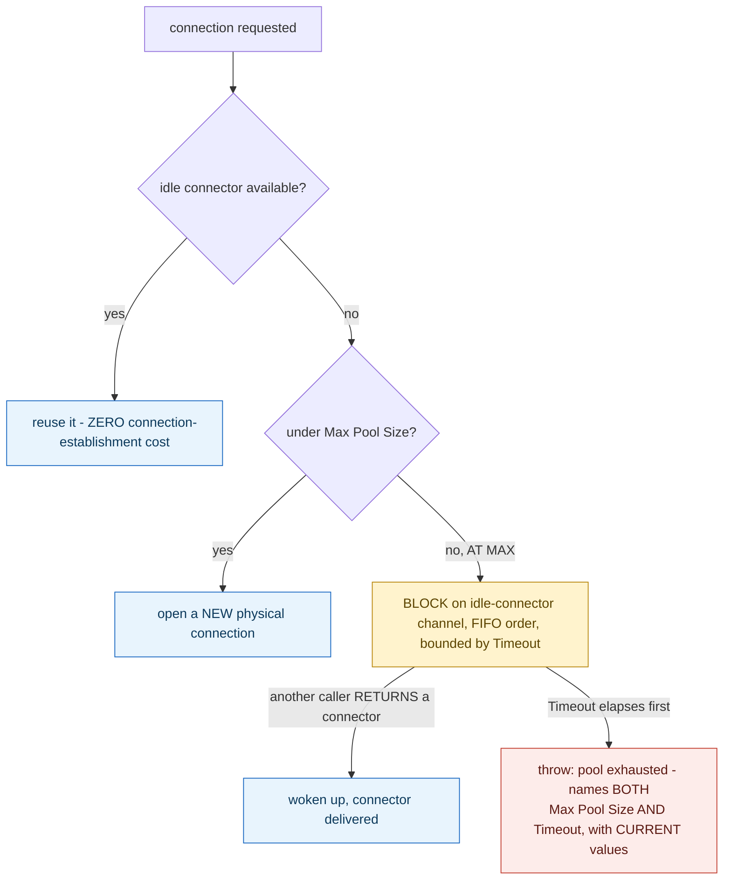

**TL;DR:** The connection pool is full — does the next request fail immediately, or wait? Npgsql makes it wait: once the pool is at its configured maximum, a new request blocks on a FIFO-fair queue until either another caller returns a connection or the configured timeout elapses, and only the timeout elapsing actually produces a failure.

**Real repo:** [`npgsql/npgsql`](https://github.com/npgsql/npgsql)

## 1. The Engineering Problem: a pool solves the cost of opening connections, but is still a finite resource with a real failure mode

Opening a real database connection is genuinely expensive — a TCP handshake, TLS negotiation, authentication — doing that on every single query would be disastrously slow. A connection pool solves this by keeping a bounded number of connections open and reused, handed out and returned as needed. But a pool with a maximum size is still a finite resource: the moment more concurrent requests need a connection than the pool allows, *something* has to happen to the excess demand. Whether that something is an immediate failure, a silent indefinite hang, or a bounded wait with a clear timeout is a real, consequential design decision — one most application code never has to think about until the pool is actually exhausted in production.

---

## 2. The Technical Solution: try idle, then try opening new, then wait on a fair queue with a timeout — and fail with a message naming exactly what to change

Npgsql's connection-acquisition path tries three things in order. First, the fast path: an already-idle, already-open connector, reused with zero connection-establishment cost. If none is idle, it tries to open a genuinely *new* physical connection — but this only succeeds while the pool is still under its configured maximum size. Once at that limit, the caller doesn't fail immediately — it blocks, waiting on a channel that another caller's connection *return* will eventually deliver a connector to, bounded by the connection string's configured timeout, with the underlying channel guaranteeing strict FIFO fairness so waiting requests are served in the order they started waiting.



The pool being momentarily "full" and the pool being genuinely "exhausted" are different states, separated entirely by whether some other caller returns a connector before the waiting request's own timeout elapses. A brief burst of concurrent demand above the configured maximum doesn't necessarily fail anything — it just waits, briefly, as long as connections keep freeing up faster than new requests need them.

---

## 3. The clean example (concept in isolation)

```csharp
async ValueTask<Connector> Get(TimeSpan timeout) {
    if (TryGetIdle(out var c)) return c;              // fast path - no connection cost

    var c2 = await TryOpenNew();                       // only succeeds if UNDER max
    if (c2 != null) return c2;

    // AT MAX CAPACITY - wait, FIFO-fair, bounded by timeout
    using var cts = new CancellationTokenSource(timeout);
    try {
        return await _idleChannel.Reader.ReadAsync(cts.Token);  // woken when someone RETURNS one
    } catch (OperationCanceledException) {
        throw new Exception($"Pool exhausted. Raise Max Pool Size ({MaxSize}) or Timeout ({timeout}).");
    }
}
```

---

## 4. Production reality (from `npgsql/npgsql`)

```csharp
// src/Npgsql/PoolingDataSource.cs
internal sealed override ValueTask<NpgsqlConnector> Get(
    NpgsqlConnection conn, NpgsqlTimeout timeout, bool async, CancellationToken cancellationToken)
{
    return TryGetIdleConnector(out var connector)
        ? new ValueTask<NpgsqlConnector>(connector)
        : RentAsync(conn, timeout, async, cancellationToken);

    async ValueTask<NpgsqlConnector> RentAsync(...)
    {
        // First, try to open a new physical connector. This will fail if we're at max capacity.
        var connector = await OpenNewConnector(conn, timeout, async, cancellationToken);
        if (connector != null)
            return connector;

        // We're at max capacity. Block on the idle channel with a timeout.
        // Note that Channels guarantee fair FIFO behavior to callers of ReadAsync (first-come first-served)
        using var linkedSource = CancellationTokenSource.CreateLinkedTokenSource(cancellationToken);
        var finalToken = linkedSource.Token;
        linkedSource.CancelAfter(timeout.CheckAndGetTimeLeft());

        try
        {
            connector = await _idleConnectorReader.ReadAsync(finalToken);
            if (CheckIdleConnector(connector))
                return connector;
        }
        catch (OperationCanceledException)
        {
            throw new NpgsqlException(
                $"The connection pool has been exhausted, either raise 'Max Pool Size' (currently {MaxConnections}) " +
                $"or 'Timeout' (currently {Settings.Timeout} seconds) in your connection string.",
                new TimeoutException());
        }
    }
}
```

What this teaches that a hello-world can't:

- **The exception message is generated with the *live, currently configured* values interpolated directly into the text** — `MaxConnections` and `Settings.Timeout` aren't described abstractly; the exact numbers a developer would need to reconsider are printed in the error itself. Whoever sees this exception doesn't need to go find the connection string to know what to change — the message already tells them, with the actual numbers currently in effect.
- **`OpenNewConnector` is retried, not just idle-waiting, at multiple points in the loop** — the comment "We might have closed a connector in the meantime and no longer be at max capacity" (from the surrounding loop) shows the pool doesn't assume its own capacity count is static while a caller waits; it re-checks whether a slot has freed up through either path (an idle connector returned, or the max-capacity ceiling itself having room again) before concluding the pool is genuinely exhausted.
- **The comment explicitly calls out that `Channels` guarantee FIFO fairness "which is crucial to us."** Without that guarantee, a newly arriving request could theoretically race ahead of a request that's been waiting longer and grab a freed connector first — starving earlier waiters indefinitely under sustained load. The fairness property is a deliberate design requirement, not an incidental detail of whichever data structure happened to be convenient.

Known-stale fact: connection pool exhaustion is sometimes assumed to mean an instant, hard failure the moment the pool reaches its configured maximum size — as if "full" and "exhausted" are the same state. Npgsql's real implementation treats them as genuinely different: reaching the maximum size just means new requests wait, FIFO-fair, for up to the configured timeout, while other callers return their connections. Only if that entire waiting window elapses without a connector becoming available does the request actually fail — meaning a pool sized slightly under peak concurrent demand can still function correctly under a brief burst, as long as connections are returned quickly enough relative to the timeout.

---

## Source

- **Concept:** Connection pooling
- **Domain:** databases
- **Repo:** [npgsql/npgsql](https://github.com/npgsql/npgsql) → [`src/Npgsql/PoolingDataSource.cs`](https://github.com/npgsql/npgsql/blob/main/src/Npgsql/PoolingDataSource.cs) — the real, actively maintained .NET driver for PostgreSQL.


