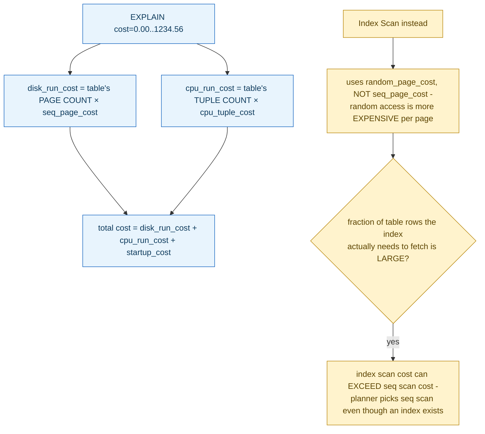

**TL;DR:** What does the "cost=0.00..1234.56" number in `EXPLAIN` actually measure? It's a literal arithmetic formula — the table's page count times a tunable per-page I/O cost constant, plus its tuple count times a tunable per-tuple CPU cost constant — computed from statistics gathered by `ANALYZE`, not a live measurement or an opaque heuristic score.

**Real repo:** [`postgres/postgres`](https://github.com/postgres/postgres)

## 1. The Engineering Problem: EXPLAIN's cost numbers look like a black-box score with no visible unit

`EXPLAIN` prints a `cost=0.00..1234.56` next to every plan node, with no unit label and no obvious explanation of where the number comes from. Without knowing what actually produces it, the number reads as an opaque heuristic score — "the planner's confidence," maybe, or some internal ranking that only Postgres itself understands. That makes "why did the planner pick a sequential scan instead of the index I created" feel like a question with no real answer, rather than something a developer could actually work out from concrete, inspectable inputs.

---

## 2. The Technical Solution: cost is a literal arithmetic formula — page reads times a page-cost constant, plus tuples times a tuple-cost constant

Postgres's actual `cost_seqscan` function computes a sequential scan's cost as the straightforward sum of two real components: **disk cost** — the number of pages the table occupies, multiplied by a tunable per-page I/O cost constant (`seq_page_cost`) — plus **CPU cost** — the number of tuples that will be scanned, multiplied by a tunable per-tuple CPU cost constant (`cpu_tuple_cost`), adjusted for whatever `WHERE` conditions need to be evaluated per row. Both the page count and tuple count come from real statistics the planner already has about the table, gathered by `ANALYZE` — not from a live count taken at plan time.



An index scan's cost formula uses a *different* page-cost constant — `random_page_cost` — because reading pages in the essentially-random order an index lookup visits them is genuinely more expensive per page than reading them sequentially. This is precisely why a query that touches a large fraction of a table's rows can end up costing *more* through an index than through a plain sequential scan, even though a matching index exists — the per-page cost assumption itself changes based on access pattern, not just whether an index is available.

---

## 3. The clean example (concept in isolation)

```c
// simplified from Postgres's real cost_seqscan
disk_run_cost = spc_seq_page_cost * baserel->pages;   // pages × per-page I/O cost
cpu_run_cost  = cpu_per_tuple * baserel->tuples;        // tuples × per-tuple CPU cost
total_cost = startup_cost + disk_run_cost + cpu_run_cost;
// this IS the number printed after "cost=" in EXPLAIN output
```

---

## 4. Production reality (from `postgres/postgres`)

```c
// src/backend/optimizer/path/costsize.c
/*
 * cost_seqscan
 *    Determines and returns the cost of scanning a relation sequentially.
 */
void
cost_seqscan(Path *path, PlannerInfo *root,
             RelOptInfo *baserel, ParamPathInfo *param_info)
{
    Cost startup_cost = 0;
    Cost cpu_run_cost;
    Cost disk_run_cost;
    double spc_seq_page_cost;
    QualCost qpqual_cost;
    Cost cpu_per_tuple;

    /* fetch estimated page cost for tablespace containing table */
    get_tablespace_page_costs(baserel->reltablespace, NULL, &spc_seq_page_cost);

    /* disk costs */
    disk_run_cost = spc_seq_page_cost * baserel->pages;

    /* CPU costs */
    get_restriction_qual_cost(root, baserel, param_info, &qpqual_cost);
    startup_cost += qpqual_cost.startup;
    cpu_per_tuple = cpu_tuple_cost + qpqual_cost.per_tuple;
    cpu_run_cost = cpu_per_tuple * baserel->tuples;

    /* tlist eval costs are paid per output row, not per tuple scanned */
    startup_cost += path->pathtarget->cost.startup;
    cpu_run_cost += path->pathtarget->cost.per_tuple * path->rows;

    path->startup_cost = startup_cost;
    path->total_cost = startup_cost + cpu_run_cost + disk_run_cost;
}
```

What this teaches that a hello-world can't:

- **`baserel->pages` and `baserel->tuples` are pre-computed statistics, not counted live at plan time** — they come from the table's own statistics catalog, last updated by `ANALYZE` (or autovacuum's analyze pass). A table whose real size has drifted significantly since the last `ANALYZE` will produce a cost estimate built on stale numbers — the formula itself is exact arithmetic, but its *inputs* can be outdated, which is a real, distinct failure mode from the formula being "wrong."
- **`cpu_per_tuple = cpu_tuple_cost + qpqual_cost.per_tuple`** — the per-tuple CPU cost isn't just a flat constant; it's the baseline tuple-processing cost *plus* whatever it actually costs to evaluate this specific query's `WHERE` clause conditions per row. A cheap equality check and an expensive regex match against every row produce genuinely different `qpqual_cost.per_tuple` values, which is why the same table can show different sequential-scan costs for different queries against it.
- **`spc_seq_page_cost` is looked up per-tablespace, not globally hardcoded** — `get_tablespace_page_costs` allows different tablespaces (potentially backed by genuinely different storage — fast SSD versus slower spinning disk) to carry different page-cost assumptions, meaning the *same* query against tables in different tablespaces can produce different cost estimates purely from where the data physically lives.

Known-stale fact: `EXPLAIN`'s cost numbers are sometimes read as if they were predicted milliseconds or some authoritative measure of query speed. They're a unitless, relative estimate — built from tunable GUCs (`seq_page_cost`, `cpu_tuple_cost`, `random_page_cost`, and others) representing the administrator's own assumptions about relative hardware costs, multiplied against the planner's statistical estimates of table size. Plain `EXPLAIN` never actually runs the query at all — it only computes this estimate. `EXPLAIN ANALYZE` is the version that genuinely executes the query and reports real, measured elapsed time alongside the estimate, which is precisely why comparing the two — estimated cost versus actual measured time — is the real diagnostic technique for spotting a planner decision based on stale or wrong statistics.

---

## Source

- **Concept:** Query plans & EXPLAIN ANALYZE
- **Domain:** databases
- **Repo:** [postgres/postgres](https://github.com/postgres/postgres) → [`src/backend/optimizer/path/costsize.c`](https://github.com/postgres/postgres/blob/master/src/backend/optimizer/path/costsize.c) — the actual PostgreSQL server source, `cost_seqscan()`.
