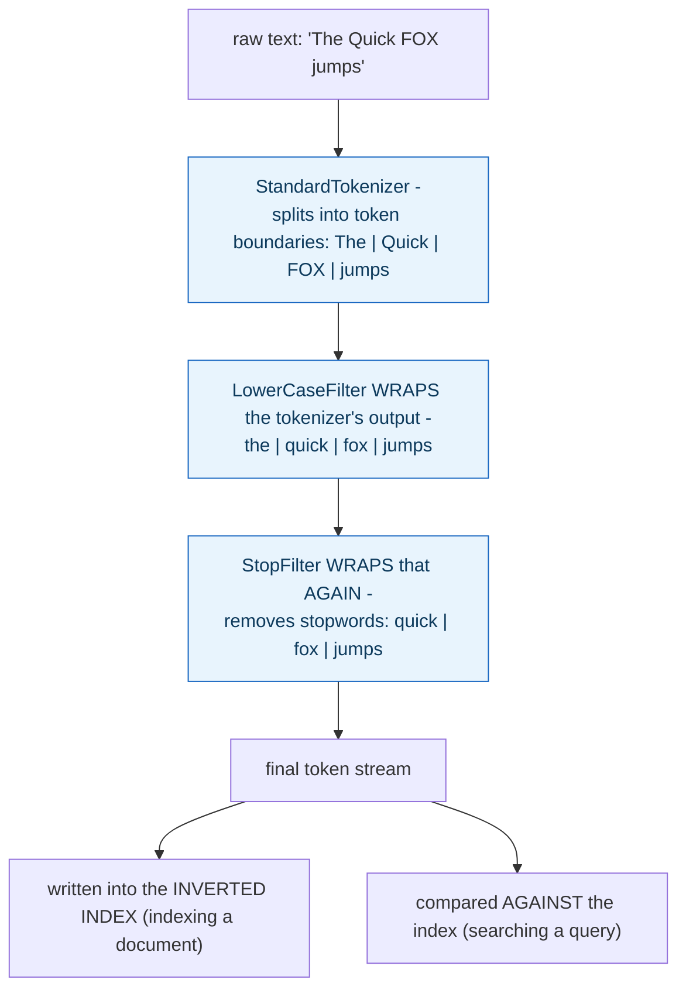

**TL;DR:** Why does searching "The Quick FOX" match a document containing "quick fox jumps"? Both the indexed document and the query text pass through the identical analyzer pipeline — tokenize, then lowercase, then strip stopwords — before anything is compared, so casing, word order, and common words like "the" never affect whether they match.

**Real repo:** [`apache/lucene`](https://github.com/apache/lucene)

## 1. The Engineering Problem: neither the query text nor the document text can be compared as literal raw strings

For a search like "The Quick FOX" to match a document containing "Quick fox jumps," neither side can be compared as a literal raw string — the casing differs, word order differs, and a common word like "the" shouldn't affect matching at all. Something has to transform *both* the content being indexed and the query text being searched through the exact same set of normalization rules before any comparison happens — otherwise a document and a query that a human would recognize as "about the same thing" would simply never line up.

---

## 2. The Technical Solution: a literal, composable pipeline runs on both sides — tokenize, then wrap in normalization filters

Lucene's `StandardAnalyzer` builds this as an actual object pipeline, not a conceptual description. A `StandardTokenizer` first splits raw text into individual token boundaries (roughly: words, punctuation-aware). That token stream is then *wrapped* by a `LowerCaseFilter`, which normalizes casing. The result is wrapped *again* by a `StopFilter`, which removes configured stopwords ("the," "a," "is," and similar) entirely from the stream. This exact chain — tokenize, then lowercase, then strip stopwords — runs on document content at index time, producing the terms actually written into the inverted index.



Because both the document's content and (typically) the query text pass through this identical pipeline, "The Quick FOX" and "quick fox jumps" both reduce down to the same normalized terms (`quick`, `fox`, `jumps`) before either one ever touches the index — matching happens between two normalized token streams, never between the original raw strings.

---

## 3. The clean example (concept in isolation)

```java
TokenStream tok = new StandardTokenizer();      // "The Quick FOX" -> [The, Quick, FOX]
tok = new LowerCaseFilter(tok);                 // -> [the, quick, fox]
tok = new StopFilter(tok, STOPWORDS);           // -> [quick, fox]  ("the" removed)
// this SAME chain runs on document text (indexing) and query text (searching)
```

---

## 4. Production reality (from `apache/lucene`)

```java
// lucene/core/.../analysis/standard/StandardAnalyzer.java
@Override
protected TokenStreamComponents createComponents(final String fieldName) {
    final StandardTokenizer src = new StandardTokenizer();
    src.setMaxTokenLength(maxTokenLength);
    TokenStream tok = new LowerCaseFilter(src);
    tok = new StopFilter(tok, stopwords);
    return new TokenStreamComponents(
        r -> {
            src.setMaxTokenLength(StandardAnalyzer.this.maxTokenLength);
            src.setReader(r);
        },
        tok);
}

// a SEPARATE, LIGHTER-WEIGHT chain, for exact single-term operations
@Override
protected TokenStream normalize(String fieldName, TokenStream in) {
    return new LowerCaseFilter(in);
}
```

What this teaches that a hello-world can't:

- **`tok = new LowerCaseFilter(src)` then `tok = new StopFilter(tok, stopwords)` is literal decorator-style wrapping — each filter takes the *previous* stage's output stream as its own input.** This is exactly what makes analyzers composable: adding a new normalization step (stemming, synonym expansion) means wrapping the chain one layer deeper, without needing to rewrite the tokenizer or any earlier filter — each stage only knows about the stream it receives, not the whole pipeline.
- **`normalize()` is a genuinely separate, narrower method — it applies *only* `LowerCaseFilter`, not the full tokenize-then-stopword chain.** This is used for exact single-term operations (matching one specific term against the index directly, as in certain range or wildcard queries) where the input is already a single term, not free text needing tokenization — running the full chain, including stopword removal, wouldn't make sense on something that isn't a sentence to begin with.
- **`StopFilter` removes tokens entirely from the stream — those words don't get indexed, and (through the same chain) they get stripped from queries too.** A search for "the fox" and a search for "fox" produce the *identical* final token stream (`[fox]`) after this pipeline — the word "the" was never a distinguishing part of either the index or the query, because both went through the exact same removal step.

Known-stale fact: full-text matching is sometimes assumed to be a case-insensitive string comparison between query and document text — as if "search" and "string matching, but case-insensitive" were roughly the same operation. Real search engines route both sides of a comparison through an explicit, multi-stage analyzer pipeline (tokenization, normalization, stopword removal, and potentially stemming or synonym handling) before anything is compared — and critically, *different* fields or query types can legitimately use *different* analyzer chains (the full index-time pipeline versus the lighter `normalize()` path shown here). Whether two pieces of text "match" depends entirely on which specific chain was applied to each side, not on a single universal definition of text equality.

---

## Source

- **Concept:** Full-text search & search indexes
- **Domain:** databases
- **Repo:** [apache/lucene](https://github.com/apache/lucene) → [`lucene/core/src/java/org/apache/lucene/analysis/standard/StandardAnalyzer.java`](https://github.com/apache/lucene/blob/main/lucene/core/src/java/org/apache/lucene/analysis/standard/StandardAnalyzer.java) — the real, foundational full-text search library underlying Elasticsearch and many other production search engines.


