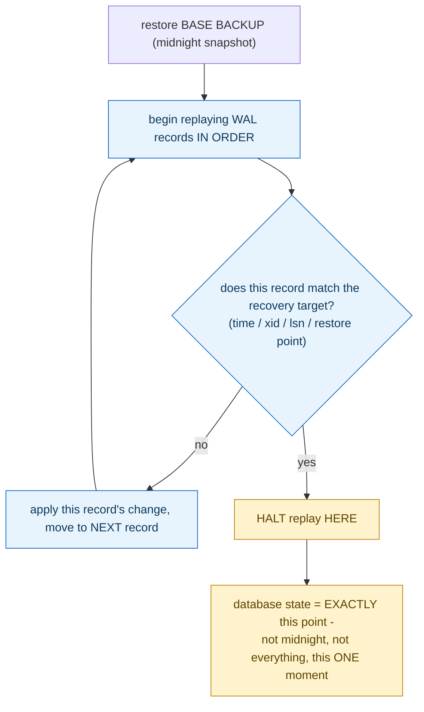

**TL;DR:** A backup ran at midnight, the accident happened at 2:47pm — how does recovery land exactly there? Postgres restores the base backup, then replays every WAL record since it in order, checking each one against the configured recovery target (a timestamp, transaction ID, or WAL location), and halts replay the instant a record satisfies the stop condition — landing the database precisely at that point, not at midnight and not at everything since.

**Real repo:** [`postgres/postgres`](https://github.com/postgres/postgres)

## 1. The Engineering Problem: a backup captures one moment, but the moment you need to recover to is almost never that one

A full backup only captures the database's state at one specific instant. Whatever happened after the backup and before whatever needs undoing — an accidental `DROP TABLE`, a bad migration, a bug that corrupted data starting at a specific time — is exactly the range recovery needs to reconstruct *up to*, not simply discard. Restoring the backup alone loses everything since; restoring nothing leaves the mistake in place. Recovery needs to land at an *arbitrary* moment described precisely — "right before 2:47pm" — not just at whichever fixed instant the last backup snapshot happened to capture.

---

## 2. The Technical Solution: replay every WAL record in order, checking each one against the target, and stop exactly there

Real point-in-time recovery restores a base backup, then replays every write-ahead log (WAL) record generated since that backup, one at a time, in the order they originally happened. Each record is checked against a configured recovery target — a specific timestamp, transaction ID, WAL location (LSN), or named restore point — via functions that decide, per record, "should recovery stop here." Recovery doesn't jump to the target directly; it walks through the actual history of every change, applying each one, until the exact record satisfying the stop condition is reached — at which point replay halts, leaving the database in precisely that state.



A precise, easy-to-miss detail: multiple transactions can share the *exact same* commit timestamp, since timestamp resolution isn't infinitely fine relative to how fast transactions can commit. "Recover to time T" therefore needs an explicit tie-breaking rule — an *inclusive* target stops *after* the last transaction that committed exactly at T; an *exclusive* target stops *before* the first one — the entire difference resting on `>` versus `>=` in the comparison.

---

## 3. The clean example (concept in isolation)

```c
bool ShouldStopReplay(WALRecord *record, RecoveryTarget target) {
    if (target.kind == TARGET_TIME) {
        TimestampTz recordTime = GetCommitTime(record);
        return target.inclusive
            ? (recordTime > target.time)    // stop AFTER the last one at exactly T
            : (recordTime >= target.time);  // stop BEFORE the first one at exactly T
    }
    if (target.kind == TARGET_XID) {
        // must test EQUALITY - transactions commit out of the order they started in
        return GetTransactionId(record) == target.xid;
    }
    return false;
}
```

---

## 4. Production reality (from `postgres/postgres`)

```c
// src/backend/access/transam/xlogrecovery.c - time-based target
if (getRecordTimestamp(record, &recordXtime) &&
    recoveryTarget == RECOVERY_TARGET_TIME)
{
    /*
     * There can be many transactions that share the same commit time, so
     * we stop after the last one, if we are inclusive, or stop at the
     * first one if we are exclusive
     */
    if (recoveryTargetInclusive)
        stopsHere = (recordXtime > recoveryTargetTime);
    else
        stopsHere = (recordXtime >= recoveryTargetTime);
}
```

```c
// xid-based target - a DIFFERENT, precise comparison rule
/*
 * when testing for an xid, we MUST test for equality only, since
 * transactions are numbered in the order they start, not the order
 * they complete. A higher numbered xid will complete before you about
 * 50% of the time...
 */
if (recoveryTarget == RECOVERY_TARGET_XID && recoveryTargetInclusive &&
    recordXid == recoveryTargetXid)
{
    recoveryStopAfter = true;
    recoveryStopXid = recordXid;
    ereport(LOG,
            (errmsg("recovery stopping after commit of transaction %u, time %s",
                    recoveryStopXid, timestamptz_to_str(recoveryStopTime))));
    return true;
}
```

What this teaches that a hello-world can't:

- **The XID-based comment explicitly warns against a naive `>=` comparison** — because transaction IDs are assigned when a transaction *starts*, not when it *commits*, a higher-numbered transaction can genuinely finish before a lower-numbered one roughly half the time under concurrent load. Recovering "up to transaction 500" by checking `recordXid >= 500` would be wrong in a way that isn't obvious until you think through what transaction numbering actually orders.
- **The time-based target's inclusive/exclusive distinction exists specifically because commit timestamps aren't unique.** Multiple transactions committing within the same clock tick share an identical `recordXtime` — without a documented, deliberate rule for which side of that tie recovery lands on, "recover to 2:47:00pm" would be ambiguous whenever more than one transaction happened to commit at exactly that timestamp.
- **Recovery genuinely replays every WAL record between the base backup and the target, in order — it doesn't seek directly to a computed offset.** This is why PITR precision is bounded by the granularity of the WAL itself (individual transaction commits/aborts), not by how often full backups are taken; a single daily backup can still support recovering to the exact transaction before an arbitrary afternoon mistake, as long as the WAL archive covering that whole day survived intact.

Known-stale fact: backup strategy is sometimes evaluated purely by *backup frequency* — as if recovering more precisely just means taking full backups more often. Real point-in-time recovery decouples these: a database backed up only once a day can still be restored to the *exact* transaction immediately preceding an arbitrary mistake that happened at any moment that day, because recovery granularity comes from replaying the WAL record-by-record to a precise target, not from how close together the full backups themselves are. What actually needs protecting continuously is the WAL archive, not necessarily the base backup frequency.

---

## Source

- **Concept:** Backup strategies & point-in-time recovery
- **Domain:** databases
- **Repo:** [postgres/postgres](https://github.com/postgres/postgres) → [`src/backend/access/transam/xlogrecovery.c`](https://github.com/postgres/postgres/blob/master/src/backend/access/transam/xlogrecovery.c) — the actual PostgreSQL server source, its WAL-replay recovery-target logic.


