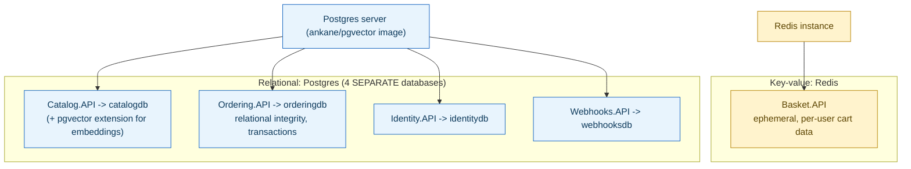

## 1. The Engineering Problem: different services have genuinely different data shapes, and one database technology can't fit all of them equally well

A shopping cart is ephemeral, scoped to one user, read and written as essentially a single blob — a perfect fit for a fast key-value store, and arguably wasted effort to model relationally. An order needs durable transactional guarantees, relationships between buyers, payment methods, and line items, and the ability to run real relational queries — a genuine fit for a relational database, and a poor fit for a plain key-value store. Forcing every service in a system onto the same database technology regardless of its actual data shape means some services pay for guarantees they don't need, while others miss capabilities they do — polyglot persistence names the alternative: choosing the database per service, deliberately, based on what that service's own data actually looks like.

---

## 2. The Technical Solution: the choice is literal, inspectable configuration — which service gets which database, wired explicitly

A real distributed application's own orchestration file makes this choice directly, as code, not as an abstract principle described in a diagram. `Basket.API` is wired to Redis and *only* Redis. `Catalog.API`, `Ordering.API`, `Identity.API`, and `Webhooks.API` are each wired to their own *separate* Postgres database — four distinct databases on the same Postgres server, not one database shared across services. The database each service depends on is declared explicitly at the point that service is composed into the running application, visible and auditable in one place.



A second, subtler layer of "multi-model" sits inside the relational choice itself: the Postgres image these services run isn't stock Postgres — it's `ankane/pgvector`, bundling the `pgvector` extension, meaning the *same* Postgres instance serving Catalog's ordinary relational rows also stores and queries vector embeddings for similarity search. Polyglot persistence doesn't always mean reaching for an entirely separate database product for every distinct capability — sometimes one product's extensions cover more than one data model at once.

---

## 3. The clean example (concept in isolation)

```csharp
var redis = builder.AddRedis("redis");
var postgres = builder.AddPostgres("postgres");
var catalogDb = postgres.AddDatabase("catalogdb");
var orderDb = postgres.AddDatabase("orderingdb");

var basketApi = builder.AddProject<Basket_API>("basket-api")
    .WithReference(redis);              // cart data - key-value, ephemeral

var catalogApi = builder.AddProject<Catalog_API>("catalog-api")
    .WithReference(catalogDb);          // product catalog - relational

var orderingApi = builder.AddProject<Ordering_API>("ordering-api")
    .WithReference(orderDb);            // orders - relational, transactional
```

---

## 4. Production reality (from `dotnet/eShop`)

```csharp
// src/eShop.AppHost/Program.cs
var redis = builder.AddRedis("redis");
var postgres = builder.AddPostgres("postgres")
    .WithImage("ankane/pgvector")          // relational Postgres + vector extension, ONE image
    .WithImageTag("latest")
    .WithLifetime(ContainerLifetime.Persistent);

var catalogDb = postgres.AddDatabase("catalogdb");
var identityDb = postgres.AddDatabase("identitydb");
var orderDb = postgres.AddDatabase("orderingdb");
var webhooksDb = postgres.AddDatabase("webhooksdb");

var identityApi = builder.AddProject<Projects.Identity_API>("identity-api", launchProfileName)
    .WithReference(identityDb);

var basketApi = builder.AddProject<Projects.Basket_API>("basket-api")
    .WithReference(redis)                  // Basket gets REDIS - not a shared Postgres database
    .WithReference(rabbitMq).WaitFor(rabbitMq);

var catalogApi = builder.AddProject<Projects.Catalog_API>("catalog-api")
    .WithReference(rabbitMq).WaitFor(rabbitMq)
    .WithReference(catalogDb);

var orderingApi = builder.AddProject<Projects.Ordering_API>("ordering-api")
    .WithReference(rabbitMq).WaitFor(rabbitMq)
    .WithReference(orderDb).WaitFor(orderDb);
```

What this teaches that a hello-world can't:

- **Four separate `AddDatabase` calls (`catalogdb`, `identitydb`, `orderingdb`, `webhooksdb`) exist on the *same* Postgres server, rather than one shared database used by all four services.** This is the database-per-service principle expressed as literal configuration: even though every one of these services is relational, they don't share a database — each owns its own, preventing one service's schema changes or query load from directly affecting another's, while still using the same underlying database *technology* where that technology fits.
- **`Basket.API` is the only service wired to `redis`, and it receives no Postgres database reference at all.** The orchestration file makes it structurally impossible for Basket to accidentally depend on relational infrastructure it doesn't need — the dependency graph itself documents the architectural decision, rather than that decision living only in a design doc that could drift from what's actually deployed.
- **`WithImage("ankane/pgvector")` is a single line changing what "Postgres" even means for this system** — every one of the four Postgres-backed databases runs on an image that also supports vector similarity search, not just ordinary relational queries. Catalog specifically uses this extra capability (for product embeddings); the other three databases simply don't happen to use it, but the *capability* is present across all of them because it's a property of the shared image, not something configured per-database.

Known-stale fact: polyglot persistence is sometimes assumed to mean reaching for a genuinely different database *product* every time a new data-modeling need appears — a document store for one thing, a graph database for another, a key-value store for a third, each adding its own separate operational burden (backup strategy, monitoring, on-call expertise). This real system shows a cheaper middle path is often available: one relational database technology, extended (via `pgvector`) to also serve a second data model, can cover more ground than the "one product per need" framing suggests — reserving an entirely separate database technology (like Redis here) for the cases where the underlying access pattern is genuinely different enough to justify it.

---

## Source

- **Concept:** Multi-model & polyglot persistence (the right database per service)
- **Domain:** databases
- **Repo:** [dotnet/eShop](https://github.com/dotnet/eShop) → [`src/eShop.AppHost/Program.cs`](https://github.com/dotnet/eShop/blob/main/src/eShop.AppHost/Program.cs) — a real, actively maintained multi-service reference application's actual deployment/orchestration definition.
