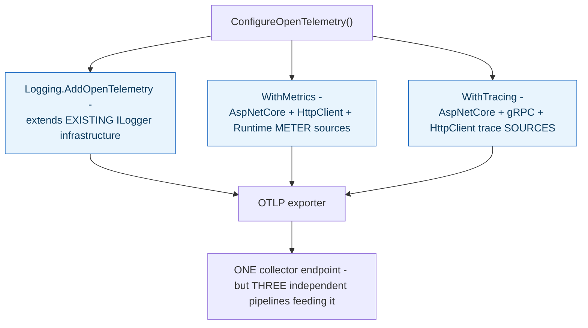

**TL;DR:** Why does turning on OpenTelemetry require three separate configuration calls instead of one? Because logs, metrics, and traces are three structurally different instrumentation APIs (`Logging.AddOpenTelemetry`, `WithMetrics`, `WithTracing`) that only converge at the final export step, so each pillar needs its own explicit registration even though they all end up going to the same OTLP collector.

**Real repo:** [`dotnet/eShop`](https://github.com/dotnet/eShop)

## 1. The Engineering Problem: "observability" sounds like one concern, but it has to answer three structurally different questions

A genuinely useful observability setup has to answer three different kinds of questions, and no single data stream answers all three well. "Is the system healthy right now, in aggregate?" needs numbers that are cheap to collect continuously and cheap to aggregate across millions of requests — that's a metric's job. "What exactly happened during this one specific failed request?" needs rich, detailed, per-event context — that's a log's job. "How did this one request's total time get spent across every service it touched?" needs causally linked records that follow a single request across process boundaries — that's a trace's job. Treating all three as one undifferentiated "log everything and hope" stream fails at all three simultaneously: too much volume for cheap aggregation, not enough per-request causal linkage, and no efficient way to ask "show me only the slow ones."

---

## 2. The Technical Solution: three genuinely separate instrumentation APIs, unified only at the export step

A real, single OpenTelemetry configuration method wires up all three pillars — and does it through three structurally distinct API surfaces, not one. Logs are configured through `builder.Logging.AddOpenTelemetry(...)`, extending the application's *existing* `ILogger` infrastructure to also emit OpenTelemetry-shaped log records. Metrics are configured through a completely separate `.WithMetrics(...)` call, registering specific **meter** sources — ASP.NET Core's own request-handling internals, outgoing `HttpClient` calls, the .NET runtime itself. Traces are configured through yet another separate `.WithTracing(...)` call, registering specific **trace source** instrumentation — incoming ASP.NET Core requests, outgoing gRPC calls, outgoing HTTP calls.



The three pillars converge only at the very last step — all three eventually export via the same OTLP protocol to the same collector endpoint — but everything before that point is genuinely separate: different registration APIs, different instrumentation sources, different underlying .NET primitives (`ILogger` for logs, `Meter` for metrics, `Activity` for traces). Unifying the *transport* doesn't mean unifying the *instrumentation* — each pillar still needs its own explicit setup because each one is measuring something structurally different about the running application.

---

## 3. The clean example (concept in isolation)

```csharp
IHostApplicationBuilder ConfigureObservability(IHostApplicationBuilder builder) {
    builder.Logging.AddOpenTelemetry(logging => {
        logging.IncludeFormattedMessage = true;   // LOGS: per-event detail
    });

    builder.Services.AddOpenTelemetry()
        .WithMetrics(metrics => metrics
            .AddAspNetCoreInstrumentation()          // METRICS: aggregate numbers
            .AddRuntimeInstrumentation())
        .WithTracing(tracing => tracing
            .AddAspNetCoreInstrumentation()          // TRACES: per-request causal chain
            .AddHttpClientInstrumentation());

    return builder;   // three SEPARATE registrations, one exporter destination
}
```

---

## 4. Production reality (from `dotnet/eShop`)

```csharp
// eShop.ServiceDefaults/Extensions.cs
public static IHostApplicationBuilder ConfigureOpenTelemetry(this IHostApplicationBuilder builder)
{
    builder.Logging.AddOpenTelemetry(logging =>
    {
        logging.IncludeFormattedMessage = true;
        logging.IncludeScopes = true;
    });

    builder.Services.AddOpenTelemetry()
        .WithMetrics(metrics =>
        {
            metrics.AddAspNetCoreInstrumentation()
                .AddHttpClientInstrumentation()
                .AddRuntimeInstrumentation()
                .AddMeter("Experimental.Microsoft.Extensions.AI");
        })
        .WithTracing(tracing =>
        {
            if (builder.Environment.IsDevelopment())
                tracing.SetSampler(new AlwaysOnSampler());

            tracing.AddAspNetCoreInstrumentation()
                .AddGrpcClientInstrumentation()
                .AddHttpClientInstrumentation()
                .AddSource("Experimental.Microsoft.Extensions.AI");
        });

    builder.AddOpenTelemetryExporters();
    return builder;
}

private static IHostApplicationBuilder AddOpenTelemetryExporters(this IHostApplicationBuilder builder)
{
    var useOtlpExporter = !string.IsNullOrWhiteSpace(builder.Configuration["OTEL_EXPORTER_OTLP_ENDPOINT"]);
    if (useOtlpExporter)
    {
        builder.Services.Configure<OpenTelemetryLoggerOptions>(logging => logging.AddOtlpExporter());
        builder.Services.ConfigureOpenTelemetryMeterProvider(metrics => metrics.AddOtlpExporter());
        builder.Services.ConfigureOpenTelemetryTracerProvider(tracing => tracing.AddOtlpExporter());
    }
    return builder;
}
```

What this teaches that a hello-world can't:

- **Metrics and traces each list a *different* set of instrumentation sources, even though both cover overlapping application layers.** Metrics registers `AddRuntimeInstrumentation()` (GC pressure, thread pool stats — aggregate, system-level numbers) which traces never touches; traces registers `AddGrpcClientInstrumentation()` specifically because a causal chain across service calls needs to see *which* gRPC call was made and *when*, a per-event fact metrics has no use for. The two lists aren't just formatted differently — they instrument genuinely different concerns.
- **`AddOpenTelemetryExporters` calls three separate configuration methods (`Configure<OpenTelemetryLoggerOptions>`, `ConfigureOpenTelemetryMeterProvider`, `ConfigureOpenTelemetryTracerProvider`) to wire up the *same* OTLP endpoint for all three pillars.** This is the concrete proof that "shared destination" and "shared pipeline" are different things — even sending everything to one collector, the code still has to tell each of the three independent subsystems separately to do so.
- **`tracing.SetSampler(new AlwaysOnSampler())` is applied conditionally, only in development, and only affects the tracing pipeline.** There is no equivalent sampling concept applied to metrics or logs in this code — sampling is a trace-specific concern (deciding which *requests* get a full causal record kept), meaningless for metrics (which are pre-aggregated regardless) and handled completely differently for logs (typically via log level, not statistical sampling).

Known-stale fact: "just instrument everything with OpenTelemetry" is sometimes treated as a single, undifferentiated action — turn it on, get observability. This real configuration shows metrics and traces are registered through entirely separate calls, with different instrumentation-source lists, because they answer structurally different questions and need different data-shape discipline: metrics are pre-aggregated numeric time series (cheap at any volume, useless for reconstructing one specific request's story), while traces are per-request causal chains (expensive to keep for every request, essential for understanding any single one in detail). A single high-cardinality field used carelessly across both would blow up cost in a metrics backend while being exactly the kind of detail a trace needs — treating them as the same stream loses that distinction entirely.

---

## Source

- **Concept:** The three pillars of observability (metrics, logs, traces)
- **Domain:** observability
- **Repo:** [dotnet/eShop](https://github.com/dotnet/eShop) → [`src/eShop.ServiceDefaults/Extensions.cs`](https://github.com/dotnet/eShop/blob/main/src/eShop.ServiceDefaults/Extensions.cs) — a real, actively maintained reference application's shared OpenTelemetry configuration, applied consistently across every service.
