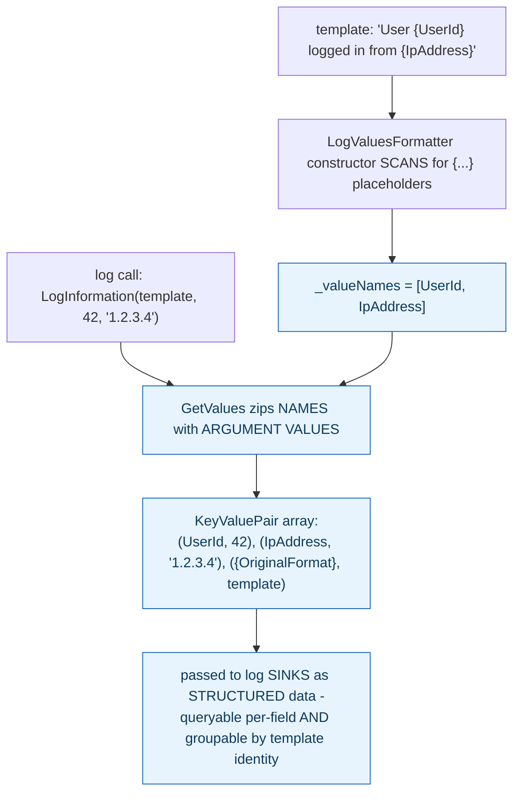

**TL;DR:** `logger.LogInformation($"User {userId}")` and `logger.LogInformation("User {UserId}", userId)` look the same — why is only one structured? Because .NET's structured logging parses the template string for `{Name}` placeholders at log-call time and passes each name/value pair (plus the original template) as separate, individually queryable fields, while string interpolation collapses everything into one opaque message before the logging API ever sees it.

**Real repo:** [`dotnet/runtime`](https://github.com/dotnet/runtime)

## 1. The Engineering Problem: two nearly identical-looking log calls produce fundamentally different queryability later

`logger.LogInformation($"User {userId} logged in from {ipAddress}")` (string interpolation) and `logger.LogInformation("User {UserId} logged in from {IpAddress}", userId, ipAddress)` (template-based logging) look almost identical at the call site and produce identical-looking console output. But only one of them lets a log backend later ask "show me every login from this IP address" or "group all logins by UserId" without parsing free text back out of a rendered string. The difference between the two is invisible at write time and only becomes painfully obvious the first time someone tries to actually query stored logs at real scale.

---

## 2. The Technical Solution: the template string is parsed for placeholder names at log-call time, and those names travel with the log entry as real, separate fields

.NET's structured logging works by parsing the *template* string — not the rendered output — for `{Name}` placeholders the moment a log call is made. `LogValuesFormatter`'s constructor scans the format string, and for every `{PlaceholderName}` it finds, extracts just the name into a list, while rewriting the template internally into a positional format string used only for rendering the human-readable message. Separately, `GetValues` zips each extracted placeholder name with its corresponding argument value into an array of `KeyValuePair<string, object?>` — genuinely structured, individually addressable fields — and appends one more entry beyond the named ones: `{OriginalFormat}`, mapped to the unrendered template string itself.



The `{OriginalFormat}` entry is what lets a log backend group every instance of "a user logged in" together as the *same kind* of event, regardless of which specific user or IP address triggered any individual occurrence — a capability that has no equivalent when the message was built by string interpolation, since interpolation collapses the template and its values into one opaque string before the logging API ever sees either piece separately.

---

## 3. The clean example (concept in isolation)

```csharp
// structured: placeholder NAMES survive as separate fields
logger.LogInformation("User {UserId} logged in from {IpAddress}", userId, ipAddress);
// produces: [(UserId, 42), (IpAddress, "1.2.3.4"), ({OriginalFormat}, "User {UserId} logged in from {IpAddress}")]

// string interpolation: ONE opaque field, no extractable sub-fields
logger.LogInformation($"User {userId} logged in from {ipAddress}");
// produces: [(Message, "User 42 logged in from 1.2.3.4")]  - can't query by UserId alone
```

---

## 4. Production reality (from `dotnet/runtime`)

```csharp
// Microsoft.Extensions.Logging.Abstractions/src/LogValuesFormatter.cs
public LogValuesFormatter(string format)
{
    OriginalFormat = format;
    int scanIndex = 0;
    int endIndex = format.Length;

    while (scanIndex < endIndex)
    {
        int openBraceIndex = FindBraceIndex(format, '{', scanIndex, endIndex);
        // ... (no more placeholders found -> done) ...

        int closeBraceIndex = FindBraceIndex(format, '}', openBraceIndex, endIndex);
        int formatDelimiterIndex = /* find any ,alignment or :formatString */;

        // extract just the NAME between the braces
        _valueNames.Add(format.Substring(openBraceIndex + 1, formatDelimiterIndex - openBraceIndex - 1));

        scanIndex = closeBraceIndex + 1;
    }
}

public IEnumerable<KeyValuePair<string, object?>> GetValues(object[] values)
{
    var valueArray = new KeyValuePair<string, object?>[values.Length + 1];
    for (int index = 0; index != values.Length; ++index)
    {
        valueArray[index] = new KeyValuePair<string, object?>(_valueNames[index], values[index]);
    }
    valueArray[valueArray.Length - 1] = new KeyValuePair<string, object?>("{OriginalFormat}", OriginalFormat);
    return valueArray;
}
```

What this teaches that a hello-world can't:

- **The placeholder name is extracted from the *template string*, at the moment `LogValuesFormatter` is constructed — not from the eventual rendered output.** This is why the actual argument *values* passed to the logging call don't matter at all for determining field *names* — the names come purely from what's written between `{` and `}` in the format string, meaning `"User {UserId}"` always produces a field literally named `UserId`, regardless of what value is logged with it on any given call.
- **`GetValues` appends `{OriginalFormat}` as an extra entry beyond the named placeholders — one more field than there are arguments.** This single addition is what lets a log aggregation backend group and count *occurrences of the same log statement* across an entire application's history, distinct from grouping by any one field's value — "how many times did this specific log line fire" is a different, equally useful question from "how many logins came from this IP," and this one extra `KeyValuePair` is what makes the first question answerable at all.
- **The format-delimiter parsing (`,alignment` / `:formatString`) is stripped out of the extracted name but preserved in the rendering template.** A placeholder like `{Price:C}` produces a field named exactly `Price` (not `Price:C`) for structured querying, while still rendering with currency formatting in the human-readable message — the display formatting and the structured field identity are deliberately kept as two separate concerns, resolved from the same single placeholder.

Known-stale fact: structured logging is sometimes assumed to simply mean "logs formatted as JSON" — as if any log line, run through a JSON serializer, becomes structured. The actual structure originates much earlier than any serialization step: it comes from the placeholder names present in the original template string at the moment the log call is written. A string-interpolated message can absolutely be wrapped in JSON too, but it produces exactly one opaque `message` field with no individually queryable sub-fields — genuine structure requires the logging call itself to preserve placeholder names as separate values, which only the template-based API demonstrated here does; string interpolation destroys that information before the logging framework ever sees it.

---

## Source

- **Concept:** Structured logging
- **Domain:** observability
- **Repo:** [dotnet/runtime](https://github.com/dotnet/runtime) → [`src/libraries/Microsoft.Extensions.Logging.Abstractions/src/LogValuesFormatter.cs`](https://github.com/dotnet/runtime/blob/main/src/libraries/Microsoft.Extensions.Logging.Abstractions/src/LogValuesFormatter.cs) — the actual .NET runtime source, the real primitive OpenTelemetry's .NET logging instrumentation is built on.
