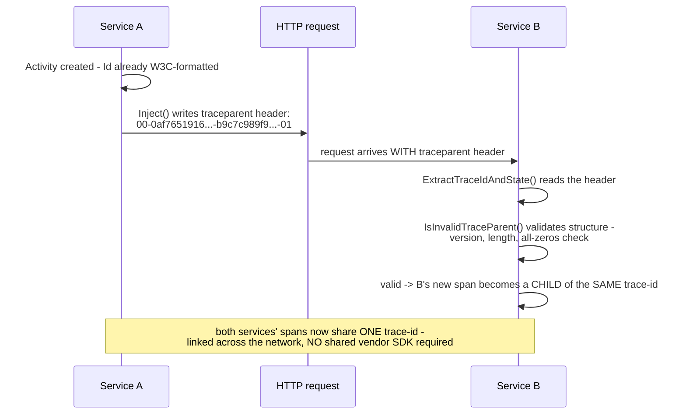

**TL;DR:** Two services using two different tracing vendors need to agree on one trace ID — how do they do that without configuring anything? The W3C Trace Context standard defines an exact `traceparent` header format (version-traceid-parentid-flags) that any compliant implementation can parse regardless of vendor, so the wire format itself — not a shared SDK — is the agreement.

**Real repo:** [`dotnet/runtime`](https://github.com/dotnet/runtime)

## 1. The Engineering Problem: linking spans across a network boundary requires both sides to agree on a shared trace identity, in a header

For two spans — one in a calling service, one in the service it just called over HTTP — to be recognized as part of the *same* trace, both sides need to agree on a shared identity that survives crossing the network as an HTTP header. Before a standard existed for this, that agreement had to be custom: a vendor-specific header format understood only by that vendor's own SDK on both ends. A service using one tracing vendor calling a service using a different one would simply fail to link their spans — not with an error, just silently, each side seeing an unrelated, disconnected trace instead of one continuous one.

---

## 2. The Technical Solution: a precisely specified wire format any W3C-compliant implementation can parse, regardless of vendor

The W3C Trace Context standard defines an exact `traceparent` header format — four dash-separated fields: a 2-character version, a 32-character trace-id, a 16-character parent-id, and a 2-character trace-flags value, all lowercase hex — for example `00-0af7651916cd43dd8448eb211c80319c-b9c7c989f97918e1-01`. .NET's own runtime implements this precisely, including validation rules beyond simple length-checking: version `ff` is explicitly forbidden (reserved to always mean "invalid"), and an all-zeros trace-id or parent-id is explicitly rejected as meaningless. A forward-compatibility rule handles future protocol versions gracefully: a header using a version number higher than `00` is still accepted as long as the fields this implementation understands (the first 55 characters) are well-formed — anything beyond that is simply ignored rather than causing outright failure.



The whole point of the standard is that neither side needs to be configured to understand the *other* side's specific tracing vendor at all — any W3C-compliant implementation, in any language, from any vendor, can correctly parse a `traceparent` header produced by any other compliant implementation, because the wire format itself is the agreement, not a shared library or negotiated configuration.

---

## 3. The clean example (concept in isolation)

```
traceparent: 00        - 0af7651916cd43dd8448eb211c80319c - b9c7c989f97918e1 - 01
             version     trace-id (32 hex chars)             parent-id (16)    flags
```

```csharp
bool IsValid(string traceparent) {
    if (traceparent.Length < 55) return false;
    if (traceparent[0] == 'f' && traceparent[1] == 'f') return false;  // version ff forbidden
    if (AllZeros(traceparent.Substring(3, 32))) return false;           // trace-id can't be all zero
    if (AllZeros(traceparent.Substring(36, 16))) return false;          // parent-id can't be all zero
    return true;
}
```

---

## 4. Production reality (from `dotnet/runtime`)

```csharp
// System.Diagnostics.DiagnosticSource/src/System/Diagnostics/W3CPropagator.cs
// value            = version "-" version-format
// version          = 2HEXDIGLC; this document assumes version 00. Version ff is forbidden
// version-format   = trace-id "-" parent-id "-" trace-flags
// trace-id         = 32HEXDIGLC; 16 bytes array identifier. All zeroes forbidden
// parent-id        = 16HEXDIGLC  ; 8 bytes array identifier. All zeroes forbidden
// Example 00-0af7651916cd43dd8448eb211c80319c-b9c7c989f97918e1-01
private static bool IsInvalidTraceParent(string? traceParent)
{
    if (traceParent is null || traceParent.Length < TraceParentCoreLength)
        return true;

    if ((traceParent[0] == 'f' && traceParent[1] == 'f') ||
        !HexConverter.IsHexLowerChar(traceParent[0]) || !HexConverter.IsHexLowerChar(traceParent[1]))
        return true;

    if (traceParent[0] == '0' && traceParent[1] == '0')
    {
        if (traceParent.Length != TraceParentCoreLength)
            return true; // version 00 must be EXACTLY 55 characters
    }
    else if (traceParent.Length > TraceParentCoreLength && traceParent[TraceParentCoreLength] != '-')
    {
        return true; // future version - extra content must start with a dash
    }

    if (traceParent[2] != '-' || traceParent[35] != '-' || traceParent[52] != '-')
        return true;

    if (!ActivityTraceId.IsLowerCaseHexAndNotAllZeros(traceParent.AsSpan(3, 32)) ||
        !ActivityTraceId.IsLowerCaseHexAndNotAllZeros(traceParent.AsSpan(36, 16)))
        return true;

    return false;
}
```

```csharp
public override void Inject(Activity? activity, object? carrier, PropagatorSetterCallback? setter)
{
    if (activity is null || setter is null || activity.IdFormat != ActivityIdFormat.W3C) return;
    string? id = activity.Id;
    if (id is null) return;
    setter(carrier, TraceParent, id);   // writes the OUTGOING header
}

public override void ExtractTraceIdAndState(object? carrier, PropagatorGetterCallback? getter, out string? traceId, out string? traceState)
{
    getter(carrier, TraceParent, out traceId, out _);
    if (IsInvalidTraceParent(traceId))    // validates the INCOMING header
    {
        traceId = null;
        traceState = null;
        return;
    }
    // ...
}
```

What this teaches that a hello-world can't:

- **Version `ff` is checked and rejected explicitly, as its own dedicated case — not merely "any invalid-looking version fails."** The W3C spec reserves `ff` specifically to always mean invalid, forever, regardless of future protocol evolution — a deliberate, permanent reserved value baked directly into the format itself, not something a future version could ever repurpose.
- **The all-zeros check on both trace-id and parent-id (`IsLowerCaseHexAndNotAllZeros`) exists because an all-zero ID is structurally valid hex but semantically meaningless** — nothing in the universe should ever generate an ID that's literally all zeros through normal random generation, so encountering one is treated as a sign of a malformed or corrupted header, not a legitimately rare-but-possible value.
- **The forward-compatibility branch explicitly tolerates a *future*, higher-numbered version's header as long as it starts with a well-formed dash after the known 55-character core** — meaning a service running an older implementation of this parser doesn't have to be upgraded in lockstep with every future revision of the W3C spec; it can still extract the trace-id and parent-id it understands from a newer header format, simply ignoring whatever extension fields a future version might add.

Known-stale fact: trace propagation across services is sometimes assumed to just require "passing a trace ID along somehow" — as if any two ends that happen to agree on *a* format are equally interoperable. The actual value the W3C Trace Context standard provides is specifically that *no* two ends need to specially agree on anything at all: because the wire format itself is a public, versioned, precisely specified standard (not a vendor's proprietary header, like Zipkin's older B3 format), any compliant implementation from any vendor, in any language, can correctly parse a `traceparent` header from any other — interoperability comes from the shared spec, not from both ends happening to use the same tracing product.

---

## Source

- **Concept:** Trace context propagation (W3C Trace Context header)
- **Domain:** observability
- **Repo:** [dotnet/runtime](https://github.com/dotnet/runtime) → [`src/libraries/System.Diagnostics.DiagnosticSource/src/System/Diagnostics/W3CPropagator.cs`](https://github.com/dotnet/runtime/blob/main/src/libraries/System.Diagnostics.DiagnosticSource/src/System/Diagnostics/W3CPropagator.cs) — the actual .NET runtime source implementing the W3C Trace Context standard.
