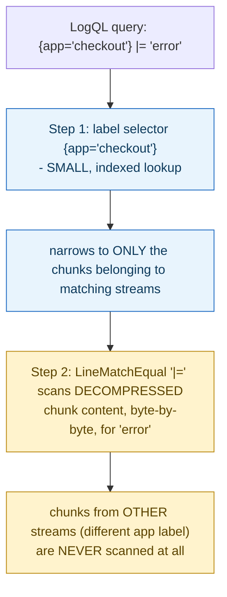

> **In plain English (30 sec):** A focused deep-dive on a specific mechanism or problem pattern.

## 1. The Engineering Problem: indexing every word of every log line is expensive, for queries that usually don't need it

Building a full-text index over every log line — the way a search engine indexes documents — means indexing every word across a system that might produce terabytes of logs per day. That index can end up several times larger than the raw logs themselves, and the cost is paid continuously, on every line written, whether or not anyone ever searches for most of those words. Most real log queries, though, don't actually need "search anywhere in any log line ever written" — they need something narrower: "show me logs from *this* service, *this* pod, in *this* time range, that happen to mention `error`." The service/pod/time filtering is a small, structured lookup; the text search is a secondary, much narrower step layered on top of it.

---

## 2. The Technical Solution: index only a small set of labels, and treat full-text matching as a query-time scan over an already-narrowed set of chunks

Loki — whose own tagline is "like Prometheus, but for logs" — deliberately does not build a full-text index over log content at all. It indexes only a small set of **labels** (service name, pod, environment — the same labeling model Prometheus uses for metrics) to identify which **stream** a set of log lines belongs to. The actual log line content is stored compressed in **chunks** associated with each stream, and is never indexed word-by-word. When a query includes a content filter — `|= "error"`, for instance — that filter is a literal substring match against raw bytes, executed at query time, and only against the chunks belonging to streams the label selector already narrowed down to.



The tradeoff is explicit: no full-text index means "find every log line anywhere containing a word" isn't instant the way it would be in an indexed search engine — but the label index stays small and cheap regardless of log volume, because it's proportional to the number of distinct label *combinations*, not the number of log lines or words within them. Content search cost scales with how much data the label filter already narrowed the search down to, not with the total log corpus.

---

## 3. The clean example (concept in isolation)

```go
type LineMatchType int
const (
    LineMatchEqual LineMatchType = iota   // |= "text" - literal substring match
    LineMatchRegexp                        // |~ "regex"
)

type Filterer interface {
    Filter(line []byte) bool   // operates on RAW BYTES, at query time
}

// query execution:
// 1. label selector -> index lookup -> find matching STREAMS/CHUNKS (cheap, small index)
// 2. content filter -> Filter(line) called on EACH line WITHIN those chunks only (query-time scan)
```

---

## 4. Production reality (from `grafana/loki`)

```go
// pkg/logql/log/filter.go
// LineMatchType is an enum for line matching types.
type LineMatchType int

const (
    LineMatchEqual LineMatchType = iota
    LineMatchNotEqual
    LineMatchRegexp
    LineMatchNotRegexp
    LineMatchPattern
    LineMatchNotPattern
)

func (t LineMatchType) String() string {
    switch t {
    case LineMatchEqual:
        return "|="
    case LineMatchNotEqual:
        return "!="
    case LineMatchRegexp:
        return "|~"
    // ...
    }
}

// Filterer is an interface to filter log lines.
type Filterer interface {
    Filter(line []byte) bool
    ToStage() Stage
}
```

What this teaches that a hello-world can't:

- **`Filter(line []byte)` operates on raw, decompressed bytes handed to it one line at a time — there's no index structure consulted at all during this step.** This is the literal proof that content matching in Loki is a runtime scan, not a lookup: the interface signature itself has no notion of an index to query — it only knows how to answer "does *this specific line*, which I've already been handed, match?"
- **The label selector (`{app="checkout"}`) is resolved through an entirely separate code path (Loki's index/stream lookup) *before* any `Filterer` is ever invoked.** The two-phase structure — narrow by label first, scan content only within what's left — isn't incidental; it's the entire reason the label index can stay small: it only ever needs to answer "which streams match these labels," never "which lines contain this word."
- **`LineMatchType` includes both equality (`|=`, `!=`) and regexp (`|~`, `!~`) variants, all implemented as the same kind of per-line, query-time check** — there's no separate "fast path" for simple substring matches versus a "slow path" for regex; both are variations of scanning bytes at query time, because neither one benefits from (or requires) a pre-built content index in this architecture.

Known-stale fact: log aggregation is sometimes assumed to universally mean "index every word of every log line," the Elasticsearch/Lucene model of full-text search applied to logs. Loki demonstrates a genuinely different, real, production architecture: index only a small set of structured labels, and treat full-text content matching as a secondary, narrower, query-time scan over an already-filtered subset of chunks. This isn't a lesser version of full-text search — it's a deliberate architectural bet that most real log queries already know which service, pod, or time range they care about before they ever need to search log content, making the label index the far more valuable thing to keep small and fast.

---

## Source

- **Concept:** Log aggregation architecture
- **Domain:** observability
- **Repo:** [grafana/loki](https://github.com/grafana/loki) → [`pkg/logql/log/filter.go`](https://github.com/grafana/loki/blob/main/pkg/logql/log/filter.go) — a real, widely deployed production log aggregation system, "like Prometheus, but for logs."


