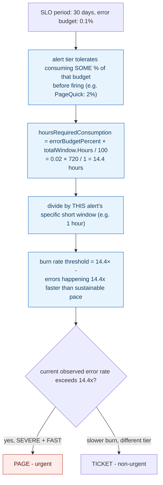

## 1. The Engineering Problem: an error budget is only useful if you know how fast it's being spent, not just whether it's gone

"99.9% uptime" sounds like an absolute promise, but treating it as a hard line — alert the instant *any* error happens — makes the SLO practically impossible to honor and pages people constantly for noise well within the allowed budget. Treating it as nothing — just track uptime, check the dashboard later — means a real, budget-threatening degradation goes unnoticed until the month's 0.1% allowance is already gone. An error budget reframes that 0.1% as a *spendable resource*, which turns the real engineering question into: how fast is it being spent *right now*, relative to how fast it's allowed to be spent to last the entire period — not simply whether it's run out yet.

---

## 2. The Technical Solution: convert an allowed percentage of the budget into an hours-based rate, then express current errors as a multiple of that rate

A real SLO alerting tool computes a **burn rate factor**: how many hours it would take to consume a specific percentage of the *entire* SLO period's error budget, at a steady error rate, then expresses that as a speed multiplier relative to a much shorter alerting window. If consuming 2% of a 30-day budget would normally take 14.4 hours at a steady rate, and the alert's actual measurement window is just 1 hour, the burn-rate threshold for that alert is `14.4×` — meaning "errors are happening 14.4 times faster than the rate that would exhaust exactly 2% of the whole month's budget on schedule." Four separate severity tiers each get their own budget-percentage and window pair, calibrated from Google's SRE workbook defaults: a fast, severe burn triggers an urgent page; a slower, still-real trend only creates a ticket.



The same underlying error budget produces genuinely different urgency depending purely on the *rate* it's being consumed at — a slow trickle that would exhaust the whole month's budget in exactly 30 days needs a fundamentally different response than a spike that would exhaust it in two hours, even though both threaten the identical budget.

---

## 3. The clean example (concept in isolation)

```go
type Window struct {
    ErrorBudgetPercent float64       // % of the FULL period's budget this alert cares about
    ShortWindow         time.Duration // this alert's own measurement window
}

func BurnRateThreshold(totalPeriod time.Duration, w Window) float64 {
    hoursToConsumeAtSteadyRate := w.ErrorBudgetPercent * totalPeriod.Hours() / 100
    return hoursToConsumeAtSteadyRate / w.ShortWindow.Hours()   // the burn-rate MULTIPLIER
}

// PageQuick: 2% budget, 1h window, 30-day period -> threshold = 14.4x
// TicketSlow: 10% budget, 6h window, 30-day period -> threshold = 12.0x
```

---

## 4. Production reality (from `slok/sloth`)

```go
// internal/alert/window.go
type Window struct {
    // ErrorBudgetPercent is the error budget % consumed for a full time window.
    // Google gives us some defaults in its SRE workbook that work correctly most of the times:
    // - Page quick:   2%
    // - Page slow:    5%
    // - Ticket quick: 10%
    // - Ticket slow:  10%
    ErrorBudgetPercent float64
    ShortWindow         time.Duration
    LongWindow          time.Duration
}

type Windows struct {
    SLOPeriod   time.Duration
    PageQuick   Window
    PageSlow    Window
    TicketQuick Window
    TicketSlow  Window
}

func (w Windows) GetSpeedPageQuick() float64 {
    return w.getBurnRateFactor(w.SLOPeriod, float64(w.PageQuick.ErrorBudgetPercent), w.PageQuick.LongWindow)
}

// getBurnRateFactor calculates the burnRateFactor (speed) needed to consume all the error budget
// available percent in a specific time window taking into account the total time window.
func (w Windows) getBurnRateFactor(totalWindow time.Duration, errorBudgetPercent float64, consumptionWindow time.Duration) float64 {
    // First get the total hours required to consume the % of the error budget in the total window.
    hoursRequiredConsumption := errorBudgetPercent * totalWindow.Hours() / 100

    // Now calculate the factor (speed) required for the hours consumption, using a different window
    // (e.g: hours required: 36h, if we want to do it in 6h: would be `x6`).
    speed := hoursRequiredConsumption / consumptionWindow.Hours()

    return speed
}
```

What this teaches that a hello-world can't:

- **Four separate `Window` values (`PageQuick`, `PageSlow`, `TicketQuick`, `TicketSlow`) exist specifically because "how much budget, consumed how fast" needs more than one answer.** A single burn-rate threshold couldn't distinguish "a severe spike that will exhaust the budget in hours" from "a mild, sustained trend that will exhaust it in weeks" — both are real signals worth alerting on, but at genuinely different urgency, which is why the tool computes four independent thresholds rather than one.
- **`getBurnRateFactor` takes the SLO period's total budget percentage and re-expresses it relative to a *different*, shorter window — the math explicitly bridges two different timescales.** "2% of a 30-day budget" and "an alert that fires based on 1 hour of data" aren't directly comparable numbers without this conversion; the burn-rate factor is precisely the translation that makes a short-window observation meaningful against a long-period budget.
- **The comment's own worked example — "hours required: 36h, if we want to do it in 6h: would be `x6`" — states the intuition directly: the multiplier answers "how many times faster than the sustainable pace is this."** A burn rate of `1.0×` means errors are happening at exactly the rate that would consume the budget right on schedule by period's end; anything meaningfully above `1.0×` means the budget is on track to run out *early*, and by how much tells you how urgently that needs attention.

Known-stale fact: SLOs and error budgets are sometimes treated as simple, single-threshold uptime tracking — "are we above 99.9% this month, yes or no" — checked periodically on a dashboard. Real, production SLO alerting computes something more precise: a burn rate relative to a calibrated time window, which is what allows genuinely different alert urgency for the *same* underlying error budget depending on how fast it's currently being consumed, not merely whether it's already been exhausted. A budget check alone tells you the past; a burn-rate calculation tells you where you're headed and how soon.

---

## Source

- **Concept:** SLIs, SLOs & error budgets
- **Domain:** observability
- **Repo:** [slok/sloth](https://github.com/slok/sloth) → [`internal/alert/window.go`](https://github.com/slok/sloth/blob/main/internal/alert/window.go) — a real, widely used open-source Prometheus SLO generator implementing Google's multi-window multi-burn-rate SRE methodology.
