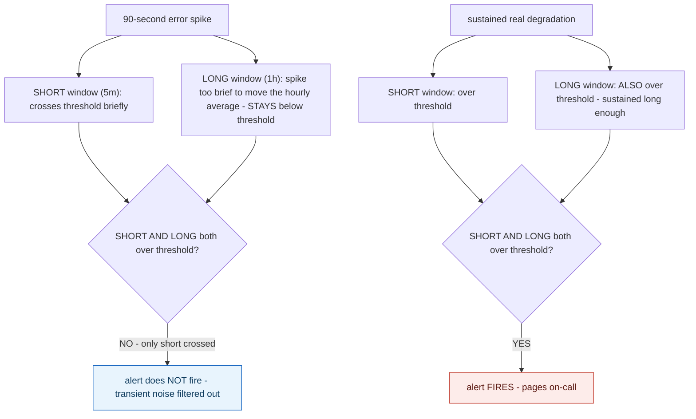



## 1. The Engineering Problem: a single-window alert pages on every transient blip, which is exactly what causes alert fatigue

An alert built on one threshold and one window — "error rate exceeded 5% for the last 5 minutes" — pages on every transient blip: a brief deploy hiccup, an upstream retry storm that self-resolves in 90 seconds, an isolated network glitch. At real production traffic volumes, a short enough window will cross almost any threshold occasionally just from ordinary noise. Paging on every one of these is exactly what causes alert fatigue: on-call engineers start muting or ignoring pages once most of them turn out to be nothing — which is dangerous precisely because it also dulls their response to the pages that genuinely matter.

---

## 2. The Technical Solution: require a short window AND a long window to both independently cross the threshold before paging anyone

A real, production SLO alerting tool generates a Prometheus alert expression requiring *both* a short measurement window and a long measurement window to independently exceed the burn-rate threshold before the alert fires at all — combined with a logical `AND`, not just one or the other. A brief spike that shows up in the 5-minute short window but never sustains long enough to also push the 1-hour long window over the same threshold simply never triggers the alert; the `AND` condition structurally filters it out. Only a degradation that's both severe enough to appear quickly *and* sustained enough to still be elevated over the longer window actually pages anyone.



The same underlying burn-rate threshold produces genuinely different alerting behavior depending on whether the anomaly is transient or sustained — a distinction a single-window design has no way to express at all.

---

## 3. The clean example (concept in isolation)

```promql
(
  max(short_window_error_rate > threshold) and
  max(long_window_error_rate  > threshold)
)
# a 90-second spike moves ONLY the short window - the AND never becomes true
# a sustained degradation moves BOTH - the AND becomes true, alert fires
```

---

## 4. Production reality (from `slok/sloth`)

```go
// internal/plugin/slo/core/alert_rules_v1/plugin.go - the ACTUAL generated PromQL template
var mwmbAlertTpl = template.Must(template.New("mwmbAlertTpl").Parse(`(
    max({{ .QuickShortMetric }}{{ .MetricFilter}} > ({{ .QuickShortBurnFactor }} * {{ .ErrorBudgetRatio }})) without ({{ .WindowLabel }})
    and
    max({{ .QuickLongMetric }}{{ .MetricFilter}} > ({{ .QuickLongBurnFactor }} * {{ .ErrorBudgetRatio }})) without ({{ .WindowLabel }})
)
or
(
    max({{ .SlowShortMetric }}{{ .MetricFilter }} > ({{ .SlowShortBurnFactor }} * {{ .ErrorBudgetRatio }})) without ({{ .WindowLabel }})
    and
    max({{ .SlowQuickMetric }}{{ .MetricFilter }} > ({{ .SlowQuickBurnFactor }} * {{ .ErrorBudgetRatio }})) without ({{ .WindowLabel }})
)
`))
```

```yaml
# internal/alert/windows/google-30d.yaml - the real, Google SRE workbook-derived window pairs
# Numbers obtained from https://sre.google/workbook/alerting-on-slos/#recommended_parameters_for_an_slo_based_a.
page:
  quick:
    errorBudgetPercent: 2
    shortWindow: 5m
    longWindow: 1h
  slow:
    errorBudgetPercent: 5
    shortWindow: 30m
    longWindow: 6h
```

What this teaches that a hello-world can't:

- **The full expression is `(quick-short AND quick-long) OR (slow-short AND slow-long)` — two entirely independent multi-window checks, joined by `OR`, not one.** A fast, severe burn (quick pair: 5m/1h) and a slower, still-dangerous burn (slow pair: 30m/6h) are genuinely different failure shapes, and either one alone is sufficient to page — but *within* each pair, both windows still have to agree before that pair contributes anything.
- **`without ({{ .WindowLabel }})`** appears on every `max(...)` call — this strips the window-size label before comparing, because the short-window metric and long-window metric are computed as *separate* time series (different label values) that need to be compared as plain numbers, not accidentally kept apart as distinct series by a label neither side of the `AND` should care about.
- **The real window values come directly from Google's own published SRE workbook recommendations, cited by URL in the source comment** — `5m`/`1h` for a fast page, `30m`/`6h` for a slower one. These aren't arbitrary defaults invented for this specific tool; they're the same widely validated parameters documented in Google's own SRE practice, adopted here as the tool's real default configuration.

Known-stale fact: alerting is sometimes designed around a single threshold-and-window pair — "alert if error rate exceeds 5% for 5 minutes" — treated as sufficient on its own. Real, production SLO-based alerting requires combining a short window (catches how *severe* an anomaly is, quickly) with a long window (catches whether it's actually *sustained*) via a logical `AND`, specifically to distinguish a genuine, budget-threatening degradation from ordinary transient noise. A single-window design has no mechanism to make that distinction at all — which is a well-documented, real driver of the alert fatigue that erodes on-call teams' trust in their own paging system.

---

## Source

- **Concept:** Alerting & on-call (paging thresholds, alert fatigue)
- **Domain:** observability
- **Repo:** [slok/sloth](https://github.com/slok/sloth) → [`internal/plugin/slo/core/alert_rules_v1/plugin.go`](https://github.com/slok/sloth/blob/main/internal/plugin/slo/core/alert_rules_v1/plugin.go), [`internal/alert/windows/google-30d.yaml`](https://github.com/slok/sloth/blob/main/internal/alert/windows/google-30d.yaml) — a real, widely used open-source Prometheus SLO generator.

