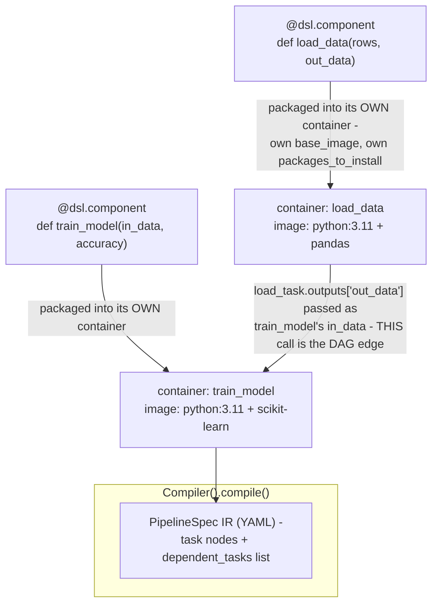
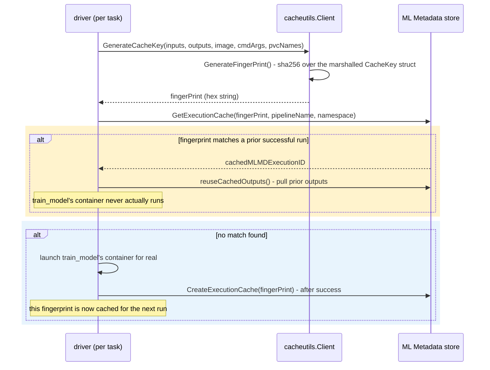

**TL;DR:** A notebook trains a great model once — why does scheduling it as a nightly job fall apart, and what actually replaces it? A notebook's correctness depends on leftover kernel state, ad hoc installed packages, and click-order execution that a scheduler can't reproduce, and it has no way to skip re-running a step whose inputs didn't change; a real ML pipeline tool instead compiles the notebook into a DAG of independently containerized, content-addressed steps, so each step gets its own isolated image and dependencies, and a per-step fingerprint hash lets unchanged steps be skipped and reused from cache.

**Real repo:** [`kubeflow/pipelines`](https://github.com/kubeflow/pipelines)

## 1. The Engineering Problem: a notebook's correctness depends on things a production job can't guarantee

A notebook that trains a good model "works" in a very specific sense: it worked in *this* kernel, with *these* variables left over from cells you already ran and maybe later deleted, using whatever packages happened to already be `pip install`ed in this environment, executed in the order you happened to click "Run" — not necessarily top to bottom. None of that is something a scheduler can reproduce. Point a cron job at `jupyter nbconvert --execute` and it re-runs every cell from a clean kernel, in file order, with no memory of the ad hoc `pip install`s you ran interactively months ago — and if the notebook depended on any of those three things, it fails, or worse, silently produces a different result. Even when it does succeed, there's no way to skip the data-loading cell just because only the training cell's hyperparameters changed — the whole file reruns end to end, every time, because a notebook has no concept of "this step's inputs didn't change, so its output is still valid."

---

## 2. The Technical Solution: compile the notebook's cells into a DAG of independently containerized, content-addressed steps

A real ML pipeline tool doesn't run a file — it runs a **directed acyclic graph of steps**, where each step is packaged into its own container image with its own declared dependencies, and the edges between steps come from *data flowing between them* (or an explicit ordering call), never from physical position in a file. Kubeflow Pipelines' Python SDK expresses this with two decorators: `@dsl.component` turns a plain function into a task definition bound to its own `base_image` and `packages_to_install` — no more "whatever's in this kernel" — and `@dsl.pipeline` composes calls to those components into a graph, where passing one task's `.outputs` into the next call *is* the dependency edge.



Compiling to a DAG also buys something a notebook structurally cannot have: per-step caching. Before actually launching a step's container, the pipeline's runtime **driver** computes a fingerprint — a SHA-256 hash over that exact step's inputs, its declared outputs, and its container image plus command — and checks whether a prior run already produced that exact fingerprint. If it has, the driver reuses the recorded outputs and skips the container entirely; if not, it runs the step for real and records the fingerprint for next time.



Three things to hold onto:

- **A DAG edge is a data dependency, not a line-order dependency.** `train_model(in_data=load_task.outputs['out_data'])` is what tells the compiler `train_model` needs `load_data` to finish first — nothing about where the calls sit in the Python file matters.
- **Isolation is per-step, not per-notebook.** Each component gets its own image and its own `packages_to_install`; a dependency bump for the training step can't silently break the data-loading step's environment, because they don't share one.
- **Caching is content-addressed, per step.** Change the training step's hyperparameters and only that step's fingerprint changes — `load_data` reruns from cache in zero time. This is the specific capability a monolithic notebook re-run has no way to express.

---

## 3. The clean example (concept in isolation)

```python
from kfp import dsl
from kfp.dsl import Dataset, Input, Output

@dsl.component(base_image="python:3.11", packages_to_install=["pandas"])
def load_data(rows: int, out_data: Output[Dataset]):
    import pandas as pd
    df = pd.DataFrame({"x": range(rows)})
    df.to_csv(out_data.path, index=False)       # written to a real artifact, not left in kernel memory

@dsl.component(base_image="python:3.11", packages_to_install=["scikit-learn", "pandas"])
def train_model(in_data: Input[Dataset], accuracy: Output[Dataset]):
    import pandas as pd
    df = pd.read_csv(in_data.path)              # reads the artifact load_data actually wrote
    # ... fit a model, write a metric to accuracy.path ...

@dsl.pipeline(name="minimal-pipeline")
def minimal_pipeline(rows: int = 1000):
    load_task = load_data(rows=rows)
    train_task = train_model(in_data=load_task.outputs["out_data"])   # THIS line is the DAG edge
```

---

## 4. Production reality (from `kubeflow/pipelines`)

```
kubeflow/pipelines/
├── sdk/python/kfp/dsl/
│   └── component_decorator.py     # @dsl.component -> its own containerized task definition
└── backend/src/v2/
    ├── driver/cache.go            # getFingerPrint() - assembles what goes into the cache key
    └── cacheutils/cache.go        # GenerateFingerPrint() - the actual sha256 over that key
```

```python
# sdk/python/kfp/dsl/component_decorator.py
def component(
    func: Optional[Callable] = None,
    *,
    base_image: Optional[str] = None,
    packages_to_install: List[str] = None,
    # ... target_image, pip_index_urls, use_venv, and other packaging args elided
):
    """Decorator for Python-function based components.

    Example:
      ::

        from kfp import dsl

        @dsl.component
        def my_function_one(input: str, output: Output[Model]):
            ...

        @dsl.component(
        base_image='python:3.11',
        output_component_file='my_function.yaml'
        )
        def my_function_two(input: Input[Mode])):
            ...

        @dsl.pipeline(name='my-pipeline', pipeline_root='...')
        def pipeline():
            my_function_one_task = my_function_one(input=...)
            my_function_two_task = my_function_two(input=my_function_one_task.outputs)
    """
    # ... partial-application branch for @dsl.component(...) with args elided
    return component_factory.create_component_from_func(
        func,
        base_image=base_image,
        packages_to_install=packages_to_install,
        # ... remaining packaging args passed through unchanged
    )
```

The docstring's own example is doing real work here, not just illustrating syntax: `my_function_two_task = my_function_two(input=my_function_one_task.outputs)` is the SDK's own canonical picture of a DAG edge — one task's `.outputs` becomes the next task's input, in the pipeline function body, with no separate "define the edges" step anywhere.

```go
// backend/src/v2/driver/cache.go
func getFingerPrint(opts Options, executorInput *pipelinespec.ExecutorInput, cacheClient cacheutils.Client, pvcNames []string) (string, error) {
	outputParametersTypeMap := make(map[string]string)
	for name, spec := range opts.Component.GetOutputDefinitions().GetParameters() {
		outputParametersTypeMap[name] = spec.GetParameterType().String()
	}
	userCmdArgs := make([]string, 0, len(opts.Container.Command)+len(opts.Container.Args))
	userCmdArgs = append(userCmdArgs, opts.Container.Command...)
	userCmdArgs = append(userCmdArgs, opts.Container.Args...)
	// ... PVC name dedup + sort elided - a mounted PVC can carry side effects from a
	// prior run, so its name is folded into the key too, not just the step's declared I/O

	cacheKey, err := cacheClient.GenerateCacheKey(
		executorInput.GetInputs(), executorInput.GetOutputs(),
		outputParametersTypeMap, userCmdArgs,
		opts.Container.Image,          // the container image itself is part of the key
		sortedPVCNames,
	)
	if err != nil {
		return "", fmt.Errorf("failure while generating CacheKey: %w", err)
	}
	return cacheClient.GenerateFingerPrint(cacheKey)
}
```

```go
// backend/src/v2/cacheutils/cache.go — turns that struct into the actual hash
func (c *client) GenerateFingerPrint(cacheKey *cachekey.CacheKey) (string, error) {
	cacheKeyJsonBytes, err := protojson.Marshal(cacheKey)
	if err != nil {
		return "", fmt.Errorf("failed to marshal cache key with protojson: %w", err)
	}
	// ... re-unmarshalled and re-marshalled through encoding/json - protojson's own
	// field ordering isn't guaranteed stable, so it's normalized before hashing
	hash := sha256.New()
	hash.Write(formattedCacheKeyBytes)
	md := hash.Sum(nil)
	return hex.EncodeToString(md), nil
}
```

What this teaches that a hello-world can't:

- **The image and command are hashed alongside the data, not separately from it.** `opts.Container.Image` and `userCmdArgs` go into the same `CacheKey` struct as the step's actual input values — bump the base image or change one CLI flag the component runs with, and the fingerprint changes even if every input value is byte-identical to the last run. A notebook has no equivalent concept: there's no "this cell's effective environment changed, invalidate its result" signal at all.
- **Output specs are part of the key too, with the artifact's URI wiped first.** The real `GenerateCacheKey` (not shown above) builds an `outputArtifactWithUriWiped` — same name, type, and metadata, but no path — specifically so that two runs producing the same *kind* of artifact still hash identically even though their actual storage paths necessarily differ.
- **PVC names are folded in deliberately, not omitted as an oversight.** The comment in `getFingerPrint` states the reason directly: a mounted volume can carry side effects from a previous run, so a step reusing a differently-named PVC is treated as a genuinely different execution, even if every other input matches.

Known-stale fact: "MLOps is just running your notebook on a schedule" is a common enough shortcut that it's worth naming directly — the actual gap a real pipeline tool closes isn't scheduling, it's that a notebook has no per-step isolation and no content-addressed caching to skip work that's provably still valid. Both are structural properties of the DAG-of-containers model, not something a `cron` entry around `jupyter nbconvert` can retrofit.

---

## Source

- **Concept:** ML pipeline fundamentals (DAG-of-containers vs. notebook execution)
- **Domain:** mlops
- **Repo:** [kubeflow/pipelines](https://github.com/kubeflow/pipelines) → [`sdk/python/kfp/dsl/component_decorator.py`](https://github.com/kubeflow/pipelines/blob/master/sdk/python/kfp/dsl/component_decorator.py), [`backend/src/v2/driver/cache.go`](https://github.com/kubeflow/pipelines/blob/master/backend/src/v2/driver/cache.go), [`backend/src/v2/cacheutils/cache.go`](https://github.com/kubeflow/pipelines/blob/master/backend/src/v2/cacheutils/cache.go) — the real DAG-based ML pipeline orchestrator for Kubernetes.
